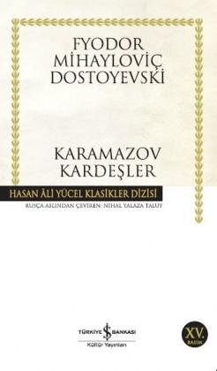

# Karamazov Kardeşler - Fyodor Miyahloviç Dostoyevski
##  1025 Sayfa
### 31.08.2021
  
 

  

    
     

 
 

***Karakterler;***

- ***Fyodor Pavloviç Karamazov:***: Karamazov kardeşlerin babaları, iki kere evlenmiş.
- ***Adelaida İvanovna:***: Fyodor Pavloviç'in ilk karısı.
- ***Sofya İvanovna:*** Fyodor Pavloviç'in ikinci karısı.
- ***Dmitri Fyorodoviç | Mitya:*** Fyodor Pavloviç'in ilk karısından, ilk oğlu. Emekli Teğmen.
- ***İvan | Vanya:*** Fyodor Pavloviç'in ikinci karısından, ortanca oğlu.
- ***Aleksey Fyodoroviç Karamazov | Alyoşa:***: Kahramanımız. | Fyodor Pavloviç'in ikinci karısından ve en küçük oğlu.
- ***Yefim Petroviç Polenov:*** İvan ve Aleksey'i büyüten kadın.
- ***İhtiyar Grigori ve Kocakarı Marfa:*** Pavloviç in hizmetçileri. Karı ve kocalar.
- ***Uşak Smerdyakov:*** - Fyodor Pavloviç'in gayri meşru çocuğu. Aynı zamanda Fyodor Pavloviç'in aşçısı.
- ***Lizaveta Smerdyaşçaya:*** Uşak Smerdyakov'un annesi. Hamamda çocuk doğuran kadın. 
- ***Staretz Zosima:*** Manastırdaki Şeyh.
- ***Rakitin:*** Alyoşa'nın arkadaşı.
- ***Pyotr Aleksandroviç Miusov:***: Fyodor Pavloviç'in ilk karısının akrabası.
- ***Pyotr Fomiç Kalganov:*** Alyoşa'nın arkadaşı, Miusov'un uzak akrabası.
- ***Katerina İvanovna Aleksey:*** Dmitri'nin nişanlısı.
- ***Gruşenka | Agrafena Aleksandrovna:*** Dmitri'nin ve Fyodor Pavloviç'in aşık olduğu kadın.
- ***Pyotr İlyiç:*** Eşya rehinecisi olan adam.
- ***Fetükoviç:***: Dmitri'nin savunucusu olan avukat.
- ***Anna Fyodorovna:***  Dul Bayan Krasotkina. Kolya'nın annesi.
- ***Kolya | Nikolay İvanov Krasotkin:*** Bay İvan Krasotkin'in ve  Dul Bayan Krasotkina'nın oğlu.
- ***Juçka | Perezvon :*** Kolya'nın  köpeği.
- ***Snigirev:***: Eski yüzbaşı yoksul. İlyuşa'nın babası.
- ***İlyuşa:***  Aleksey'in elini ısıran çocuk. Snigirev'in oğlu.
- ***Katerina Osipovna Hohlakova:*** Lise'nin annesi.
- ***Bayan Lise Hohlakova:*** Katerina Osipovna Hohlakova'nın hasta kızı.

 

> ***(Tanıtım Bülteninden - Türkiye İş Bankası Kültür Yayınları)***

***Dostoyevski, yaşamının son yıllarında başyapıtı Karamazov Kardeşler'i tamamladığında, Rus yazınında 'felsefe düzeyinde roman-tragedya denen türün de temelini attığının bilincinde değildi. Dostoyevski'nin yaşam birikiminin tümünü ve sanat gücünün doruğunu içeren bu roman, gerçekte insanı insan yapan ne varsa, onlara adanmış bir destan niteliğini taşır. Yazar, hiçbir romanında "Karamazov Kardeşler"de olduğu denli insan ruhuna inmemiş, insanoğlunu bu denli kesitler biçiminde, içgüdülerinin ve istencinin tüm görünümüyle sergilenmiştir. Bir aileyi konu alan ve bir felaketler zinciri olarak gelişen olay örgüsü, bireysel öğelerin yanı sıra, ondokuzuncu yüzyılın ikinci yarısındaki Rus toplumunu da geçirdiği sarsıntıların tümüyle, dünya edebiyatında bir eşi daha bulunmayan bir sanat aynasından yansıtır.***

***Dostoyevski (1821-1881): Gerek 1840'ların ortalarından itibaren yayımlamaya başladığı Beyaz Geceler ve Öteki gibi uzun öykü-kısa romanlarıyla, gerekse Karamazov Kardeşler,  Suç ve Ceza ve Budala gibi Sibirya sürgünü sonrası büyük romanlarıyla, insanın karanlık yakasını kendinden sonraki bütün romancıları derinden etkileyecek biçimde dile getirmiş büyük bir 19.  yüzyıl ustasıdır. Karamazov Kardeşler, yazarın son başyapıtıdır.***
_____

***BİRİNCİ BÖLÜM***

> ***Birinci Kitap - Bir Ailenin Hikayesi (s.1)***

Fyodor Pavloviç Karamazov, çocukların babasıdır.  Pavloviç, çok fazla gözü dışarıda ve alkolik bir adamdır. İlk karısı olan Adelaida İvanovna'u kaçırmıştır. Sonrasında ise bu çiftin Dmitri isminde çocukları olmuştur. Adelaida İvanovna, en sonunda dayanamaz ve Pavloviç'i terk eder. Adelaida İvanovna, Petersburg'a gider, orada yeni biriyle birlikte olur. Ama bir süre sonra Adelaida İvanovna'in ölüm haberi gelir.

Adelaida İvanovna, terk edip gittikten sonra Dmitri daha küçük bir çocukken ortalıkta kalır. Aynı şekilde babası Pavloviç yine umursamaz ve alkolik bir şekilde hayatına devam etmektedir.. Adelaida İvanovna'in akrabası olan Pyotr Aleksandroviç Miusov avrupadan döndükten sonra Dmitri'nin bu halini görünce üzülür ve Dmitri'yi yanına alır. Ama bir süre sonra Pyotr Aleksandroviç Miusov'da oradan ayrılır ve Dmitri'yi başka bir yere bırakır. Maalesef Dmitri bu şekilde farklı yerlerde kalarak büyümeye devam eder..

Pavloviç bir süre sonra Sofya İvanovna ismindeki bir kadından çok etkilenir ve yine bu kadını kaçırdıktan sonra evlenirler. Bu evlilik sekiz yıl devam eder ve iki tane çocukları olur. Ama ne yazık ki sekiz yılın ardından Sofya İvanovna, vefat eder. Bu sefer çocuklar yine bir başına, başı boş bir şekilde kalırlar. Babaları Pavloviç yine alkolik ve umursamaz bir şekilde hayatına devam etmektedir. 

Pavloviç'in ilk eşinden olan çocuğunun ismi Dmitri'ydi. İkinci eşinden olan büyük oğlunun adı ise İvan, en küçük oğlu ise Aleksey'dir.. Bu çocukların arasında 4'er yaş fark vardır.. Aleksey ve İvan Yefim Petroviç Polenov tarafından büyütülmüştür...

_____

> ***İkinci Kitap - Manastır'a Geliş (s.37)***

Dmitri 28, İvan 24 ve Aleksey 20 yaşındadır.   Bir süre sonra çocuklar bir müddet babalarıyla yaşamaktadırlar. İvan eğitim hayatı boyunca zorluk çekmiştir ve hem okuyup hem de parasını kendi kazanmıştır. Aleksey bunun tam tersi ne kadar parası olup olmadığı umrunda değildir ve parasını hiç düşünmeden harcar... Aleksey okulunu yarıda bırakmıştır, buna rağmen hem yakışıklı hem de zeki bir çocuktur. Aleksey bunların ardından Manastıra gitmek ister ve babasından izin alır. Aleksey bir süre Manastır'da eğitim görür ve oradaki din konularıyla ilgilenir.

Birçok insan dertlerinden kurtulabilmek için Staretz'e gitmektedir. Staretz ise bu insanlar için dua edip, aynı zamanda onları kutsamaktadır.

Aleksey'e Liza tarafından bir tane mektup verilir. Katerina İvanovna Aleksey'le görüşmek istediğini belirtmiştir.   Bir süre sonra ise Staretz, Staretz Yosif, Kalganov, Aleksey, Pavloviç ve Miusov  Manastır'da bir araya gelmişlerdir. Fakat Dmitri geç kalmıştır. Bu adamlar, bu esnada kiliselerin, devlet ile olan ilişkilerini ve aynı zamanda Ivan'ın yazmış olduğu aynı benzer konuyla ilişkisi olan makalesini ele almışlardır... Miusov'un anlattığı bir hikayeden kesit;   ***Konuşmanın esas konusunu geçerek, sadece o saygıdeğer zatın ağzından kaçırdığı epey ilgi çekici birkaç sözü tekrarlayayım: "Bizim bütün bu sosyalist, anarşist, zındık ve devrimcilerden pek o kadar korktuğumuz yok," dedi. "Onların peşindeyiz, yapıp ettiklerini çok iyi biliyoruz. Fakat aralarında sayıları çok olmamakla birlikte, birkaç kişi var ki durumları tamamen başka: `Bunlar hem Tanrıya inanan Hıristiyanlar, hem de sosyalistler... Bizi en çok bunlar kaygılandırıyor, korkunç insanlar! Bir Hıristiyan sosyalist, dinsiz bir sosyalistten çok daha korkunçtur."` Bu sözler beni o zaman da etkilemişti. Şimdi burada, aranızda bulunduğum sırada beyler, bunları birden bire hatırlayıverdim.   Paisiy Peder sözü uzatmadan,   - Yani böylece bizleri de sosyalist olarak gördüğünüzü mü söylemek istiyorsunuz? diye sordu.   Pyotr Aleksandroviç vereceği yanıtı toparlayamadan kapı açıldı, içeri epeydir geciken Dmitri Fyodoroviç girdi. Doğrusu, oradakiler onu beklemekten vazgeçmiş gibiydiler. Ansızın çıkagelmesi ilk anda biraz şaşkınlık uyandırdı. (s.82)***

Bunun üzerine bir müdddet konuşma normal ilerlese de sonrasında Payloviç ve büyük oğlu Dmitri arasında hararetli bir tartışma başladı. Uzun bir süre bu tartışma devam etti ve çirkin bir hal aldı. En sonunda bir anda Staretz, Dmitri'nin yanına gelerek ayaklarına kapandı. Oradakiler ne olduğunu anlayamadılar ve bunun üzerine oradan ayrıldılar.

Başrahip'te yemek düzenlenecekti, bazıları oraya gittiler.

Tüm bu olanlardan sonra Aleksey, Staretz Zosima'ı odasına getirdi. Staretz'in durumu hiç iyi değildi. Staretz  halsiz ve hasta gibiydi. Aleksey, Staretz'in yanında kalmak istiyordu ama Staretz izin vermedi ve şu şekilde karşılık verdi;   ***Orada daha yararlı olursun. Huzursuzluk var orada. Yardımın dokunur. Şeytanlar bastırınca dua et. Hem şunu da bil oğulcuğum, (Staretz onu böyle çağırmayı pek severdi) burası sana göre değil. Unutma bunu delikanlı. Ulu Tanrının huzuruna kavuştuğum zaman manastırdan git. Temelli git. (s.95)***   Staretz, aynı şekilde Aleksey'e, artık yakın zamanda öleceğini ve az bir zamanı kaldığını söyledi.   Aleksey yemeğe gitmek için oradan ayrıldı ve kapıdan çıkınca şunları düşündü;   ***Staretzin, yakın ölümü hakkındaki kehanetli sözlerini tekrar duyar gibi oldu. Büyük bir kesinlike söylediği o sözlerin hepsi mutlaka gerçekleşecekti. Alyoşa buna iman etmişti. Fakat o, Staretzsiz ne yapacak, onu görmeden, sözlerini duymadan nasıl yaşayacaktı? Hem nereye gidecekti? Staretz, arkasından ağlamamasını ve manastırdan ayrılmasını emrediyordu, aman Tanrım!.. Alyoşa çoktandır bu kadar üzülmemişti... (s.96)***

Aleksey yola çıktıktan bir süre sonra Rakitin'in kendisini beklediğini görür. Birlikte Başrahip'in yemeğine giderken sohbet ederler...   Rakitin, Staretz Zosima'nın Dmitri'nin ayaklarına neden kapandığını anlayamadığından bahseder ve şu bu olayı şekilde yorumlar:   Staretz, bir kahin gibi bazı şeyleri önceden gördüğü imajını vermek istediği için böyle yaptı der. Yakın zamanda Karamazov ailesi içersinde bir cinayet işleneceğini düşündüğünü söyler. Rakitin, muhtemelen bu olayın Dmitri ile Pavloviç arasında olacağını söyler...   Aynı zamanda Rakitin, Karamazov ailesinin birbirinin ardından ne işler çevirdiğini de aktarır. Babaları ve diğer çocukları arasında aynı kadınları elde etmek ve baştan çıkartmak düşüncesi olduğunu ve Pavloviç'in Dmitri'yi hapise attırmak için planlar yaptığından bahseder.. Rakitin, Karamazov ailesi için şu çıkarımı yapar:   ***Hepsi gün gibi açık, hep bildiğin şeyler... Sende bile şehvet düşkünlüğü varken kardeşin İvan'ın ne olacağını düşün. O da bir Karamazov, zaten Karamazovluk şöylece özetlenebilir: Şehvetli, kâr düşkünü ve akıldan  sakat insanlar... (s.100)***   Aleksey ve Rakitin, Başrahip'in yemek vereceği yere ulaştılar.

Staretz'in orada olan tartışmadan sonra Payloviç yemeğe gitmeyi düşünmüyordu. Ama ne olduysa bir anda fikri değişti ve her şey daha ne kadar kötü olabilir ki diye düşünerek yemeğe gitmeye karar verdi. Payloviç, oraya ulaştığında yemeğe daha yeni başlanmıştı. Oradakilerin Payloviç'i görünce keyfi kaçtı. Zaten kısa bir süre sonra Payloviç, oradakilere ve Manastır'la ilgili kötü sözler söyledi ve ortalığı karıştırdı... Payloviç, çok fazla saygısızlık ettikten sonra oradan ayrıldı ama yanında çocuklarını da götürdü. Ve çocuklarının bir daha Manastır'a gelmeyeceklerini de belirtmeyi ihmal etmedi...

_____

> ***Üçüncü Kitap - Şehvet Düşkünleri (s.117)***

Fyodor Pavloviç, çok büyük bir evde yaşıyordu.  Fyodor Pavloviç'in yanında ise üç tane hizmetçisi vardı. Bunlar yıllardır kendisiyle birlikte olan, İhtiyar Grigori - Kocakarı Marfa'dır. Bu karı-koca yıllardır Pavloviç'in hizmetçiliğini yapmaktadırlar. Özellikle Grigori ve Pavloviç birbirlerini çok severler. Diğer bir hizmetçi ise Aşçı Uşak Smerdyakov'dur..   Yıllar önce, Grigori ve Marfa'nın çocukları altı parmaklı olarak doğar. Bu sebeple Grigori çocuğuna hep canavar gözüyle bakmıştır. Zaten bir süre sonra çocukları ölür..   O zamanlarda Lizaveta Smerdyaşçaya isminde bir kadın başıboş şekilde şehirde dolaşır ve canı nerede isterse orada kalır. Lizaveta, aslında  çoğu kişi tarafından sevilir. Lizaveta'nin hiçbir şeyde gözü yoktur. Eline para ya da başka bir şey geçtiğinde bunu başkalarına dağıtır. Halk tarafından Lizaveta'ya yeni kıyafet ve ayakkabılar alınır ama Lizaveta bunları başkalarına verir. Lizaveta, her zaman yalın ayak ve gömlekle dolaşır..

Bir gece vakti Lizaveta kenar köşe de yatarken, sarhoşlar bunun yanına gelir ve kendisiyle alay ederler. Bu sarhoşların içerisinde Pavloviç'de vardır. Diğerleri kendi arasında konuşurken Lizaveta'dan iğrenirler ve bu kadının yüzüne kim bakar gibisinden bir fikir ortaya atarlar. Oradaki adamların aksine Pavloviç, Lizaveta'yı beğendiğini söyler.. Aradan uzun bir süre geçtikten sonra Lizaveta'nın hamile olduğu şehirde yayılır.. Gerçek olup olmadığı bilinmez ki, o gece Pavloviç'in, Lizaveta'ya sahip olduğu dedikodusu yayılır. Bu söylentiler Pavloviç'in umrunda değildir..

Lizaveta, hamileliğinin sonlarında Pavloviç'in evinin bahçesine çitlerden atlayarak girer. Bir süre sonra orada doğum yapan Lizaveta maalesef ölür. Bunun üzerine ihtiyar Grigori doğan bebeğin bir tanrı misafiri olduğunu ve kendi ölen çocuklarının yerine verildiğini belirtir. Bu sebeple bu Lizaveta'nın yeni doğan bebeğini Grigori'ler sahiplenir.. Halk tarafından Pavloviç'e bu yaptığından dolayı güzel düşünceler gelir..   İşte o bebek, şu anda hizmetçiliğini yaptığı Aşçı Smerdyakov'dur.

___

Aleksey, Katerina'nın kendisini beklediği için evine doğru yol alıyordu. Neyseki gitmek diğer yolu tercih etti. Bunun sonucunda ise ağabeyi Dmitri ile karşılaştı. Dmitri büyük bir heyecan içerisinde Aleksey'i yanına çağırdı.. Dmitri, Aleksey'e bunca zamandır kimseye söylemediği şeylerini anlatmaya başladı..

Dmitri'nin askerlik yaptığı zamanlarda, üstü olan bir tane yarbay varmış. Bu yarbayında karısı ölmüş ve Agafya İvanovna isminde bir de kızı varmış.. Dmitri bir süre sonra Agafya ile dost olmuş. O zamanlar için de bu yarbay kasadaki paraları alıp kullanıyormuş.. Aynı zamanda Dmitri'ye babasından, annesinden kalan 6 bin para gelmiş..   Dmitri, Agafya'ya giderek, babasının zor durumda olduğunu. Kasadaki parayı yerine koyamadığını söylemiş ve gerekirse kendisinin bu parayı onlara verebileceğini iletmiş.. Bir süre sonra Albay hastalanıp yatağa düşmüş. Hal böyle olunca Dmitri'den parayı alması için  Katerina İvanovna'yı göndermişler.. Katerina parayı almış ve geri dönmüş.. Paranın üstünü daha sonra mektup ile Dmitri'ye geri göndermişler ve kendileri 4500 borçlanmışlar.. O parayı yerine koyduktan sonra sorun halledilmiş. Fakat bir süre sonra Albay hastalığa yenik düşmüş ve ölmüş.. Bunun üzerine Agafya, Katerina olmak üzere ailesi başka bir şehre gitmişler..   Katerina oradan Dmitri'ye mektup yazmış. Ne olur lütfen kendisinin kocası olmasını istemiş... Bunun üzerine ne yapacağını bilemeyen Dmitri, kendisinin ona layık olmadığını söylemiş. Dmitri, Katerina ile görüşmesi için İvan'ı göndermiş, fakat sonradan hata yaptığını anlamış elbette ama iş işten çoktan geçmiş... İvan bu kıza aşık olmuş...   Neyse ki, bir süre sonra Dmitri bu kızın yanına gittiği sıralarda, birbirleriyle nişanlanmışlar.. Ama Dmitri yüzüden devamı gelmemiş, fakat hâlâ nişanlılarmış.. Yakın zamanda Dmitri Katerina'dan 3 bin almış ve Katerina'nın kardeşine gönderecek olduğu bu parayı göndermemiş..  Dmitri bunun azabıyla kıvranıyordu... Bunun üzerine Dmitri, Aleksey'den babasından para istemeye gitmesini, eğer vermezse de ne olursa olsun Katerina'nın yanına giderek selamını iletmesini ve elveda demesini istedi...

Aleksey, Pavloviç'in evine geldi. Ağabeyi İvan'da oradaydı. Bir süre orada birlikte sohbet ettiler. Pavloviç, yine alkol alıyordu. İlk başlarda kafası normaldi ama aradan baya zaman geçtikçe sarhoş oldu..  En sonunda ise Dmitri çıktı geldi. Orada Dmitri ve Pavloviç arasında büyük bir kargaşa yaşandı.. Dmitri babası Pavloviç'e beddualar ve hakaretler savurdu. Üstelik Dmitri Pavloviç'e yumruk attı.. Bunların ardından Dmitri oradan ayrıldı... Pavloviç ise en küçük oğlu Aleksey'e büyük bir minnetle bakıyordu. Pavloviç, Aleksey'e, kendisini savunduğu için çok teşekkür etti ve kendisini çok sevdiğini söyledi, aynı zamanda Manastır'a tekrardan gitmesine izin verdi.

Aleksey bunların ardından ise Katerina'nın evine gitti. Aleksey, Katerina'ya, Dmitri'nin veda selamını iletti ve tüm olanları bir bir anlattı. Bunların aksine Katerina, Dmitri'ye karşı öfke duymuyor ve bir o kadar seviyordu. Katerina, Dmitri'nin kendisini niye bu kadar görmezden geldiğin anlayamadığını söylüyordu... Pavloviç, Dmitri'nin Gruşenka'ya gideceğini söyledi. Belkide evlenebileceklerini de ekledi. Fakat Katerina böyle bir şeyin olmayacağını söyledi ve perdenin arkasında duran Gruşenka'yı yanlarına çağırdı. Aleksey şaşırmıştı... Gruşenka, Katerina'yı kandırmış, Katerina ilk başta Gruşenka'nın Dmitri'yi sevmediğini ve onunla ilgilenmediğini Dmitri'ye anlatacağını sanıyormuş. Ama öyle olmadı, Gruşenka bir anda çirkinleşti ve Katerina'ya hakaretler etti. Bunun üzerine ise Gruşenka ve Katerina kavgaya tutuştular... Gruşenka'yı evden gönderdiler... Aleksey'de evden ayrılacağı sırada, Bayan Lise Hoklakov'dan gelen mektubu Aleksey'e verdiler..

Aleksey Manastır'a dönerken. Karanlıkta dört yolda ağabeyi Dmitri ile karşılaştı. Dmitri, Aleksey'i bekliyormuş.. Aleksey olanları birbir ağabeyine anlattı.. Tüm bunların ardından Dmitri, Aleksey'e veda etti ve bir daha kendisini göremeyeceğini söyledi. Aynı zamanda kendisi için dua etmemesini ve kendisinin bunu hak etmediğini de söyledi. Dmitri, yakın zamanda çok büyük bir alçaklık yapacağını ve bunu zamanı gelince göreceğini de ekledi.. Ve ayrıldılar...

Aleksey , Manastır'a döndü. Staretz Zosima, hastalığı iyice ilerlemiş bir şekilde yatıyordu. Artık ölüm kapısını çalmak üzereydi. Aleksey'in en sevdiği insan ölümle burun burunaydı ve bu sebeple Aleksey çok üzgündü... Aleksey, Staretz Zosima'nın yanında diz çöküp uzun uzun dua etti... Aleksey, orada kenara kıvrılıp yattı. Uyumadan önce ise cebindeki mektubu okudu. Bayan Lise Hohlakova'dan gelen mektup şöyleydi:

***“Aleksey Fyodoroviç,” diye başlıyordu. "Herkesten annemden bile gizli yazıyor, bunun ne kadar kötü bir şey olduğunu da biliyorum. Fakat yüreğimdekileri size açmazsam, yaşayamayacağım artık. Bunu bir süre ikimizden başka kimse bilmemeli. Yalnız söylemek istediklerimi size nasıl anlatacağımı bilemiyorum... Kâğıdın yüzü kızarmaz, derler. Oysa emin olun yalan, kızarır; tıpkı benim şimdi kızardığım gibi... Sevgili Alyoşa, sizi seviyorum, ta çocukluğumdan, Moskova'dan beri seviyorum. O zaman şimdiki gibi değildiniz; hem sizi ömrümün sonuna kadar seveceğim. Yüreğim, sizinle birleşmeyi seçti; yaşlanınca hayatımızı birlikte bitirmek için sizi seçti. Tabii manastırdan çıkmanız koşuluyla... Yaşlarımıza gelince, yasaların emrettiği kadar bekleriz. O zamana kadar ben de tamamen iyileşip yürüyeceğim, dans edeceğim. Bundan en ufak şüpheniz olmasın.  
Bunu nasıl ayrıntılı düşündüğümü görüyorsunuz ya! Yalnız şunu aklım almıyor: Bu satırları okuduktan sonra hakkımda  ne düşüneceksiniz acaba? Hep gülüp yaramazlık ederim; demin sizi gücendirdim ama emin olun, kalemi elime almadan önce Meryem Ana ikonunun önünde dua ettim. Şimdi de dua ediyorum, neredeyse ağlayacağım...  
Sırrımm elinizde; yarın bize gelince yüzünüze nasıl bakacağımı bilemiyorum. Ah Aleksey Fyodoroviç, ya size bakarak, deminki hesap, aptal gibi kendimi tutamadan gülüverirsem?.. Beni kötü, alaycı bir kız sanır, mektubuma inanmazsınız. Bunun için yalvarırım canım, bana azıcık merhametiniz varsa yarın içeri girince tam gözlerimin içine bakmayın, bakışlarımız karşılaşınca belki kendimi tutamaz, birdenbire gülüveririm, hem üzerinizde o uzun elbise de olacak... Bunları düşündükçe şimdiden buz kesiliyorum. Bunun için içeri girince bir süre bana hiç bakmayın, anneme ya da pencereye bakın...  
Işte size bir aşk mektubu yazdım; Tanrım, ne yaptım ben!.. Beni küçük görmeyin Alyoşa, çok fena bir şey yaptım ve sizi üzdümse bağışlayın. Bundan sonra belki ebedi olarak mahvolmuş şerefimin sırrı sizin elinizde...  
Bugün eminim ağlayacağım. Hoşça kal, korkunç buluşmamıza kadar.  
~ Lise   
Hamiş: Ama muhakkak, muhakkak gelin Alyoşa, muhakkak!  
~Lise" (s.208-209)***

_____

***İKİNCİ BÖLÜM***

> ***Dördüncü Kitap - Acılar (s.213)***

Aleksey uyandığında, Staretz kendine gelmişti. Artık Staretz'in son saatleriydi, çünkü konuşmakta bile zorlanıyordu. O gün içerisinde birçok insan Staretz'i ziyarete geldiler. Staretz onlara bol bol öğütler verdi ve adeta son sözlerini aktardı.. Aleksey, Staretz'in yanından ayrılmak istemiyordu. Fakat Staretz, Aleksey'e verdiği sözlerin olduğunu bu sebeple ailesinin yanına gitmesini, kendisinin gelmeden ve ona son sözlerini söylemeden ölmeyeceğini söyledi...

Bunun üzerine Aleksey babasının dün kendisini bugün için çağırması üzerine yanına gitti. Ama Pavloviç muhtemelen dünkü alkolin etkisiyle o kadar yakın ve sevecen davranmıştı. Bugün Pavloviç, Aleksey'e hiçte öyle yaklaşmadı. Bir süre küçük diyaloglardan sonra ise Aleksey oradan ayrıldı...   Aleksey yoldayken bir grup çocuk gördü, ve bu çocuklardan ayrı bir kişi daha vardı.. Aleksey ilk başta bu grupla sohbet etmeye çalıştı ama bir süre sonra altı kişiye karşı bir kişi olarak karşılıklı taşlaşma başladı. O tek çocuğun attığı taşlardan bazıları Aleksey'e isabet etti. Bir süre sonra çocuk oradan uzaklaştı ve Aleksey'de peşinden gitti. Aleksey çocukla konuşmak istedi ama pekte istediği gibi olmadı. Çocuk Aleksey'e taşlar attı ve en sonunda neredeyse Aleksey'in  parmağını koparacaktı, çocuğun ısırdığı parmaktan kanlar akıyordu. Tüm bunlara rağmen Aleksey hiçbir şey yapmadı ve çok sakin kalmayı başardı ve bunun üzerine çocuk ağlayarak oradan kaçtı..

Ardından Aleksey, Hohlakova'ların evine geldi. Aleksey'i kapıda Bayan Hohlakova karşıladı bir süre sohbet ettikten sonra, Aleksey'in elindeki korkunç yarayı fark ettiler. Bir anda Lise hemen telaşlandı ve Aleksey'i kendi odasına götürdü. Annesinden yarayı temizleyip sarabilmek için malzeme istedi.. Bu esnada Aleksey ile Lise yalnız kaldılar.. Lise, "dünkü mektubun çok büyük bir şaka olduğunu ve lütfen bu mektubu ciddiye almayın, ve umarım benimle dalga geçmemişsindir," şeklinde Aleksey'e  söyledi. Ama Aleksey ise bu mektubu ciddiye aldığını söyledi ve şunları ekledi:   ***Doğru söyleyin, benimle alay ettiniz mi?   - Asla, hiç alay etmedim.   - Neden?   - Yazdıklarınıza tamamen inandım da ondan.   - Bana hakaret ediyorsunuz!   - Asla. Mektubu okur okumaz, her şeyin tıpkı böyle olacağını düşündüm. Staretz Zosima ölür ölmez manastırdan çıkmam gerekiyor, öğrenimime devam edeceğim, sınavlarımı verdikten sonra yasal iznimizi alıp evleniriz. Sizi seveceğim. Böyle şeyleri enikonu düşünecek vaktim oldu diyemem ama, kendime sizden daha iyi bir eş bulamayacağımı düşündüm. Staretz'de evlenmemi istiyor...   - Ama ben sakatım, koltukta taşıyorlar beni.   Lise, yanakları pembeleşmiş, gülüyordu.   - Koltuğunuzu ben çekerim, ama o zamana kadar iyileşeceğinize eminim. (s.242)***

Bunun ardından Aleksey, evin içerisine geçti. İçeride ise İvan ve Katerina birlikte konuşuyorlarmış.. Katerina, Aleksey'i gördüğü için çok mutlu oldu ve aynı zamanda bir o kadar heyecanlandı.. Biraz önce içerideyken Bayan Hohlakova Katerina için Aleksey'e şöyle demişti: "Katerina İvan'ı seviyor, ama Dmitri'ye duyduğu minnetten dolayı Dmitri'yi sevdiğini söyleyerek kendi kandırıyor ve acı çekiyor.."

Bunun üzerine konuşma esnasında Katerina, Aleksey'e yine Dmitri hakkında şeyler söylemeye başladı. Yine ne olursa olsun Dmitri Gruşenka ile evlense bile Dmitri'nin peşinden gideceğinden bahsetti. En sonunda Aleksey şöyle bir yorum yaptı:   "Katerina'nın Dmitri'yi sevmediğini ve İvan'ı sevdiğini" söyledi.   Bunun üzerine de İvan şöyle karşılık verdi:   "Katerina'nın kendisini hiçbir zaman sevmediğini, kendisi ne yaparsa yapsın buna karşılık vermediğini, artık bunların hiçbir önemi olmadığını ve kendisinin Moskova'ya gideceğini" söyledi.   Tüm bunların ardından İvan oradan kimseyle vedalaşmadan ayrıldı. Aleksey, her ne kadar İvan'ın arkasından bağırsa bile bir şey ifade etmemişti... Tüm bu söylediklerinden dolayı Aleksey kendisini suçlamaya başladı, niye böyle şeyler söyledim ki diyerek kendisine kızıyordu..

Katerina Aleksey'in eline 200 birim para verdi ve bu parayı Snigirev ismindeki eski, yoksul yüzbaşıya götürüp vermesini rica etti. Bunun sebebi ise, geçen günlerde Dmitri bu adamı herkesin içerisinde mekandan dışarıya çıkarmış ve sokakta uzun bir süre sürüklemiş... Bunların ardından Aleksey, Katerina'nın evinden ayrıldı ve Snigirev'in evine doğru yola çıktı..

Aleksey, Snigirev'in evine geldi. İçeriye girdiğinde ise içerisi yoksulluk içerisindeydi ve bir sürü aile ferdi vardı. Aynı zamanda Aleksey'in parmağını ısıran çocuk Snigirev'in oğluydu.. Muhtemelen bu çocuk, babasına kötü davranan Dmitri'nin kardeşi olduğu için Aleksey'e öyle şeyler yapmıştı.. Aleksey bir süre oradakilerle konuştuktan sonra Snigirev ile dışarıya çıktılar.

Bir süre dışarıda yürürken sohbet ettiler. Snigirev, başına gelenleri Aleksey'e şu şekilde anlattı:   Dmitri'nin hiçbir şey yokken, kendisini sakalından çekerek uzun bir süre yerlerde sürüklediğini ve bunu gören oğlunun yani İlyuşa'nın koşarak yanlarına geldiğini ve babasını bırakması için Dmitri'ye adetâ yalvardığından bahsetti. Tüm bunlardan sonra halk içerisinde kendilerinin hiçbir saygınlığının kalmadığını da ekledi...  Bu olayların ardından ise İlyuşa'nın okuldaki tüm ilişkileri de aynı şekilde bozulmuş. Okuldaki herkes İlyuşa ile alay ediyormuş. Bu sebeple İlyuşa tek başına herkese karşı babasını savunup, herkesle dalaşmaya başlamış. Aynı zamanda İlyuşa'nın bu olanlardan dolayı psikolojisi iyice bozulmuş.. Artık son çare olarak tüm ailenin oradaki şehri terk ederek, kendilerini kimsenin tanımadığı bir yere yerleşmek olduklarını düşünüyorlarmış ama elbette bunun için ellerinde yeterli para yokmuş... Üstelik evdeki diğer aile üyelerinin çoğunun hastalığı mevcut ve tedavileri için ilaç alabilecek maddiyatları da yokmuş..   Tüm bunlardan sonra Aleksey, Katerina'nın gönderdiği 200 lirayı Snigirev'e verdi. Snigirev, ilk başta çok mutlu oldu, ailesini tedavi ettirebileceğini ve üstelik buradan da gidebileceklerini söyledi. Ama ne olduysa en sonunda bir anda paraları yere attı ve paraların üzerinde tepindi. Ardından ise benim bunları alacak kadar şeref yoksunu mu olduğumu düşünüyorsun dedikten sonra Snigirev arkasına bakmadan oradan uzaklaştı... 

____

> ***Beşinci Kitap - Pro ve Contra (s.281)***

Aleksey, tekrardan Katerina'nın evine geldi. En son Katerina fenalık geçirmişti ve o anda baygın bir şekilde ateşler içerisinde yatıyormuş. Bunun üzerine Aleksey, Lise'nin yanına gitti. Lise ve Aleksey odada yalnız kaldılar. Lise dünkü olanlardan bahsetti ve ona yazdığı mektubun gerçek olduğunu söyledi. Bunun üzerine ise Aleksey çok mutlu oldu ve bunu zaten bildiğini söyledi.. Lise ve Aleksey, birbirlerine duygularından söz ettiler. Birbirlerini ne kadar sevdiklerini, geleceğe yönelik nelerin nasıl olacağı hakkında konuştular. Lise ve Aleksey, birbirlerinin ellerini tutup bir süre öpüştüler..

Aleksey tam oradan ayrılmak için dışarıya çıkmıştı ki Lise'nin annesini karşısında gördü. Bayan Katerina Osipovna Hohlakova (Lise'nin annesi), tüm konuştuklarını duyduğunu ve böyle bir şeye asla izin veremeyeceğini aynı zamanda Aleksey'in bir daha bu eve gelmemesini söyledi.. Katerina Osipovna Hohlakova, Aleksey'den Lise'nin yazdığı mektubu göstermesini istedi ama Aleksey bunu kesinlikle kabul etmedi. Aleksey yarın geldiğinde her şeyi detaylıca konuşabileceklerini söyleyerek oradan ayrıldı..

Aleksey ilk önce dün Dmitri ağabeyini gördüğü yere gitti. Aleksey kimselere görünmeden çitlerden atladı ve bahçeye girdi. Aleksey bir süre orada bekledikten sonra ise Smerdyakov' ve yanındaki bir tane hanımefendi ile karşılaştı. Smerdyakov, Aleksey'e Dmitri ve İvan'ın çarşıdaki bir tane lokantada yemek yiyeceklerini söyledi. Bunun üzerine Aleksey hemen o mekana gitti.   Aleksey oraya geldiğinde ise sadece İvan vardı.. Aleksey ve İvan sohbet etmeye başladılar..

İvan yarın gidecekti. Aynı zamanda bu iki kardeş uzun yılların ardından bir araya geliyorlardı, öncesinde birbirleriyle neredeyse tanışmıyorlardı. İvan son üç aydır buradaydı ve bu sürede de hep birbirlerinden uzak durmuşlardı. Ama artık İvan, Aleksey'i çok sevdiğinden bahsetti.. İvan Aleksey'e dini konularda bir takım şeyler anlattı..

***Hemen ardından Aleksey ve İvan arasındaki konuşma derin konularla devam etti. İlk önce çocuklara yapılan haksızlıklar ve zulümler üzerinde konuştular. Sonrasında ise din konularında konuştular. Bu konuşmanın ardından ise İvan kardeşinden ayrılarak oradan uzaklaştı.(s.314 - s.353)***   ***İvan, hırçın bir tavırla,   Bir ricam daha var, diye ekledi. Dmitri ağabeyden de asla söz açma. Mesele bitti, söylenecekler söylendi, değil mi? Ben de sana karşılık olarak bir söz vereceğim:   Yaşım otuza gelip de "kadehimi yere çarpmak" niyetinde olursam seninle bir daha konuşabilmek için için nerede olursan ol, Amerika'dan bile gelir, seni bulurum; ileriki halini merak ediyorum doğrusu. Gördün mü, gayet ciddi bir vaat. Sahi söylüyorum, belki sekiz on yıl birbirimizi göremeyiz. Şimdilik git de, şu senin Pater Seraphicus sensiz ölmesin bari. Sonra oyaladığım için kızarsın bana. Hadi hoşça kal. Öp beni bir daha kardeşim...   Ha şöyle, şimdi git! (s.352)***

İvan, babasının evine geldi. Kapıda Smerdyakov ile karşılaştı. İvan, Smerdyakov'dan nefret ediyordu. Bir süre kapının önünde konuştular. Smerdyakov İvan'nın buradan gitmesini tavsiye etti. Babasıyla Dmitri'nin birbirlerine zarar vereceğini ve kendisinin tüm bu kötü şeylerden uzak durması gerektiğini söyledi.. Pavloviç akşamları Dmitri'nin korkusuna kendisini odaya kapatıp Gruşenka'nın gelmesini bekliyormuş. Pavloviç, Smerdyakov'ye bazı şifreler öğretmiş, kapıya nasıl vurması gerektiği ile ilgili...   Smerdyakov'da bu şifreleri, Dmitri'den korktuğu için Dmitri'ye ispiyonlamış... O gün gece İvan, babasının evinde uyudu. Ertesi sabah ise İvan tüm eşyalarını toplayarak yola .çıktı. Pavloviç, İvan'dan Çermyaşnaya'ya uğramasını oradaki bir işini halletmesini istemişti. İvan başta bunu kabul etti, fakat yola çıktıktan sonra ise bu fikrini değiştirmişti... Bu sıralarda ise Smerdyakov, tekrardan sara krizi geçirip bayılmıştı ve herkes Smerdyakov' için seferber olmuştu...

_____

> ***Altıncı Kitap - Rus Rahibi (s.377)***

Aleksey, manastıra geri döndüğünde beklemediği bir manzara ile karşılaştı. Staretz Zosima, gayet keyfi yerinde dinlenmiş bir şekilde oturuyor ve etrafındaki en yakın dört dostuyla sohbet ediyordu.. Staretz Zosima, Aleksey'in geldiğini görünce mutlu oldu... Staretz Zosima, Aleksey'e Dmitri ağabeyini bulup bulamadığını sordu, ama Aleksey Dmitri'yi bulamamıştı.. Staretz Zosima, dün Dmitri'nin ayaklarına kapanma sebebini şu şekilde açıkladı: **"Dmitri'nin gözlerinde kaderini görmüştüm, çok nadirdir bir insanın kaderinin bakışlarına yansıması.. Daha önce birkaç kez karşılaşmıştım bu durumla, geçmişte de tam da hissettiğim gibi sonuçlanmıştı her şey. Bu sebeple kardeşini yarın kesinlikle bulmalısın, kardeşin hakkında gelişecek olan kötü bir şeyi engel olabilirsin Aleksey.."** şeklinde yanıt verdi Staretz Zosima..   Bunun ardından Staretz Zosima, etrafındaki dostlarına Aleksey'i niye bu kadar çok sevdiğinin sebebini söyledi. **"Yıllar önce ağabeyim benim hayatımı değiştirmişti. Bu sebeple Aleksey, ağabeyime çok benziyor. Sadece yüz olarak değil, aynı zamanda kişiliği ile de çok benziyor."** şeklinde açıkladı.

Staretz Zosima, bunun üzerine kendi hayat hikayesini ve ağabeyini anlatmaya başladı:   Staretz Zosima'nin babası henüz iki yaşındayken ölmüştü. Staretz Zosima, ağabeyi ve annesi ile yaşamaktaydı. Aynı zamanda ağabeyi kendisinden sekiz yaş büyüktü. Ağabeyi 17 yaşında hastalığa yakalanmıştı ve artık doktorlar yaşaması için çok bir zamanının kalmadığını söylüyorlardı.. Ağabeyi başta o kadar aksi, kimseyi sevmeyen, aynı zamanda dine ve tanrıya inanmayan biriydi. Fakat en sonunda yatağa düşmüştü, artık adım adım ölüme yaklaşıyordu. Bir anda ağabeyi değişiverdi, kutsal kitapları okumaya başladı. Etrafındaki insanlara karşı güler yüzlü ve iyi davranmaya başladı. Aynı zamanda kendisini herkese ve doğa karşı bile suçlu görüyordu. Kendisine karşı iyi davranılmalara hak etmediğini, kendisine bakan hizmetçilerin ne için kendisi gibi alçak birine bu kadar iyi davrandıklarını söyleyip duruyordu... Bir süre sonra ağabeyi vefat etti. 

Staretz Zosima, biraz zaman geçtikten sonra farklı bir şehre  okuması için askeri liseye gönderildi... Üç yılın ardından Staretz Zosima'nın annesi de vefat etti..   İlerleyen zamanlarda Staretz Zosima, gününü gün ederek yaşayan, biraz da zorba bir gençti..   Staretz Zosima, o zamanlar bir tane genç kıza aşık olmuştu ama bu genç kız farklı bir adamla evlenmişti. Staretz Zosima bunu kendine yediremeyip, bu kızın kocasına düelloya davet etti... Aynı zamanlarda Staretz Zosima, emrinde olan ve kendisine yardım eden Afanasi'yi çok şiddetli bir şekilde vurarak dövmüştü. Afanasi kendisini korumak için eliyle  bile yüzünü siper edememişti.. Aynı akşam Staretz Zosima, uyuyamadı. Bunun sebebini de haksız yere dövdüğü Afanasi'ya yaptığı haksızlık yüzünden içinde çok büyük huzursuzluk vardı.. Staretz Zosima, ölmeden önce ağabeyinin söylediği sözleri düşündü; ***"anacığım benim, gerçekten, hepimiz her birimize karşı ve birbirimiz için suçluyuz; yalnız insanlar bilmez bunu, bilseler, dünya şimdiden cennet olurdu!..." (s.398)***   Bu sözün ardından ertesi sabah, Staretz Zosima gidip Afanasi'nin ayaklarına kapandı ve ondan af diledi. Bu olayın ardından, Staretz Zosima düellonun yapılacağı yere gitti. Karşısındaki adam ilk önce ateş etti ve mermi Staretz Zosima'nın başını ve kulaklarını sıyırarak geçti. Sıra Staretz Zosima'ya gelmişti, Staretz elindeki dolu silahı ağaçlığa fırlattı ve karşısındaki adamdan af diledi... Herkes ne olduğunu şaşırmıştı. Staretz Zosima, ***"Dün aptalın biriydim, ama bugün akıllandım. --- Zamanımızda insanın ahmaklığını anlaması, bunu açıkça söyleyerekaf dilemesi bu kadar şaşırtıcı mı?" (s.399)*** Bu sözler ile affını diledikten sonra karşısındaki adam da bunu kabul etti, ve Staretz Zosima'nın çok iyi bir kalbi olduğunu söyledi...

Bu olanlardan sonra Staretz Zosima, askeriden istifa etti ve Manastır'a gireceğini söyledi... Bir ay gibi bir sürenin ardından istifası kabul edildi. Bu sırada Staretz Zosima herkesi etrafında toplayıp onlarla sohbet ediyor ve öğütler veriyordu. Herkes Staretz Zosima'yı çok seviyordu...   Bir gün Staretz Zosima'ya bir adam gelmeye başladı ve Zosima'nın duygu ve düşüncelerini dinliyordu. Staretz Zosima' bu adamı cana yakın ve güvenilir buldu. Bu adam neredeyse bir ay kadar Staretz Zosima'ya her gün geldi...   Bu adam en sonunda 14 yıl önce bir cinayet işlediğini söyledi.. Bu adam; "Bir tane kadını seviyormuş, ama kadın bu adamı kabul etmemiş. Bunun üzerine adam gidip bu kadını öldürmüş ve suçu uşakların üzerine yıkacak şekilde kanıtlar bırakmış. Tesadüfte odur ki, bir tane uşak cinayetten yargılanır. Bir süre sonra da bu uşak, hastalanır ve ölür. Bu şekilde olunca cinayeti uşaktan başka kimsenin işlemediğini düşünürler ve olay bu şekilde kapanır gider... Bu adam yıllar geçtikçe bir bakıma en ufak bir huzursuzluk duymaz. Bu adam zamanla iyi bir gelir elde eder, üstelik evlenir ve çocukları olur. Adam bağış yapmaya da başlayınca halk tarafından sevilir. Ama zamanla çocukları büyür ve bu adam onların yüzüne nasıl bakabildiğini, onları nasıl sevebildiğini, kendisinin katil olduğunu ve bunları hak etmediğini düşünerek. Çok büyük huzursuzluk içerisinde yaşamaya başlar.  Adam en sonunda düello esnasında Staretz Zosima'nın yaptığı hareketten etkilenir ve kendiyle bir araya gelir. Sonrasında olanlar olur.. Staretz Zosima, adama yaptıklarını itiraf etmesi için cesaretlendirir ama adam bir türlü itiraf edemez. Adam birkaç kez daha Staretz Zosima'ya geldikten sonra, bu ikinci gelişini hatırlaması gerektiğini söyler ve oradan ayrılır.  Ertesi günü admamın doğum günüdür ve adamın evinde bir sürü nüfuzlu insanlar toplanır. Bu sırada adam tüm olanları oradakilere bir bir anlatarak itirafta bulunur. Aynı zamanda kadından çaldığı eşyaları onca yıl saklamıştı ve kanıt olması için polislere bu eşyaları da teslim eder...  Başta hiçkimse bu olanlara inanmaz ve adamın delirdiğini düşünür.. Bir süre sonra adam hastalanır ve yatağa düşer. Tüm bu olanlardan sonra halk Staretz Zosima'ya düşman olur. Bu adamı bu hale getirenin Staretz Zosima olduğunu düşünürler...   Adam ölmeden önce Staretz Zosima, adamı ziyaret eder. Adam, Staretz Zosima'ya şunları söyler:   ***- Sana o gün ikinci gelişimi hatırlıyor musun?.. dedi. Hatta bunu unutmamanı söylemiştim. Niçin geldiğimi biliyor musun? Seni öldürmeye gelmiştim.  
Bütün vücudumla ürperdim.  
– Evinden çıktım; karanlıktı... Sokaklarda dolaştım durdum. Kendimle mücadele ettim. Sonra birdenbire sana karşı öyle bir nefret duydum ki kalbim çatlayacaktı neredeyse... “Şimdi bana yalnız o köstek oluyor," diyordum. "Yargıçlığımı yalnız o yapabilir. Onun yüzünden yarın kendimi teslim etmek zorundayım. Çünkü her şeyi bilen yalnız o var...” Beni ele vereceğinden korkum yoktu, (bunu aklımdan bile geçirmiyordum) ama şöyle düşünüyordum; “Gidip haber vermezsem yüzüne nasıl bakardım?” Dünyanın öbür ucunda bile olsan; sağ olduğunu, her şeyi bildiğini ve beni kınadığını düşündükçe dayanamazdım. Sanki her şeyin nedeni, suçlusu senmişsin gibi senden nefret ediyordum. Geri döndüm; hatırlıyorum, masanın üzerinde bir kama vardı.  
Oturdum ve sana da oturmanı söyledim, uzun bir an düşündüm. Seni öldürseydim, eski suçumu söylemesem de bu cinayet yüzünden mahvolacaktım. Ama o anda bunu da düşünemiyor, düşünmek istemiyordum. Sadece senden nefret ediyor, olanca gücümle her şey için senden öç almak istiyordum. Ama Tanrım kalbimdeki şeytanı yendi. Gene şunu bil ki, hiçbir zaman o andaki kadar ölüme yakın değildin. (s.416)***

Devamında ise Staretz Zosima, şu başlıkları anlattı:  
e) Rus Sahibi ve Oynaması Mümkün Olan Rol Üzerine  
f) Beylerle Hizmetkârlar Arasında Karşılıklı Bir Ruh Kardeşliğinin Mümkün Olup Olmadığı Üzerine  
g) Dua, Sevgi, Başka Dünyalarla İlişki Üzerine  
h) İnsan İnsanın Yargıcı Olabilir mi? Sonuna Kadar İnanç Üzerine  
i) Cehennem ve Cehennem Ateşi Üzerine Mistik Bir Düşünce

_______

***ÜÇÜNCÜ BÖLÜM (s.435)***

> ***Yedinci Kitap - Alyoşa (s.437)***

Staretz Zosima ölmüştü. Aleksey bunun üzüntüsü içerisindeydi.. İşin ilginç tarafı kısa bir süre sonra Staretz Zosima'nın bedeni çürümeye başlamış ve kötü kokular yayılmaya başlamıştı. Normal bir insanın bedeni daha geç sürede kokmaya başladığı için, halk tarafından çok saçma düşünceler ortaya çıktı. Tanrının Staretz Zosima'yı sevmediği, ya da onu yanına almadığı gibi yorumlar ortaya çıkmıştı... 

Aleksey, Manastır'ı terk etti ve kimseye veda etmeden Manastır'dan ayrıldı... Bir süre sonra Aleksey'i çok kötü halde Rakitin buldu. Ağlamaktan ve üzülmekten Aleksey'in yüzü çok kötü bir hal almıştı.. Bir süre Aleksey ve Rakitin konuştuktan sonra Rakit'in önerisi üzerine Gruşenka'nın yanına gitmeye karar verdiler.. 

Gruşenka'nın evine vardıklarında Gruşenka, Aleksey'i gördüğü için çok mutlu oldu.. Gruşenka, bir anda Aleksey'in yanına yaklaştı ve kucağına oturup boynuna sarıldı. Gruşenka, Rakitin'le anlaşmış. Eğer Rakitin, Aleksey'i Gruşenka'nın yanına getirirse para alacakmış. Bunun sonucunda ise Gruşenka, Rakitin'e parasını verdi... Bir süre sonra Gruşenka geçmişte yaşadıklarını anlattı.. Geçmişte bir tane adam Gruşenka'yı bırakıp gitmiş, kendisine kötü davranmış.. Şimdi de bu adam yeniden Gruşenka'yı görmek istiyormuş..   Gruşenka'nın kafasında daha öncesinde Aleksey ile ilgili çok farklı şeyler varmış. Tüm bunlar sebebiyle Gruşenka yıllardır acı çekiyormuş. Belki de şimdi gidince adamı öldürmeyi bile düşünüyormuş.. Tüm bunların ardından büyük bir acı ve hıçkırıklarla Gruşenka ağlamaya başladı.. Bunun üzerine Aleksey, Gruşenka'yı teselli etti ve gönlünü alacak sözler söyledi. Ama Gruşenka, Aleksey'in ne kadar iyi kalpli olduğunu ve ilk birisinin kendisine acıdığından bahsetti.. En sonunda kapıya Gruşenka'yı götürmek için araba geldi ve Gruşenka oradan ayrıldı... 

Aleksey, Manastır'a geri döndü. Saat geç olduğu için görevli Aleksey'i arka kapıdan içeriye soktu. Aleksey, Staretz Zosima'nın tabutunun olduğu odaya girdi. Paisiy Peder, Staretz Zosima'nın başucunda İncil okuyordu. Aleksey, bir süre sonra orada uykuya dalmıştı ve rüyasında Staretz Zosima'yı gördü. Aleksey, bir anda kendine geldi ve sonrasında dışarıya çıktı.. Aleksey;    ***Toprağı niçin kucakladığını, neden öpmek istediğini bilmiyordu; gene de yeri gözyaşlarıyla ıslatarak bütün çoşkunluğuyla  bu toprağı daima, ölene kadar sevmek için ant içiyordu. İçinden `"Toprağı sevinç gözyaşlarınla sula ve bu gözyaşlarını sev..."` diye geçti. Niçin ağlıyordu? Öyle bir çoşkunluk içindeydi ki, göğün sonsuzluğunda parlayan yıldızlar için bile ağlıyor ama çılgınlığından utanmıyordu. Sanki evrenin sayısız âlemlerinden uzanan teller hep birden ruhunda birleşmiş, ruhu da başka âlemlerle ilişkinin titreşimleri içindeydi. Herkese her şeyi bağışlamak, af dilemek istiyordu; ama kendisi için değil, hayır, başkaları hesabına, dünyada işlenen büyük suçlar için... Onun, `"Benim için de başkaları af dileyecekler..."` sözlerini yeniden duyar gibi oldu. Her geçen an âdeta elle tutulur gibi bir açıklık ve kesinlikle, ruhuna üstündeki gök kubbesi gibi sağlam, sarsılmaz bir şeyin yayıldığını hissediyordu. Sanki içinde bir düşünce vücut buluyor, bir daha ondan ayrılmamak üzere, ömrünün sonuna kadar yerleşip temelleşiyordu. Zayıf bir delikanlı olarak yere kapanan Alyoşa doğrulduğu zaman sağlam, cenge hazır bir erkekti, bunu geçirdiği vecd anında anlamış, duymuştu. Alyoşa bu hatırayı ömrü boyunca sakladı içinde. Derin bir inançla, "O saat ruhuma biri girdi," diye tekrarladı.   Üç gün sonra manastırdan ayrıldı. Staretzin "dış dünyada yaşamak" emrine uygundu bu zaten. (s.484)***
_____

> ***Sekizinci Kitap - Mitya (s.485)***

Dmitri her şeyden habersizdi. Dmitri'nin kafasında Gruşenka'yla birlikte olabilmek vardı. Gruşenkay'la herkesten uzak bir şehirde, kimsenin tanımadığı bir yerde evlenip yuva kurmak vardı.. Ama bunu yapmadan önce Katerina'dan aldığı ve geri vermediği üç bin lirayı ödemek istiyordu. Bunu ödemeden yeni bir hayata başlayıp namussuzluk yapmak istemiyordu..  Dmitri, bu parayı bulabilmek için Gruşenka'nın ev sahibi olan Samsonov ismindeki yaşlı adama gitti.. Kendisine para vermesini teklif etti, Samsonov böyle şeyler yapmadığını belki Lyagavıy ismindeki adamın kendisine yardımcı olabileceğini söyledi.. 

Dmitri bunun üzerine sevinçle elindeki saati sattı, üç lira da kendi ev sahiplerinden aldı. Bu sayede Lyagavıy'ın olduğu biraz uzaktaki köye gidebildi.. Dmitri, oraya vardığında, Lyagavıy sarhoş bir şekilde uyuyordu. Dmitri ne yaptıysa bu adamı uyandıramadı ve mecbur sabah olmasını bekleyecekti. Dmitri, sabah biraz geç uyanmıştı. Dmitri uyandığında Lyagavıy başında oturmuş, votka içiyordu ve adam hala sarhoştu.. Dmitri' olanları anlattı, ama adam Pavloviç isminde birini tanımadığını bahsetti ve ne yaptıysa Dmitri, adam ile anlaşamadı... Dmitri'nin orada artık yapacak bir şeyi kalmamıştı ve oradan ayrılarak geriye dönmek için yola koyuldu...

Dmitri son çare para istemek için Bayan Hovlakova'ya gitti. Oraya vardığında Bayan Hovlakova, Dmitri'yi gördüğü için çok mutlu oldu ve kendisini beklediğini söyledi. Dmitri, Bayan Hovlakova'dan üç bin lira istedi. Bayan Hovlakova' çok daha fazla para alacağını teklif etti ama bunun ancak ve ancak yolu altın madeninden altınları bulmak ile olacağını söyledi. Bu yüzden Bayan Hovlakova, Dmitri'ye altın madenlerine gitmesini söyledi.. Bu olanlardan sonra çok sinirlenen Dmitri daha fazla orada kalmadı ve oradan ayrıldı.. Dmitri, yolda gece karanlıkta ilerlerken yaşlı bir kadına çarptı. Bu kadın Gruşenka'nın ev sahibinin hizmetçisiydi. Dmitri, bu kadına Gruşenka'yı sordu. Kadının cevabı üzerine Gruşenka'nın evde olmadığını öğrendi. Dmitri tüm bu olanlardan dolayı Gruşenka'nın Pavloviç'e gideceğini düşündü ve hemen babasının evine gitti. Babası evdeydi ve odasındaydı. Dmitri, ilk önce babasını dışarıdan izledi fakat Gruşenka'nın orada olup olmadığından kesin emin olamıyordu. Dmitri, Gruşenka'nın odanın içindeki paravanın arkasında olabileceğini düşünüyordu.. Tüm bunları anlamak için Dmitri, pencereyi belli bir şifreyle vurdu. Bu şifreyi Smerdyakov'dan öğrenmişti. Bu şifre Gruşenka geldi şifresiydi.. Babası hemen bir heyecanla başını pencereden çıkartıp, etrafına bakınarak Gruşenka diye sesleniyordu. Bunların sonucunda Dmitri, Gruşenka'nın orada olmadığını anladı. Ama Dmitri'de bir anda babasına karşı çok büyük bir kin ve nefret ortaya çıktı. Dmitri, bir anda ortadan kayboldu. O sırada evdeki hizmetçi İhtiyar Grigori, uyanıktı ve birini gördüğünü düşündü. İhtiyar Grigori, hemen bu gölgenin ardına düşerek takip etmeye başladı. Tam Dmitri bahçenin duvarını tırmanacağı sırada İhtiyar Grigori, Dmitri'nin paçasından yakaladı ve geri çekti.. Orada bir karmaşa oldu ve İhtiyar Grigori, bir anda yere yığıldı ve başından kanlar akmaya başladı.. Olanlardan sonra panik içerisine giren Dmitri, eli yüzü kan içerisinde oradan kaçtı.. 

Dmitri ilk önce, Gruşenka'nın ev sahibinin evine geldi. Dmitri, oradaki hizmetçi kadının boğazına yapıştı ve Gruşenka'nın neler yaptığını bir bir anlatmasını istedi. Çok korkan kadın, neler olduysa bir bir Dmitri'ye anlattı. Bunun üzerine Dmitri oradan ayrıldı ve rehineci adama bıraktığı silahlarını almaya geldi. Rehineci adam, Pyotr İlyiç, Dmitri'yi kanlar içinde görünce çok şaşırdı ve neler olduğunu anlamaya çalıştı. Bir yandan Pyotr İlyiç, Dmitri'nin elindeki ve yüzündeki kanları yıkamasına yardım etti.. Dmitri'nin yanında bir deste dolusu para vardı ve yaklaşık üç bin lira kadardı.. Pyotr İlyiç ve Dmitri bir süre birlikte alkol aldılar. Ardından Dmitri, Gruşenka'nın peşinden gitmek için araba ayarladı ve yola çıktı..

Dmitri, belli bir sürenin ardından Mokroye'ye ulaştı. Hemen otele gelmişti. Otel sahibinden Gruşenka'nın orada olduğunu öğrendi. Otel sahibi Dmitri'yi onların yanına götürdü. Gruşenka'nın yanında Kalganov, toprak sahibi Maksimov ve Polonyalılar vardı. Gruşenka ilk başta karşısında Dmitri'yi görünce korktu ama Dmitri hiçbir şey yapmadı efendi bir şekilde müsade istedi ve onların masasına oturdu. Bir süre hep birlikte sohbet ettiler, kumar olarak kart oyunu oynadılar. Ardından Dmitri, oradaki iki tane Polonyalıyı yan odaya çağırdı ve onlara eğer buradan giderlerse ve bir daha geri gelmezler ise  üç bin lira vereceğini söyledi fakat bunu kabul etmediler. Daha sonra içeriye Gruşenka'nın yanına gelince olanları anlattılar ve bunun sonucunda Gruşenka, Mitya'yı destekledi ve oradaki Polonyalı adamları kovdular.. Polonyalı adamların içerisinde yıllar önce aşık olduğu adam da vardı, ama bu adam terbiyetsizlik yaptı...

Dmitri ve Gruşenka diğerleri gittikten sonra eğlenmeye devam ettiler ve aynı zamanda alkol almaya devam ediyorlardı. Gruşenka, yaptıkları için çok üzgündü ve aynı zamanda Dmitri'den af diledi. Birbirlerini seveceklerini ve herşeyden uzak bir yerde yeni bir hayata başlamaları gerektiğini söylediler birbirlerine. Sonrasında sarılıp öpüştüler. Bir süre sonra Dmitri ve Gruşenka sarhoş oldular.. En sonunda ise Dmitri'yi almak için polisler ve savcılar geldi. Dmitri'yi babasını öldürmek suçundan tutukladılar...

_____

> ***Dokuzuncu Kitap - ön Kovuşturma (s.595)***

Pyotr İlyiç, ilk önce Gruşenka'nın ev sahibinin evine gitti. Oradaki hizmetçi kız Dmitri ile arasında olan her şeyi anlattı, kanlardan bahsetti.. Bunun ardından Pyotr İlyiç, Bayan Hohlakova'nın evine gitti ve Dmitri'ye borç para verip vermediğin öğrendi, fakat kadın para vermemişti. Artık tek bir seçenek kalıyordu. Dmitri babasını öldürmüştü.. Pyotr İlyiç, hemen emniyete koştu..   Pavloviç'in hizmetçisi olan Kocakarı Marfa, gece uykusunda uyurken Smerdyakov'nın krizlerine ve iniltisine uyanmıştı. Smerdyakov'ın durumunu çok kötü görünce Marfa, kocasına seslendi ama herhangi bir yanıt alamadı. Marfa kocasını yattığı yerde göremeyince, bahçeye aramaya çıktı ve kocasını kanlar içerisinde yatarken buldu. İhtiyar Grigori, karısına hemen polislere haber vermesini söyledi ve nitekimde öyle olmuştu. Tüm bunların ardından Pavloviç'i odasında öldürülmüş bir şekilde buldular..

Dmitri'yi karakola getirmişlerdi. Aynı zamanda Gruşenka'da vardı. İkisi de kendisini suçlu görüyordu bu olanlar için. Gruşenka ve Dmitri, kendilerini birlikte idam etmelerini istediler oradakilerden. Neyseki sonradan Gruşenka ve Dmitri'yi sakinleştirdiler..   Bunun ardından Dmitri'yi sorgulamaya başladılar. Dmitri olanların hepsini büyük bir içtenlikle bir bir anlattı. Fakat babasını öldürdüğünü kabul etmiyordu. Çünkü her ne kadar öldürmek istediğini ifade etmekten kaçınmasa da sonuç olarak öldürmediğini söylüyordu.. İşin bir ilginç tarafı ise Dmitri, bahçeden ayrılırken evin bahçe kapısı kapalıymış, fakat polisler geldiklerin de ise bu kapıyı açık bulmuşlar.. 

Dmitri, ilk öncelerde aynı gün sadece 10 lirası varken sonrasında bir deste parayı nereden bulduğunu polislere anlatmak istemedi.. Bir süre sonra polisler Dmitri'nin üzerindeki kıyafetleri çıkarttılar ve Dmitri'yi aradılar. Maalesef bir süre Dmitri çıplak bir şekilde beklemek zorunda kaldı. Sonrasında ise polislerin getirdiği başka kıyafetleri giydi... En sonunda ise bu paraları nereden bulduğunu anlatmaya karar verdi.. Dmitri, yaklaşık bir ay önce Katerina'dan aldığı üç bin lira'nın sadece yarısını harcamış ve geri kalan yarısını da bir tane bez parçasına dikmiş ve hep boynunda taşımış.. Ama bir ay önce, herkese paranın tamamını harcadım olarak anlatmış.. Dmitri, bu olayla ilgili detayları da polise anlattı, neden böyle bir şey yaptığını da anlattı..

Tüm bunların ardından polisler, olayla ilgili olarak tüm görgü tanıklarını bir bir dinlediler. Fakat içlerinden hiçbirinin ifadesi Dmitri'nin lehine değildi.. Hepsi de bir ay önce Dmitri'nin üç bin lira harcadığını söylüyordu.. En sonunda Dmitri, tutuklu olarak ceza evine gönderildi.. Gönderilmeden önce ise Gruşenka, Dmitri'ye şunları söyledi:   ***Söylediğim gibi, seninim artık; senin olacağım, nereye sürerlerse ölünceye kadar peşinden geleceğim. Talihin açık olsun, kendini boş yere yok eden bahtsız! (s.677)***

____

***DÖRDÜNCÜ BÖLÜM (s.681)***

> ***"Onuncu Kitap - Çocuklar (s.683)***

Dul Bayan Krasotkina, 18 yaşındayken kocasını kaybetmiştir. O zamanlar daha henüz kocasıyla sadece 1 yıl geçirebilmiştir ve ardından kocası ölmüştür. Aynı zamanda bir tane Kolya isminde erkek çocukları olmuştur.. Bayan Krasotkina, oğlunu her şeyden çok sakınmış ve o şekilde büyütmüştür. Biraz yaramaz bir çocukluk geçiren Kolya, bir keresinde arkadaşlarının gazına gelmiş ve hareket halindeki trenin üzerinden geçmesine izin vermiştir. Tren raylarına yatmış ve hiç kıpırdamadan beklemiştir. Kendisi de çok korkmuştur. Bir süre sonra bu olayı annesine anlatınca, annesi korkudan ve sinirden çok kötü olmuş bir süre kendine gelememiştir...   ***Unutmadan söyleyelim; Kolya Krasotkin, okuyucumuzun daha önceden tanıdığı emekli Yüzbaşı Snigirev'in oğlu İlyuşa'nın, babasına "kıtık" diye takıldıkları için öğrencilerle kavga ederken çakıyla böğründen yaraladığı çocuktu.. (s.689)***

Bir gün Bayan Krasotkina, komşuları olan doktorun karısına ve onun hizmetçisi Katerinayla birlikte bir işleri vardır ve bu yüzden evden hep birlikte gitmişlerdir. Hizmetçi Katerina hamiledir ve onun için gitmişlerdir... Kolya, komşularının iki tane 7-8 yaşlarındaki çocuklarına gözkulak olmak için evde kalmıştır. Kolya'nın aynı zamanda dışarıya çıkması gerekmektedir ve bunun için kendi hizmetçileri olan kadını beklemesi gerekir. Bu kadın nihayetinde geçte olsa gelir.. Bunun üzerine Kolya evden çıkar ve Smurov ile buluşur..

Smurov ile birlikte Kolya, emekli yüzbaşı Snigirev'in evine gitmek için yola çıkarlar. Oraya gitmelerinin sebebi ise kendileriyle taşlaşan İlyuşa'nın çok hasta bir şekilde yatıyor olması ve neredeyse bir hafta gibi bir süre içerisinde öleceğinin düşünülmesi. Bu yüzden Kolya ve Smurov, İlyuşa'yı ziyarete giderler. Kolya ve Smurov, İlyuşa'nın evine gelmiştir. Aynı zamanda Kolya yanlarında Perezvon ismindeki köpeğini de getirmiştir.

Kolya içeriye girmeden önce, Smurov'dan Aleksey'i çağırmasını istedi. Aleksey geldikten sonra Kolya ile tanıştılar. Kolya henüz 14 yaşına girmek üzereydi, ama Aleksey karşısındaki bu çocukla âdeta bir yetişkinmiş gibi konuşuyordu.. Kolya, İlyuşa ile olan ilişkilerini şu şekilde anlattı:   **Kolya, İlyuşa'dan iki yaş büyüktür. İlyuşa fakir bir ailenin çoğu olduğu için ayakkabıları delik ve aynı zamanda kıyafetleri de biraz eskiydi. Bu sebeple okuldaki çocuklar İlyuşa'yla alay ediyorlar ve İlyuşa tek başına bu çocuklara karşı direniyor ve boyun eğmiyordu. Kolya ilk başta bunu uzaktan gördü ve bu çocuğun cesaretini takdir etti. Kolya sonrasında İlyuşa'yı bu çocuklardan kurtardı ve artık dost olmuşlardı. İlyuşa, Kolya'yı çok seviyordu ve onun peşinden ayrılmıyordu. İlyuşa deyim yerindeyse Kolya'ya tanrı gözüyle bakıyor, o kadar seviyor, o kadar sayıyor ve o kadar bağlıydı... Ama bir gün İlyuşa, birisinin aklına uyarak ekmeğin içerisine iğne koyup bir tane aç olan köpeğin önüne bu ekmeği atmıştır. Köpek ekmeği yiyince iğne boğazına takılınca, haycancağız kıvrana kıvrana, bağıra bağıra oradan uzaklaşmıştır.. Bu köpeğin ismi de Juçka'dır.. Sonradan her ne kadar İlyuşa pişman olsa da iş işten geçmiştir.. Tüm bu olanlardan sonra Kolya, İlyuşa'ya ders vermek için onunla konuşmayacağını söylemiştir... Hemen kısa bir süre sonra ise Dmitri'nin İlyuşa'nın babasını sakalından tutarak yerlerde sürüklemesi olayı olunca.. Diğer tüm çocuklar İlyuşa ile alay ediyorlarmış. O sırada Kolya uzaktan bu olayı izliyormuş ama kesinlikle gülmemiş. İlyuşa artık, o anda Kolya'da nasıl bir yüz ifadesi yakaladıysa bir anda gelip Kolya'yı çakısıyla bıçaklamış.. Zaten kısa bir süre sonra da hasta olup yatağa düşüyor... İlyuşa, bu hasta zamanında neredeyse tüm arkadaşları onu ziyarete gelir ve İlyuşa'yı yalnız bırakmazlar... İlyuşa bu süreçte iki şeyi çok fazla sayıklar; İlk olarak Kolya'yı, ikinci olarak ise Juçka'yı.. İlyuşa her ikisine karşı yaptıklarından dolayı çok üzgündür..** 

Kolya, Aleksey ile konuştuktan sonra İlyuşa'nın yattığı odaya girer. Hiç kimse Kolya'nın geleceğini beklemiyordur ve bir anda büyük bir sevinç gösterisi oluşur.. İlk başta İlyuşa ve babası olmak üzere oradaki herkes Kolya'nın geldiği için çok mutlu olmuştur.. Biraz sohbet ettikten sonra ise Kolya, kendinin Perezvon ismindeki köpeğinden bahseder. Ama İlyuşka Juçka'nın acısını çektiği için Kolya'nın bu köpeğini görmek istemez ve odaya  getirmemesi için bağırır.. Fakat Kolya köpeği odaya çağırır.. İlyuşa bir anda mutluluktan haykırmaya başlar. Çünkü bu köpek Juçka'dır... Kolya, o olaylardan sonra köpeği ne halde bulduğunu ve onu eve alıp iyileştirip, ardından da köpeği nasıl eğittiğinden bahseder.. Tüm bunlardan sonra Kolya, Perezvon'un marifetlerini oradakilere gösterir. Bu gösteriyi herkes büyük bir ilgi ve heyecanla takip eder. Oradaki herkesi güldürmeyi başarırlar...

Katerina, başka bir şey için dışarıdan  doktor  çağırmıştır. Gelmişken aynı zamanda İlyuşa'yı da ziyaret etmesini rica eder... Bu doktor, İlyuşa'yı görmek için odaya girdiğinde içerisinin ne kadar fakir bir yer olduğunu fark eder ve çok büyük küstahlık gösterir.. Neyse işte sonrasında İlyuşa'yı muayene edecektir ve bu sebeple odadan herkes ayrılır.. 

Doktorun İlyuşa'yla ilgilendiği sırada, Kolya ve Aleksey sohbet ederler.. Birbirlerinin görüşlerinden, okuduğu kitaplardan ve birçok şeyden bahsederler.. Üstelik Kolya ve Aleksey çok iyi anlaşırlar.. Kolya daha önce düşündüğü şu şeyi Aleksey'e aktarır:   ***"Onunla daha ilk karşılaşmada ya ölene kadar dost ya da düşman olacağız!" (s.743)***  şeklinde aktarır.. 

Bunların ardından doktor içeriden çıkmıştır. İlyuşa'nın durumunun çok kritik olduğunu söyler.. Babası yapılacak bir şey yok mu diye doktora sorar ve doktorun cevabı "İlyuşa'yı Sicilya'ya göndermesi gerektiğini belki bunun işe yarayabileceğini söyler."    Bunun üzerine doktor oradan ayrılmadan önce Kolya ile biraz hararetli söz dalaşına girerler. Daha çok Kolya, doktora kızdırmaya yönelik ithamlarda bulunur. Aleksey, birkaç kez Kolya'yı uyarmıştır fakat Kolya durmamıştır. En sonunda Aleksey, Kolya'yı son kez uyarır ve aksi takdirde selamı sabahı keseceğini söyler.. Bunun üzerine Kolya'nın doktora söyledikleri şunlar olmuştur:   ***"Hekim efendi, Nikolay Krasotkin'e emredebilen tek canlı vardır dünyada, o da bu adam işte! (Kolya, Alyoşa'yı gösterdi.) Onun sözünden çıkmam. Hoşça kalın!" (s.746)***

Bunların ardından İlyuşa'nın yanına gittiler.. İlyuşa, babasına ve Kolya'yı kollarının arasına aldı ve bu üçlü sıkı sıkı sarıldı. Babası ağlıyordu, Kolya ise ağlamamak için kendini zor tutuyordu.. İlyuşa doktorun tüm söylediklerini duyduğunu söyledi ve babasına şunları söyledi:   ***"Ağlama baba... Ben ölünce başka, iyi bir çocuk al... aralarından en iyisini seç, benim adımı ver... benim yerime sev onu..." (s.746)***   Bunun üzerine Kolya İlyuşa'ya, böyle söylememesi gerektiğini ve iyileşeceğini söyledi... Bunların üzerine Kolya, akşam geleceğine söz vererek şimdi eve dönmesi gerektiğini belirti ve oradan ayrıldı...

____

>***On Birinci Kitap - İvan Fyodoroviç Kardeş (s.749)***

Dmitri'nin tutuklanmasının ardından yaklaşık iki ay geçmişti.. Gruşenka'nın kendisini çağırması üzerine Aleksey onun yanına gelmişti. Gruşenka, Aleksey'in geldiği için çok mutlu oldu. Gruşenka, Aleksey'e Dmitri ile arasında geçenleri anlattı. Gruşenka ne zaman Dmitri'yi hapishaneye ziyarete gitse kavga ettiklerinden bahsetti.. Gruşenka, Dmitri'ye söz vermişti söylememek için ama ağzından kaçırdı. Ağzından kaçırdığı şey ise şuydu: "İvan, Dmitri'yi iki kez ziyarete gelmişti ve üstelik aralarında bir şeyler dönüyordu. Dmitri, bunun aralarında bir sır olduğunu ve Aleksey'e kesinlikle söylememesini söylemişti."   Bunların ardından Aleksey,  Lise Hohlakova'nın kendisini çağırması üzerine oraya gitmişti. Aleksey, Lise'yi görmeden önce annesiyle karşılaştı. Annesi Aleksey'i uzun bir süre lafa tuttu. Lise'yi Aleksey'e emanet etti ve bir takım şeylerden bahsettiler.. En sonunda Aleksey Lise'nin yanına gitti.. Lise'nin de kafası iyi değildi, bir sürü değişik şeylerden bahsetti. Çoğu şeyi yakmaktan filan bahsetti... Lise çok değişik bir ruh haline sahip... En sonunda Aleksey oradan ayrılmadan önce ise Lise, Aleksey'e bir zarf verdi. Bu zarfın üzerinde ise İvan'ın ismi vardı. Bu zarfı kesinlikle İvan'a ulaştırmasını yoksa aksi takdir de kendini zehirleyeceğini söyledi... Aleksey oradan ayrıldı...
 
Aleksey, Dmitri'yi görmeye hapishaneye geldi, akşam olmak üzereydi.. Aleksey'in geldiği sırada Rakitin, Dmitri'nin yanından gitmek üzereydi.. Aleksey ve Dmitri, bir süre konuştular. Aleksey, Gruşenka'nın söylediklerini Dmitri'ye anlattı.. Yarınki mahkemeye dair hiçbir umutları yoktu... Dmitri, bir hafta önce İvan'ın kendisini görmeye geldiğini söyledi. İvan'dan şöyle bir fikir çıkmış, Dmitri'yi Amerika'ya kaçıracaklarmış. Dmitri bununla ilgili olarak olanları Aleksey'e anlattı.. Ve üzülerek şunu ekledi, İvan'ın gözlerinden kendisinin babasını öldürdüğünü düşündüğünü söyledi.. Dmitri'yi en çok üzen bu olmuş... Artık geç olmuştu,  Dmitri ve Aleksey sarıldılar, öpüştüler ve vedalaştılar.. Tam Aleksey arkasını döndü ve kapıdan çıkmak üzereydi ki Dmitri seslendi ve Aleksey'i yanına çağırdı:   ***- Yanıma gel; karşımda dur şöyle!   Alyoşa'yı tekrar omuzlarından sımsıkı kavradı. Yüzü o anda, karanlıkta belli olacak kadar soldu. Dudakları çarpıldı, bakışı Alyoşa'yı burguluyordu.   - Alyoşa, bana Tanrı huzurundaymışsın gibi dosdoğru söyle; Onu benim öldürdüğüme inanıyor musun, inanmıyor musun? Sen, sen buna inanıyor musun, inanmıyor musun? Yalan istemem ama, dosdoğru söyle.   Alyoşa bütün varlığıyla sarsıldı, yüreğini sert bir cismin ezdiğini duyar gibi oldu. Şaşkın, şaşkın,   - Neler diyorsun ağabey? diye mırıldandı.   Mitya yeniden,   - Doğru söyle, yalan istemiyorum! dedi.   Alyoşa titreyen bir sesle, göğsünden koparak,   - Bir an bile senin katil olduğuna inanmamıştım! diye bağırdı. Tanrıyı tanık gösterir gibi sağ elini yukarı kaldırdı.   Mitya'nın yüzüne sonsuz bir mutluluk yayıldı. Baygınlıktan sonra derin bir soluk bırakır gibi kelimeleri uzatarak,   - Sağ ol! dedi. Yeniden hayat verdin bana. İnanır mısın, şu ana kadar sana bunu sormaya korkuyordum; sana, evet sana! Eh, git artık, git! Yarın için güç verdin bana, Tanrı senden razı olsun! Hadi git, Ivan'ı da sev! (s.795)***

Aleksey, oradan İvan'ı bulmak için ayrıldı. İvan'a doğru giderken, Katerina'nın evinin önünden geçmek zorundaydı. Bu sebeple Katerina'yı uğramaya karar verdi, belki İvan'ın orada olabileceğini düşündü, ki nitekim de haklıydı.. Ağabeyi tam da Katerina'dan ayrılıyordu.. Tekrardan içeriye geçtiler, Katerina, İvan ve Aleksey biraz konuştular. Zaten İvan çok fazla kalmadı, hemen birkaç dakika içerisinde gitmek için oradan ayrıldı... Katerina'da, Aleksey'i İvan'ın peşinden gönderdi.. Biraz İvan ve Aleksey konuştular. İvan, Dmitri'nin katil olduğunu düşünüyordu...   Ama nedendir bilmiyorum. Aleksey, İvan'a "senin katil olmadığını biliyorum orası kesin. Geçen günlerde yalnızken kendinin katil olduğunu sayıklıyordun ama böyle bir şey yok inan bana." şeklinde bir şey söyledi..   Bunların ardından İvan, bir daha Aleksey'i görmek istemediğini ve kendisini de görmeye gelmemesini söyledi ve ayrıldırlar... İvan tam eve gelmek üzereydi ki, birden fikrini değiştirip son kez Smerdyakov'u görmeye gitmek istedi. Ve Smerdyakov'un evine doğru yol aldı..

Bundan daha önce İvan, Smerdyakov'u iki kez daha ziyaret etmişti. İlk ziyareti, Moskova'dan dönünce, cinayetten 4-5 gün sonraydı. O sıralarda Smerdyakov, hasta olduğu için hastanede yatıyordu ve İvan onu orada ziyaret etti. Son kez görüştüklerinde aralarında geçen konuşmalardan bahsettiler. Aynı zamanda bu konuşmaları ifadelerinde kullanmadıklarını da söylediler...   İvan'ın Smerdyakov ile bir sonraki, ikinci görüşmesi ise Smerdyakov hastaneden çıkıp eve geldikten sonra olmuştu. Bu görüşmede ise Smerdyakov, çekip gitmesiyle İvan'ın da suçlu olduğunu ve içten içe babasının ölümünü onunda istediğini açık açık belirtmişti. Çünkü eğer babaları Gruşenka ile evlenmeden ölürse, üç kardeşe otuzar bin para düşecekti... 

İşte son kez İvan, Smerdyakov'un evine geldi. Konuşmanın başında İvan çok sinirliydi. Smerdyakov, İvan'ı katil olmakla suçladı. Bunun üzerine İvan, Smerdyakov'a saldırdı ve birkaç tane yumruk indirdi.. Tüm bunların ardından Smerdyakov alaycı bir tavırla İvan ile tepeden konuşmaya başlamıştı...  Smerdyakov, ihtiyarı kendisinin öldürdüğünü itiraf etti. O gece olanları bir bir İvan'a anlattı.. Smerdyakov o gece Dmitri'nin geleceğini tahmin ediyordu ve cinayeti işledikten sonra ise Dmitri'nin üzerine atacaktı. Nitekimde her şey istediği gibi gelişmişti.. Smerdyakov, o gün bodruma inip kendi yere yattı ve sanki sıtma krizi gelmiş gibi bağırmaya başlamıştı. Herkes Smerdyakov'un yanına koşmuş ve yeniden hasta olduğunu düşünmüştü ama Smerdyakov rol yapıyordu... Akşam olunca Smerdyakov, hasta şekilde yatıyordu. Herkes uyuduktan sonra, Dmitri'nin gelişini ve Grigori ile olan sesleri duydu. Bunun üzerine Smerdyakov, ihtiyarı öldürdü ve üç bin lirasını alıp zarfı orada bıraktı. Her şey Smerdyakov'un istediği gibi olmuştu. Tüm deliller ise Dmitri'yi gösteriyordu...

Smerdyakov, tüm bunları anlattıktan sonra ise üç bin liranın hepsini İvan'a verdi.. İvan ise yarın mahkemede her şeyi birbir anlatacağını söyledi. Fakat Smerdyakov kendinden emin bir şekilde, İvan'ın böyle bir şey yapamayacağını hayatını mahvedemeyeceğini, şerefini mahvedemeyeceğini ve tüm bunları yapacak cesaretin onda olmadığını söyledi... İvan oradan ayrıldı ve evine döndü.. Yarın mahkemede her şeyi anlatacağına dair çok kararlıydı.

İvan evine geleli uzun bir süre olmuştu. İvan'ın hastalığı iyice kendini belli etmeye  başlamış ve iyice kendisini zorluyordu.. İvan eve geldikten bir süre sonra öylece yere uzanmıştı, açıkçası pek hareket edecek hali yoktu. Yine her zamanki gibi İvan hayal görmeye başladı. Karşısında bir tane adamı görüyordu, bu adam yine gelmişti.. Bu adam aslında bir şeytandı.. Uzun bir süre İvan bu adamı dinlemek zorunda kaldı. Her ne kadar bu adamın gitmesini istiyor olsa da bir türlü gitmiyordu... En sonunda İvan, kapının vurulmasıyla kendine geldi. Zorda olsa kendini o hayalden kurtardı ve kapıya gitti. Gelen kişi Alyoşa'ydı. İvan, Alyoşa'ya bir daha buraya gelmemesi gerektiğini hatırlattı.. Alyoşa ise şunları söyledi: "Bir saat önce Smerdyakov, kendini astı." 

Alyoşa içeriye girdi ve İvan ile konuşmaya başladı. Alyoşa, Smerdyakov'un kendini astığını ve yanında ise, ölümünden kimsenin sorumlu olmadığını kendi isteğiyle hayatına son verdiğini, yazdığı bir not bırakmış. Sonrasında ise İvan sayıklamaya ve hiç durmadan konuşmaya başladı. Biraz önceki şeytanla arasında geçenleri Alyoşa'ya anlattı. Şeytanın kendisiyle nasıl dalga geçtiğinden bahsetti. Üstelik şeytan Alyoşa gelmeden önce, Smerdyakov'un kendini astığını bile söylemişti İvan'a... Alyoşa ağabeyi için çok endişeliydi, İvan'ı zar zor yatağına yatırdı. Bir süre sonra İvan zor da olsa uyuyup kalmıştı...   Artık Smerdyakov öldüğü için, İvan'ın tek başına olanları itiraf etmesi acaba bir anlam ifade edecek miydi?

____

> ***On İkinci Kitap - Adli Hata (s.875)***

Mahkeme günü gelmişti. Bu olay tüm Rusya'da büyük bir ilgi uyandırıyordu. Bu sebeple ülkenin farklı şehirlerinden akın akın insanlar mahkemenin olacağı yere gelmişlerdi. Aynı zamanda mahkeme salonu hınça hınç doluydu. Kadınlar ve birçok insan Dmitri'nin kurtulmasını istiyorlardı. Erkekler ise bir o kadar Dmitri'nin cezasını çekmesi taraftarıydılar...

Mahkeme başlamıştı. Başkan Dmitri'ye: ***"Sanık, suçlu olduğunu kabul ediyor musun?" diye sordu.   Mitya ayağa kalkarak gene bambaşka, âdeta çılgınca bir sesle,   - "Sarhoşlukta, ahlâksızlıkta, tembellik ve düşkünlükte suçluluğumu kabul ediyorum! diye bağırdı. Tam namuslu bir insan olmaya karar verdiğim anda kader yıktı beni... Fakat ihtiyarın, düşmanım ve babam olan adamın ölümünde suçum yok. Soyan da ben değilim. Hayır, hayır, suçlu değilim, olamam da, Dmitri Karamazov ahlâksız olabilir, ama hırsız olamaz!" (s.882)***

Dmitri'nin savunma avukatı Fetükoviç, çok başarılı ve herkes tarafından bilinen bir insandı. Çoğu mahkemeyi başarılı bir şekilde kazanmış ve aynı zamanda ünlüydü... Fetükoviç, Dmitri aleyhinde tanıklık yapan ve ifade veren herkesin kendileriyle çeliştiği bir noktayı yakalamayı başarmıştı. Bu sebeple Dmitri'nin aleyhine olan tüm ifadeleri bir bir çürütmüştü... 

Herzenstube ismindeki bir doktor ve yanında birkaç doktor daha Dmitri'nin sağlığı ile ilgili görüşlerini bildiriyorlardı.. Tüm bunların sonunda Herzenstube'nin ağzından şunlar döküldü:   ***- Oo, evet, ben de o sıralar henüz pek genç bir adamdım, diye devam etti Herzenstube.  Şey, kırk beş yaşındaydım, yeni gelmiştim buraya. Çocuğa çok acıdım. Kendi kendime sordum: "Niçin ona bir kilo... şey almamayım?" Şeydi o... Ne derlerdi o şeye?.. Bir kilo, çocukların o çok sevdiği şeyden... Neydi acaba?...    - Evet, fındık diyordum, diye doğruladı. Bir kilo fındık getirdim ona. Çünkü çocuğa o zamana kadar hiç kimse fındık getirmemiş. Parmağımı kaldırdım,   - Oğlum, dedim, Gott der Vater! O da güldü. "Got der Vater," diye tekrarladı. "Gott der Sohn!" Gene gülerek kekeledi: "Got der Sohn. Gott der Heilige Geist!" Küçük o zaman da güldü, dili döndüğü kadar, "Gott der Heilige Geist"ı da tekrarladı. Gittim ben. İki gün sonra oradan geçerken beni görünce, "Amca, Gott der Vater, Gott der Sohn!" diye bağırdı. Sadece Gott der Heilige Geist'ı unutmuştu, ben hatırlattım. O gün de çok acıdım ona. Sonra götürdüler oradan, bir daha da görmedim. Aradan yirmi üç yıl geçti, saçlarım iyice aklaşmıştı artık. Bir gün baktım, bir türlü tanıyamadığım, yağız bir delikanlı odama giriyor... Girer girmez parmağını kaldırdı, gülerek,   - Gott der Vater, Gott der Sohn, Gott der Heilige Geist! dedi. "Henüz geldim; bana aldığınız bir kilo fındığa teşekkür etmek için koştum. O zamanlar kimse bana bir kilo fındık almamıştı, yalnız siz aldınız bana bir kilo fındığı..." O anda ben, mutlu gençliğimi, avludaki yalınayak çocuğu hatırladım, yüreğim sızladı. Ona, "Kadir bilir delikanlıymışsın, Küçüklüğünde aldığım bir kilo fındığı unutmamışsın," dedim. Kucakladım, kutsadım onu... Ağladım, O gülüyor, gülerken de ağlıyordu. Ruslar çoğun ağlanacak yerde gülüyorlar. Fakat o ağlıyordu, gördüm bunu. Yazık ki şimdi...   - Şimdi de ağlıyorum Alman Efendi, şimdi de ağlıyorum, Tanrı kulu! diye yerinden bağırdı Mitya. (s.899)***

> ***Gott der Vater, Gott der Sohn, Gott der Heilige Geist! -- Baba Tanrı, Oğul Tanrı, Kutsal Ruh Tanrı | Hıristiyanların Kutsal Üçlüsü, Teslis.  (s.899)***

Duruşma devam etti. Aleksey'nın tanıklığı biraz olsun Dmitri'ye umut olmuştu.. Aleksey son anda bir detayı hatırladı ve bunu hakime anlattı. Şöyleydi;   Aleksey, abisi Dmitri ile son karşılaştığında ayrılmadan önce Dmitri kalbinin üstünü yumrukluyordu ve hatalar yaptığını ama bundan kurtulabilirim diye söylenirken kalbinin üzerini yumruklamaya, işaret etmeye devam ediyordu.. O zamanlar Aleksey bunu anlayamamıştı. Kalbi orada değil ki, niye daha yukarıya vuruyor diye düşünüyordu. Ama sonradan anlamıştı ki, Katerina'dan aldığı paranın yarısını harcadıktan sonra kalan yarısını oradaki iç bölmeye dikmişti Dmitri.. O esnada tüm kastettiği şey işte oradaki paraydı... Aleksey bunları anlattıktan sonra da Dmitri aynı olduğu gibi onayladı...   Aleksey'in ardından Gruşenka ve Katerina tanıklık yaptılar. Bu iki kadın neredeyse birbirlerine düşman gibiler.. Katerina ilk önce Dmitri lehine açıklamalar yaptı...

Bunlardan sonra İvan geldi, biraz hasta gibiydi. Tanıklık yapmak için, hakim karşısına geçti.. Cebinden üç bin lira çıkardı ve hakime verdi. Bu paranın çalınan para olduğunu ve dün kendini öldüren Smerdyakov'ın verdiğini ve aynı zamanda babasını öldürenin de yine Smerdyakov olduğunu söyledi.. Ama maalesef bunu kanıtlayacak hiçbir delili yoktu. İvan, zaten hastaydı ve o şeytan zırvalıklarından da bahsedince, İvan'ın iyice kafayı yediğini düşündüler ve doktorlar eşliğinde onu oradan çıkardılar..   Bunun ardından Katerina'nın İvan'a karşı içinde büyük bir sevgi baskın çıktı ve tekrardan hakime doğru atılarak söylemek istediği şeyler olduğunu belirtti... Bunun üzerine Katerina, olaydan bir gün önce Dmitri'nin sarhoş kafayla lokantada yazdığı mektubu hakime verdi. Bu mektupta Dmitri'nin o sinirle, babasını nasıl öldüreceğini ve bu üç bin lirayı babasından alacağını tane tane anlattığı yazıyordu.. Tüm bunlar karşısında âdeta Katerina, Dmitri'nin celladı olmuştu. Katerina, artık Dmitri aleyhine ne varsa bir bir anlatmış ve bu esnada kendinden geçmişti... Tüm tanıkları dinledikten sonra ise savcı tüm olanları özetledi ve bir bir anlattı. Savcının anlattığı her şey Dmitri'yi suçlamaya yönelikti. Ve bu suçlamaların hiçbirinin kesin bir kanıtı yoktu.

_____

> ***Sayfa 963'ten sonrası tamamen okunarak hissedilmesi gereken şeyler. Burada sadece kısaca olaylardan bahsedeceğim. Bunları bir bir anlatmaya kelimeler yetmez!!! Buradan sonrası için, bu kitabı defalarca okuyabilirim...***

Savcının anlattıklarından sonra ise Dmitri'nin savunma avukatı Fetükoviç konuştu.. 

***Fetükoviç doğruca konuya girdi. Söze, çalışma alanı Petersburg olduğu halde, suçsuzluğundan emin olduğu veya bunu hissettiği sanıkların savunmaları için memleketin birçok şehrini dolaştığını söyleyerek başladı..(s.963)***

Fetükoviç, savcının anlattığı her şeyi bir bir çürüttü ve aksi savunmasını yaptı. Tüm bunların sonucunda ise Dmitri'yi suçlamak için hiçbir kanıt yoktu..  Ama ne yazık ki biz insanlar, önyargılarımızı çok seviyoruz. İnsanları kolayca suçlayabiliyor ve kalplerindeki merhameti göremiyoruz...

Fetükoviç, tüm anlattıklarından sonra salondaki herkesi etkilemişti. Salondaki herkes çok büyük duygulanmış ve aynı zamanda ağlamışlardı... Tüm bu savunmanın ardından herkes, Dmitri'nin suçsuz bulunmasını bekliyordu... Fakat ne yazık ki vicdansız mahkeme juri üyeleri, Dmitri'yi suçlu olarak yargıladılar...

Mahkemeden 4-5 gün sonrasında Dmitri, Katerina'nın yanına gelmesi için Aleksey'i ona göndermişti. Katerina, Aleksey'e şunları söylemişti:   "Aynı zamanda İvan çok hastaydı.. Fakat bunun öncesinde İvan, ağabeyi Dmitri'yi hiçbir zaman katil olarak suçlamamıştı. Üstelik, her ne olursa olsun Dmitri'yi kaçırabilmek için bir plan yapmıştı. İvan hasta olduğu için, eğer kendine bir şey olursa diye Katerina'ya bir mektup bırakmıştı.. Bu mektup'ta Dmitri'nin nasıl kaçacağına dair her şey planlanmıştı ve üstelik ağabeyi için de Katerina'ya on bin lira bırakmıştı.."   Nitekim bunların ardından Katerina gelmişti.. Katerina ve Dmitri, "Her ne kadar başkalarını sevselerde, ömür boyu kalplerinin bir yerinde birbirlerini sevmeye devam edeceklerinin sözünü verdiler."

____

Aynı zamanda İlyuşa maalesef ölmüştü.. İlyuşa'nın cenazesini büyük bir üzüntü içerisinde toprağa defnettiler. İlyuşa'nın ailesi, arkaşları ve Aleksey cenazeye katılmıştı... Aleksey, en sonunda çocuklara şöyle bir konuşma yaptı:   ***- Çocuklar, yakında ayrılacağız. Ben şimdilik kardeşlerimin yanındayım. Biri sürgüne gidiyor, öbürü ölümle pençeleşmekte... Yakında buradan, hem belki de çok uzun bir zaman için dışarı gideceğim. Böylece ayrılacağız birbirimizden. Onun için burada, İlyuşa’nın taşı önünde ilkin İlyuşa’yı, sonra da birbirimizi unutmamaya söz verelim. İleride, hayat bizi nereye götürürse götürsün, hatta yirmi yıl hiç karşılaşmasak bile, gene de eskiden taş fırlattığımız (köprünün yanında, hatırlıyor musunuz?), sonra da hep birlikte sevdiğimiz bu zavallı çocuğu, onu nasıl toprağa verdiğimizi unutmayalım. Sevimli, iyi kalpli, cesur çocuktu. Babasının uğradığı hakaret yüzünden şerefi adına başkaldırmıştı. Onu ömrümüz boyunca hatırdan çıkarmayalım. İster büyük mevkilerde önemli işler başında, ister şu veya bu felaketin pençesinde olalım, şu anda bizi birleştiren, o çocuğu sevdiğimiz sürece bizi olduğumuzdan daha iyi yapan temiz duyguyu, dostluğumuzun tatlı huzurunu unutmayalım. Yavru güvercinlerim! Size böyle dememe izin verin! Sevimli, tatlı yüzlerinize baktıkça o güzel, küçük kuşlara ne kadar benzediğinizi düşünüyorum... İşte böyle sevgili yavrularım, belki sözlerimi iyice anlayamayacaksınız, çoğu zaman söylediklerim kolay kolay anlaşılmıyor, gene de unutmamaya çalışın; zamanla bana hak vereceksiniz. Şunu bilin ki, hayatımızda en yüce, en güçlü ve faydalı dayanağımız ana baba evinden kalma hatıralarımızdır. Size sık sık terbiyenizden söz açılır; dediğim gibi, güzel, kutsal çocukluğunuzdan kalma bir hatıra terbiyenin en iyisidir. Böyle hatıralardan dağarcığına çokça toplayarak hayat yoluna çıkan insan, bütün ömrüne güvenle bakabilir. Kalbimizde kalan tek bir iyi hatıranın bile bir gün faydasını görebiliriz. Belki zamanla kötüleşir, kötülük etmekten kendimizi alamayız, başkalarının gözyaşlarıyla, Kolya'nın deminki, “Bütün insanlar için istirap çekmek isterdim!” gibi sözleriyle kötü kötü alay etmek isteyebiliriz. Gene de ne kadar kötü olsak, Tanrı bizi bundan korusun. İlyuşa’mızı nasıl toprağa verdiğimizi, son günlerini, onu nasıl sevdiğimizi, bu taşın başında toplanarak dostça konuşmamızı hatırlayınca en katı yürekli, en alaycımız bile bu anın iyi, güzel duygularını içinden alaya almaya cesaret edemeyecektir. Hatta belki, bu hatıra onu yapmak istediği bir kötülükten koruyacaktır. Kendini toparlayarak, “O zaman ben de iyi, mert, şerefli bir adamdım...” diyecektir. Sonradan buna içinden gülümseyecek belki, olsun, zararı yok; insan çoğu zaman iyi, temiz şeylerle alay etmek züppeliğinden kendini kurtaramaz. Ama emin olun çocuklar, hemen ardından, “Yo, buna gülmekle doğru etmedim, bununla alay edilmez!” diye kendi kendine geçirecektir içinden. (s.1022 - 1023)***

______

***Ne dersiniz, kaybettik o işi. Hep öyleyim zaten. Hoş, sevimli olayım derken işi berbat ederim. Epey oluyor, bir defa da büyüklerden birine, "Pırlanta gibi bir eşiniz var!" demiştim. Bunu, kadının namus, ahlâk bakımından temizliğini anlatmak için söylemiştim. Adam durup dururken, "Gözleriniz mi kamaştı yoksa?" demez mi! Biraz takılayım diye, "Kamaştı ya!.." dedim, ama herif benim gözlerimi tam kamaştırdı. Hoş bu eski bir hikâye artık, çekinmeden anlatabiliyorum. İşte hep  böyle, kendi kuyumu kendim kazarım. (s.47)***
_____

***Doğru söyleyin, benimle alay ettiniz mi?   - Asla, hiç alay etmedim.   - Neden?   - Yazdıklarınıza tamamen inandım da ondan.   - Bana hakaret ediyorsunuz!   - Asla. Mektubu okur okumaz, her şeyin tıpkı böyle olacağını düşündüm. Staretz Zosima ölür ölmez manastırdan çıkmam gerekiyor, öğrenimime devam edeceğim, sınavlarımı verdikten sonra yasal iznimizi alıp evleniriz. Sizi seveceğim. Böyle şeyleri enikonu düşünecek vaktim oldu diyemem ama, kendime sizden daha iyi bir eş bulamayacağımı düşündüm. Staretz'de evlenmemi istiyor...   - Ama ben sakatım, koltukta taşıyorlar beni.   Lise, yanakları pembeleşmiş, gülüyordu.   - Koltuğunuzu ben çekerim, ama o zamana kadar iyileşeceğinize eminim. (s.242)***
____
388
_____

397
____

416
____

428
____
708
____
734
___
926
___

***- Eskisi gibi kötü kitaplar okuyor musunuz, Lise?"   - Okuyorum. Annem okuyor, yastığının altında saklıyor; oradan çalıyorum.   - Kendinizi mahvediyorsunuz, yazık değil mi?   - Kendimi mahvetmek istiyorum. Burada bir çocuk var, rayların arasına yatmış, tren üstünden geçmiş. Ne mutlu ona! Bakınız, ağabeyiniz babasını öldürdüğü için yargılanıyor, oysa herkes onun babasını öldürdüğüne memnun.   - Memnun mu,  babasını öldürdüğü için mi?   - Evet, hepsi memnun. Hepsi, bunun korkunç, feci olduğunu söylüyor, ama içlerinden hoşlarına gidiyor. Başta da ben..." (s.775)***
___
791
_____

 

### Kitaptan Alıntılar ;
- ***"Size gerçek, gerçeğin ta kendisi olarak diyorum ki: Toprağa düşen bir buğday tanesi yok olmazsa, yalnızca bir buğday tanesi olarak kalır; ama yok olursa o zaman bereketli bir ürün doğurur." (İncil, Yuhanna'dan XII. Bap, 24) (s.1)***
- ***"Böyle deli doluların çoğu hayli zeki, kurnaz kimselerdir." (s.3)***
- ***"Çoğu zaman insanlar, hatta caniler bile, haklarında verdiğimiz yargılardan çok daha saf, temiz ruhlu olurlar." (s.6)***
- ***`"Daha çok küçük yaşlarda bile, tek başına bir köşeye çekilerek kitap okumaya bayılırdı."` (s.19)***
- ***"Ne de olsa öbür dünyanın nasıl bir yer olduğunu bildikten sonra göçmek daha kolay olur." (s.26)***
- ***"İşte hep  böyle, kendi kuyumu kendim kazarım." (s.47)***
- ***"Kendi kendine yalan söyleyip yalanını ciddiye alan insan sonunda ne kendinde, ne de çevresinde gerçeği seçemez olur." (s.51)***
- ***"Saygının olmadığı yerde sevgi de kaybolmaya başlar." (s.51)***
- ***"Neye dokunsanız kirletiyorsunuz." (s.53)*** 
- ***"Sızlanmalar, kanayan yarayı büsbütün azdırmak ihtiyacından başka şey değildir." (s.57)***
- ***`"Ah bir kerecik daha, sadece bir kerecik onu yeniden görebilsem!.."` (s.58)***
- ***"İnsanlar  mutluluk için yaratılmışlar; tam anlamıyla mutlu olan, kendine, 'Ben yeryüzünde Tanrının emirlerini yerine getirdim!' deme hakkı kazanmıştır. Doğruluk yolundan ayrılmayanların, ermişlerin ve din uğruna ölenlerin hepsi mutluydu." (s.66)***
- ***"Oysa nerede o sözünü ettiğiniz mutluluk? Kim kendisinin mutlu olduğunu söyleyebilir?" (s.66)***
- ***"Ne diye yaşıyor böyle bir adam? diye boğuk boğuk kükredi. Söyleyin bana, böyle bir adamın varlığıyla yeryüzünü kirletmesine ne diye izin veriliyor?" (s.91)***
- ***"Mutluluğunu kederde ara. Çalış, durmadan çalış. Sözlerim kulağına küpe olsun." (s.95)***
- ***"Bu... Bunu sen henüz anlayamazsın azizim. Bu öyle bir şey ki, adamın biri herhangi bir güzel şeye, kadın vücuduna, hatta vücudunun bir parçasına âşık olur; (bunu ancak şehvet düşkünleri anlayabilir), uğruna evlatlarını verir, anasını, babasını, Rusya'yı, vatanını satar." (s.99)***
- ***"Bir yere girdiğim zaman kendimi herkesten aşağı görüyor, oradakilerin bana bir soytarı gözüyle baktıklarını sanıyorum. Mademki öyledir, varsın ben de soytarı kılığına gireyim, çünkü karşımdakiler benden çok daha aptal ve aşağılıktır!" (s.108)***
- ***"Bundan sonra nasıl olsa kendini temize çıkaramazsın, hiç olmazsa battı balık yan gider hesabı, daha beterini yap da kimseden utanıp çekinmediğini görsünler!" (s.109)***
- ***"Karşılaştığın iftiraya iftira edenden nefret etmeden, sabırla, üzülmeden dayan." (s.114)***
- ***"Ne de olsa evde yalnız kalınca insanın canı daha az  sıkılır." (s.117)***
- ***"Alyoşa dünyada hiç kimsenin onun kötülüğünü istemediğine, sadece istemediğine değil, ona kötülük etmeyeceğine emindi." (s.129)***
- ***`"Ah, ne iyi ettin de geldin; ben de şimdi seni düşünüyordum."` (s.131)***
- ***"Görünüşe aldanma,   Boş, yalancı kütleye kanma,   Şüphelerini unut..." (s.133)***
- ***`"Fakat âşık olmak sevmek değildir. İnsan nefret ederken de âşık olur."` (s.133)***
- ***"İnsan yer yüzünde neler çeker, ne felaketlere katlanır." (s.137)***
- ***"Tanrının yarattığı ne varsa muammadır zaten." (s.139)***
- ***"Aklın aşağılık saydığında kalp çoğu zaman güzellik buluyor." (s.139)***
- ***"Sizi hep sevmek, sizi kendinizden kurtarmak istiyorum..." (s.150)***
- ***"İnsanların çevrelerine bakarak, bunlar arasında, yaşamaya layık olan ve olmayanları seçmeye hakkı olabilir mi?" (s.186)***
- ***"Herkesten, kendinden bile utanabilir, ama benden utanmasın.   Tanrıya dilediği gibi açılıyor ya... Neden, onun uğruna nelere katlanabileceğimi hâlâ anlamadı? Neden beni tanıyamıyor, bütün olanlardan sonra anlamamaya nasıl cesaret ediyor?" (s.192)***
- ***"Dünyada en değerli bildiği, ölüm yatağına düşmüş bu varlığı bırakarak şehirde, kısa bir zaman için bile olsa onu aklından çıkarabildiğini acı acı düşündü." (s.207)***
- ***"Tanrım, deminkilerin hepsine merhamet eyle!" diye mırıldanıyordu.   "Bedbahtları, asileri koru ve doğru yolu göster. Sevginin kendisi olan sen, hepsine huzur ihsan eyle!" (s.209)***
- ***"Bir konudan başkasına atlıyor, sanki söylemeye yetişemediklerini sanki ömrünün son dakikasına sığdırmaya uğraşıyordu."(s.214)***
- ***"Yalnız seninle iyi anlarım oluyor, yoksa kötü bir insanım ben." (s.228)***
- ***"Sizi bekliyordum. Hasretle bekliyordum!" (s.238)***
- ***"Ah, sinirli kadınlarla baş etmek kolay değil." (s.244)***
- ***"Doğrusu, buna nasıl cesaret ettiğimi bilmiyorum, ama hiç olmazsa bir kişinin doğruyu söylemesi gerek... Çünkü burada hiç kimse gerçeği söylemek istemiyor." (s.252)***
- ***"Gönül kimi severse güzel odur." (s.266)***
- ***"Rusya'mızda sarhoşlar insanların en iyisidir. En iyiler de alabildiğine sarhoştur her zaman..." (s.271)***
- ***"Bilirsiniz, konuşkan olmayan, gururlu, gözyaşlarını hep içine atan çocuklar, büyük bir keder karşısında ansızın kendilerini tutamaz, birdenbire boşanıverirler." (s.274)***
- ***"Çamlar insanlar gibi değildir Aleksey Fyodoroviç, uzun zaman dayanırlar." (s.282)***
- ***"Bilir misiniz, ezilen bir adama, etrafındaki herkesin velinimet kesilmesi son derece ağır gelir." (s.285)***
- ***"Her zaman hoşunuza gitmek isterdim, Lise!   Ama bunu nasıl yapayım bilmem ki..." (s.287)***
- ***"Hayata inanmasam, sevdiğim kadına sırt çevirsem, dünyanın gidişine inancım kalmasa, hatta tam tersine, her şeyin karmakarışık, uğursuz, belki de şeytanca bir kaos olduğuna iman etsem, insanların hayal kırıklığından uğradığı bütün korkulara tutulsam gene de yaşamayı isteyeceğim, hayat kadehini ağzıma götürünce bitirene kadar bırakmayacağım!" (s.304)***
- ***"Bence hepimiz, her şeyden önce hayatı sevmeliyiz." (s.306)***
- ***"Evet, dediğin gibi mantıktan önce, mutlaka mantıktan önce hayatı sevmeli, anlam ancak o zaman anlaşılır hale gelir." (s.306)***
- ***"Bir insanın sevilmesi için kendini göstermemesi gerekir; yüzünü gösterdi mi, sevgi ortadan silinir." (s.314)***
- ***"İlkin çocukların kirli, çirkin olanları (hoş, bence çocuğun çirkini yok ya) yakından da sevilebilir, ikinci olarak,  çocuklar suçsuzdur; büyüklerden söz açmamamın nedeni iğrenç oluşları, sevgiyi zaten hak etmemiş bulunmaları..." (s.315)***
- ***"Bir suçsuza, hele bu derece masum bir yaratığa başkasının günahları ödetilemez." (s.315)***
- ***`"Bir hayvan asla insan gibi zalim olamaz; böylesine ustalıklı, böylesine sanatsal bir zalimlik insanda olur sadece."` (s.316)***
- ***"Düşünüyorum da, şeytan yoksa, o zaman onu insan icat etmiştir; hem kendi benzeri olarak icat etmiştir." (s.317)***
- ***"Dünya saçmalıkların üzerine kurulmuş, belki onlar olmasa hiçbir şey olmazdı." (s.323)***
- ***"Hiçbir şey anlamıyorum, anlamak da istemiyorum. Olaylarda kalmak istiyorum. Anlamamaya karar vereli çok oluyor. Anlamak istersen olaydan sıyrılman gerekir, oysa ben sadece olayda kalmak istiyorum." (s.323)***
- ***"Gökten işaret gelmez,   Kalbin dediğine inan!" (s.329)***
- ***Kalabalık içinde küçük yaştan beri kör olan bir ihtiyar, "Rabbim bana, şifa ver ki Seni görebileyim!" diye yalvarıyor. O anda gözlerindeki perde kalkıyor, kör adam O'nu görmeye başlıyor." (s.331)***
- ***"İnsan için vicdan özgürlüğü kadar çekici, ama o kadar da azap verici şey yoktur." (s.339)***
- ***"İnsanoğlu zayıf ve alçaktır." (s.341)***
- ***"...ya taze bahar yaprakları, aziz mezarları, mavi gök, sevdiğin kadın?.. Nasıl yaşayacak, neyle seveceksin onları? Ruhun, kafan böyle cehennemlik olmuşken mümkün mü?" (s.350)***
- ***"Bir güç var ki, her şeye dayanır, dedi" (s.351)***
- ***"Kardeşim benim, dedi, buradan ayrılırken, şu koca dünyada hiç olmazsa sen varsın diye düşünüyordum. Ama şimdi senin yüreğinde de bana yer olmadığını görüyorum." (s.351)***
- ***"Bak Alyoşa, dedi, taze bahar yapraklarını sevecek halim olursa yalnız seni hatırlayarak seveceğim onları. Senin bir yanda olduğunu bilmek bana yeter. Yaşama isteğimi kaybetmeyeceğim." (s.352)***
- ***"Tekrar, önceleri olduğu gibi, yeni umutlar besleyecek, hayattan çok, pek çok şey bekleyecekti; ama ne beklediğini, neler istediğini bir türlü bilemeyecekti." (s.353)***
- ***"Akıllı insanla konuşmak zevklidir." (s.372)***
- ***"Geçmişle, eski âlemle her şey, birden bitti, oradan ne bir haber, ne bir ses isterim artık! Yeni âleme, yeni yerlere, hem de bir daha geriye bakmadan..." (s.372)***
- ***"Hayatta çok acı çekeceksin; bu acılar senin mutluluğunu artırmaya yarayacak. Hem kendin şükredeceksin, hem de başkalarına öğreteceksin bunu." (s.380)***
- ***"Şunu bil ki, anneciğim, hepimiz birbirimize karşı suçluyuz, hele ben herkesten çok..." (s.385)***
- ***"İnsanın mutluluğunun derinliğine varması için bir gün bile yeter. Ne diye birbirimizle kavga ediyor, böbürlenip kin tutuyoruz. Hep birlikte hemen bahçeye inmeliyiz; gezmeli, eğlenmeli, birbirimizi sevmeli, kucaklaşmalıyız, hayatı kutsamalıyız!" (s.385)***
- ***"Hadi git, oyna, benim için de yaşa!" dedi. Çıkıp oynamaya gittim. Kendisi için yaşamamı istediğini her hatırlayışımda gözlerim yaşarmıştır." (s.386)***
- ***"Baba evimden  bana sadece değerli anılar kaldı. İnsanın en değerli anıları  aile ocağında geçen çocuklukğunun anıları oluyor." (s.387)***
- ***"Tanrıya inanmayan, kullarına da inanmaz." (s.392)***
- ***"Evet, insandan başka her şey temiz ve mükemmeldir."  (s.393)***
- ***"İnsan ne hallere gelebiliyor; kendi gibi bir insanı döven bir insan!.. Cinayetten ne farkı var bunun!" (s.397)***
- ***"...anacığım benim, gerçekten, hepimiz her birimize karşı ve birbirimiz için suçluyuz; yalnız insanlar bilmez bunu, bilseler, dünya şimdiden cennet olurdu!.." (s.398)***
- ***"Dün aptalın biriydim, ama bugün akıllandım." (s.399)***
- ***"Zamanımızda insanın ahmaklığını anlaması, bunu açıkça söyleyerek af dilemesi  bu kadar şaşırtıcı mı?" (s.399)***
- ***"Baylar!" diye bağırdım, "çevremizi saran şu Tanrı nimetlerine bakın bir kere: Gök açık, hava temiz, otlar körpe, kuşlar,  doğa alabildiğine güzel ve günahsız... Yalnız bizler, Tanrı bilmez ahmaklar hayatın bir cennet olduğunun farkında değiliz. Bunu anlamaya azıcık niyetimiz olsa cennet bütün güzelliğiyle karşımızda şekillenir, biz de birbirimizle kucaklaşır ağlamaya başlardık." (s.400)***
- ***"Dünya çoktandır başka yola sapmış, yalanı gerçek diye kabul etmiş, herkesten aynı yalana katılması isteniyor." (s.401)***
- ***`"Cennet hepimizin içinde saklı."` (s.404)***
- ***"İnsanların içinde taşıdıkları kendi günahlarından başka herkes ve her şey için de sorumlu oldukları inancınız doğrudur." (s.404)***
- ***"Bu kitaplarda ne korkunç şeylere rastlanır." (s.413)***
- ***"Yaşayan Tanrının eline düşmek korkunçtur..." (s.413)***
- ***"Kendimi insanlar arasında yaşamaya layık olmayan bir canavar saydığım için çekiliyorum.  Tanrı aydınlattı beni, cezam neyse çekmek istiyorum." (s.414)***
- ***"Zira insanlar temiz kimsenin düşmesine, rezil olmasına sevinir." (s.417)***
- ***"Sorarım size, yüksek düşünceler kimde doğar? Bir köşeye çekilmiş bir zenginde mi,  yoksa kendine her türlü maddiyattan, alışkanlık zincirinden kurtarabilmiş bir insanda mı?" (s.420)***
- ***"Geleceğimize ait hayaller kurarken, şimdiden görür gibi oluyorum, öyle bir zaman gelecek ki, ahlâkça düşük bir zengin, yoksulun önünde zenginliğinden utanacak, yoksul bu eğilmeye anlayış göstererek soylu utanca açık yüreklilikle, tatlılıkla karşılık verecek." (s.422)***
- ***"Bana hizmet edenin fakir, cahil oluşundan faydalanarak ona eziyet etmeye hakkım var mı, kim oluyorum ben?" (s.424)***
- ***"Gerçi hayatta uşak, hizmetkâr sınıfına da ihtiyaç var, ama evimizdeki uşağın kendisini ruhça uşak olmayan insandan daha özgür hissetmesini sağlamak da bizim elimizde... Niçin ben uşağıma hizmet etmeyeyim, bende kibir, güvensizlik duygusu neden ortadan kalkmasın? Neden hizmetkârlarımı ailemin içine alıp sevine sevine bağrıma basmayayım?" (s.424)***
- ***"İnsanın hayatta en büyük zevkinin bugünkü gibi oburluk, sefahat, kibir, övünme, kıskançlıktan gelen rekabet gibi hırs zevkleri değil de, aydınlığa, acımaya hizmet etmek olduğu düşüncesi sadece bir hayal midir?" (s.424)***
- ***"Zira kan kanı çeker, kılıcı kınından çeken kendi de kılıç altında can verir." (s.425)***
- ***"Delikanlı, duayı unutma, içten gelen her dua yeni bir duygunun ifadesidir; yeni, bilmediğin güçlü fikirlerin kaynağıdır." (s.425)*** 
- ***"Tanrı, şu anda huzuruna çıkanlara merhamet eyle!" (s.425)***
- ***"Zira yeryüzünde her saat, her an binlerce insanın ömrü sona erer, ruhları Ulu Tanrının huzuruna varır. Aralarında niceleri yalnızlık içinde, herkesçe unutulmuş, genel ilgisizlikten küskün, incinmiş olarak dünyadan ayrılmıştır. Belki, tanımadığın bu insanlardan biri için dünyanın öbür ucundan yolladığın rahmet dilekleri Tanrıya ulaşır.  Rabbin huzuruna korku içinde çıkan ruh, yeryüzünde onu düşünen, yardımcısı olan birisi bulunduğunu duyunca nasıl duygulanırdı, kim bilir!" (s.425)***
- ***"Kardeşlerim, günahtan ürkmeyin; günah işleyen insanları da sevin. Böyle bir sevgi tanrısal sevginin örneğidir, yeryüzünün en büyük sevgisidir. Yaratılan her şeyi hem tümüyle, hem de kum taneciğin kadar ayrı ayrı sevin. Ağaç yaprağına, güneş ışığına, hayvanlara, bitkilere gönülden bağlanın." (s.426)***
- ***"İnsanoğlu, hayvanlara hükmetmeye kalkışma, onlar günahsızdır; oysa sen, büyüklüğüne rağmen yaşadığın yeryüzü toprağını çürütüyor, arkada sadece bu çürümenin izlerini bırakıyorsun." (s.426)***
- ***"Özel olarak çocukları sevin, çünkü onlar da melekler gibi günahsızdır; kalplerimizi duygulandırmak, paklamak için yaratılmışlardır, bizim için örnektir onlar. Küçüklerden birine kötülük etmek günahların en büyüğüdür!" (s.426)***
- ***"Her zaman sevgiden yana olun. Sevginin yardımıyla koskoca dünyayı fethedebilirsiniz. Sevgiden doğan alçak gönüllülük güçlerin en yamanıdır." (s.426)***
- ***"Başkasına yargıçlık etmeye hakkın olmadığını asla unutma. Suçluyu yargıçlayan yargıç, kendisinin de karşısında duran kadar suçlu olduğunu, o adamın işlediği suçta belki herkesten çok sorumlu bulunduğunu bilmelidir." (s.428)***
- ***"Çalışmaktan bıkkınlık duyma. Gece uykuya dalmadan önce, 'Gerekeni yapmadım' düşüncesi aklına gelirse hemen kalk ve yap." (s.429)***
- ***"Sonuna kadar inan; herkes doğru yoldan sapsa, doğru yolda kalan tek başına  sen olsan bile... Tek başına kaldığın zaman bile adaklarını yerine getir." (s.429)*** 
- ***`"Bence cehennem, sevememekten doğan bir acıdır."` (s.430)***
- ***"Cehennem de ateş olmasına sevinmeliyiz, çünkü bu ateşin verdiği bedensel acıyla ruhların acısını bir an olsun unutabilirler." (s.431)***
- ***`"Ölümüne beş dakika kala bile kimse öleceğini aklına getirmiyordu."` (s.433)***
- ***`"Seni kırdı, ama gücenme. Söylediklerini duydun mu? İnsan ruhuna bu kadar yüklenilmez, biraz merhametli olmalı..."` (s.474)***
- ***"İçi doluydu, ama duyguları bulanık, karmakarışıktı." (s.480)***
- ***"İnsanları seven, sevinçlerini de sever..." (s.481)***
- ***"Gerçek, insanın başına ne belalar sarıyor bazen!" (s.501)***
- ***`"Oysa, sürekli denetleme ve gözetlemeyle hangi aşk yürütülebilirdi?"` (s.508)***
- ***"Şu yüksek sosyete kadınları kaprislerini yerine getirmek için hiçbir şeyi esirgemezler, yeter ki diledikleri olsun.." (s.510)***
- ***"Ne kadar iyi kalplisiniz, hanımefendi! diye bağırdı.   Kurtardınız beni! Bir adamı intihardan, kafasına kurşun sıkmaktan kurtarıyorsunuz, hanımefendi... Ölünceye kadar unutmayacağım!" (s.513)***
- ***"Hem biliyor musunuz, Dmitri Fyodoroviç, param olsa da vermezdim size.   İlkin, kimseye ödünç para vermek âdetim değildir. Borç verdiğin adamı dostluktan silmek gerek." (s.517)***
- ***"Sadece sessizliğin fısıltısı duyuluyor." (s.521)***
- ***"Ben ruhen sarhoşum Pyotr İlyiç, ruhen sarhoşum!" (s.535)***
- ***"Yaşadığım hayata karşılık kendimi cezalandırıyorum." (s.537)***
- ***"Hayatım baştan aşağı düzensizlik içinde geçti, bir çekidüzen vermem gerekiyor hayatıma..." (s.540)***
- ***"Sonunda her şey olacağına varıyor." (s.541)***
- ***"İyi çocuk iyi olmasına ama aptal..." (s.544)***
- ***`"Birisinin hayatını zehirledinse, mahvettinse, cezalandır kendini!"` (s.549)***
- ***"...insanları ezmemeli, eziyet etmemeli, hem yalnız insana değil, hiçbir canlıya yapmamalı bunu, nihayet hepsi Tanrı yaratıkları değil mi?" (s.549)***
- ***"İnsan anayurdunu sevmez olur mu hiç?" (s.567)***
- ***"Ayıldım, gözlerim açıldı... aptallaştım,   İçtim, kaybettim kendimi... akıllandım." (s.622)***
- ***`"Sus kalbim, Sabret eğil ve sus!"` (s.629)***
- ***"Evet, belki... Herkes alçak olabilir, ama hırsız olamaz. Hırsızlığı ancak alçaklığın da aşağısında olanlar becerebilir." (s.655)***
- ***"Öleceğime göre ha namuslu olmuşum, ha alçak, fark etmez!" (s.657)***
- ***"Yalnız yaşamak değil, alçakça ölmek de mümkün değil... Hayır baylar, ölüm bile şerefli olmalı!" (s.657)***
- ***"Hem kaçıncı defa soruyorsunuz bunu. Yalan söyledim, o kadar işte. Ağzımdan çıktı bir kere, bir daha da dönemedim. İnsan zaman zaman yalan söyler; nedeni açıklanabilir mi bunun?" (s.660)***
- ***"altın bukleli Phoebus'un ilk ışığıyla kendini vurmak istediğini hatırladı. 'Böyle bir sabahta bundan iyisi olamazdı..." diye gülümsedi. (s.663)***
- ***"Öldükten sonra cennete mi, cehenneme mi gideceğim? Öbür dünyada bağışlar mı, bağışlamazlar mı beni?" (s.666)***
- ***"Bilirim onu ben: Laf olsun diye ya da inatçılığından bir şey yumurtlayıverir, ama vicdanına karşı yalan söylemez. Gerçeği gizlemek elinden gelmez, inanın buna!" (s.672)***
- ***"Bir dakika! dedi.   Baylar, hepimiz zalim, hepimiz canavarız; hepimiz insanlara, analara, memedeki çocuklara bile gözyaşı döktürürüz. Ama şimdi, şuracıkta kararlaştıralım ki, gene de benden daha aşağılık bir yaratık yok!" (s.676)***
- ***"Zaten bazen, idama götürülen suçlu bile ne çeşitli, o anla hiç ilgisi olmayan şeyler hatırlayıverir." (s.677)***
- ***"Söylediğim gibi, seninim artık; senin olacağım, nereye sürerlerse ölünceye kadar peşinden geleceğim." (s.677)***
- ***"Ne biçim iş bu, insanlar hep böyle mi oluyor?" (s.679)***
- ***`"Babasından, içinde birkaç kitap bulunan bir dolap kalmıştı; okumayı çok seven Kolya bunlardan bazılarını okumuştu. Annesinin buna aldırdığı yoktu, sadece çocuğu oynamaya çıkacak yerde dolabın önünde elinde kitapla saatlerce oturmasına şaşıyordu bazen."` (s.685)***
- ***`"Duyguları yüzünden kimseye hesap verecek değildi."` (s.690)***
- ***"Sözümü anlamayıp tekrar tekrar soranlardan hoşlanmam ben. Zaten bazı gerçeklerin açıklanması da kolay değildir." (s.701)***
- ***"Ne kadar bencilim gördünüz ya! Ah hepimiz benciliz Karamazov, hepimiz!" (s.712)***
- ***"Babası üstüne titriyordu, içkiden bile vazgeçmişti. Oğlunun öleceği aklına geldikçe dehşetten çıldıracak gibi oluyordu." (s.716)*** 
- ***"Bir ulusun doğuşu gibi önemli tarih olaylarından söz açmadan önce konuştuklarımızın anlamını iyice bilmek gerek, dedi." (s.732)***
- ***"İki hafta sonra on dördüme basıyorum. İkincisi, yaşımla bunun ilgisini anlayamadım, iş yaşımda değil, düşündüklerimde, öyle değil mi?" (s.736)***
- ***"Rus öğrencilerine, şu ana kadar hiç bilmediği yıldızlarla dolu bir gök haritası gösterin. Ertesi gün bunu size, üzerinde düzeltmeler yaparak geri verecektir... Almanın Rus öğrencisi için söylemek istediği şu: Bilgiden yana sıfır oldukları halde alabildiğine bir kendini beğenmişlik..." (s.739)***
- ***"Karamazov, öyle mutsuzum ki! Bazen aklıma neler, neler gelir: Herkesin, bütün dünyanın benimle alay ettiği... İşte o zaman ben de dünyayı altüst etme isteğine kapılıyorum..." (s.741)***
- ***`"Siz de herkes gibi, yani çokları gibisiniz, ama herkes gibi olmamaya bakmalı."` (s.741)***
- ***"Bakın, şu anda çirkin ve gülünç halinizi açıklamaktan çekinmediniz. Oysa zamanımızda kim yapar bunu? Hiç kimse. Kimse kendinde kusur görmek ihtiyacı duymuyor. Herkes gibi olmayın, tek başına kalmak pahasına bile olsa ayrılın." (s.741-742)***
- ***`"Onunla daha ilk karşılaşmada ya ölene kadar dost ya da düşman olacağız!"` (s.743)***
- ***"Ağlama baba... Ben ölünce başka, iyi bir çocuk al... aralarından en iyisini seç, benim adımı ver... benim yerime sev onu..." (s.746)***
- ***"İyiliklerinize layık değilim, alçağım... İyiliklerinizi benden daha faydalı kimselere yapın siz!" (s.753)***
- ***"Faydasız insan var mı Maksimuşka, kimin kimden daha faydalı olduğunu ne bilirsin?" (s.753)***
- ***"Yarını düşündükçe ölecek gibi oluyorum." (s.761)***
- ***"Size bir isteğimi açıklamak istedim. Birisinin beni hırpalamasını istiyorum: Evlensin benimle, sonra hırpalayıp aldatsın, bırakıp gitsin... Mutlu olmak istemiyorum!" (s.773)***
- ***"Kim bilir," diyordu, "belki aslında iyi ruhlu bir adamdı, ama içki, derbederlik bu hale getirdi onu..." (s.780)***
- ***"Bu meseleyi çözmek için her şeyden önce kişiliğinizin varlığınıza karşı koyması gerek." (s.784)***
- ***"...güneşi görüyorum, görmesem de varlığını biliyorum. Güneşin varlığını bilmek bile yaşamaktır." (s.788)***
- ***"Yalnız Tanrısız erdemli olabilir mi insan?  Mesele! Hep onu düşünüyorum. Böyle olunca kimi sever insan? Kime şükredip övgülerini yollar? (s.789)***
- ***"Sevgili çocuğum, sevdiğin kadından, işlediğin bir suç için af dilemekten Tanrı korusun seni! Hele sevgilinden, en çok ondan; ne kadar suçlu olursan ol!" (s.791)***
- ***"Hele birine 'suçluyum, kusura bakma, affet!' demeye kalk, sitemlerinden soluk alamazsın! İçtenlikle, kolayca affetmez, paçavraya çevirir seni, olmamış şeyleri de hesaplaşmaya katar, her şeyi toplar, bir şeycik unutmaz, kendinden ekler ve ondan sonra bağışlar seni." (s.791)***
- ***"Sen insanların nasıl delirdiklerini bilir misin Aleksey Fyodoroviç?" (s.798)***
- ***"Bilmemek mümkün müydü? Bile bile lades. Yalnız sonun böyle olacağı kimin aklına gelirdi!" (s.807)***
- ***"Daha çok sizi kaybettiğim için dünyada kimsesiz kalmanın üzüntüsünü çekiyordum." (s.808)***
- ***"İçinde bir an önce gömmek istediği bir şey vardı." (s.812)***
- ***"Evet, İvan Fyodoroviç Katya'yı delicesine seviyordu, ama zaman zaman öldürebilecek kadar da nefret ediyordu ondan." (s.813)***
- ***"Kendini büsbütün kaybetmemek, deliye dönmemek için karşı koymaya çabalıyordu." (s.853)***
- ***"İnsanlar inkâr edilemez zekâlarına rağmen bu komedyayı  ciddiye alıyorlar. Kötülük bunda zaten. Tabii acı çekiyorlar... Ama... hiç olmazsa yaşıyor, gerçek, düşsel olmayan bir hayat yaşıyorlar, çünkü hayat aslında acı demektir." (s.855)***
- ***"Her şeyin başını sonunu kaybedip sonuçta adını bile yitiren bir hayaletim..." (s.856)***
- ***"Kim kazandı? Sadece vicdansızlar. Vicdan olmayınca vicdan azabı vız gelir onlara!" (s.857)***
- ***"İdama götürülenler bile elde olmadan binlerce şey hatırlar bazen..." (s.859)***
- ***"Oğlum, her şey Ulu Tanrının sırrına eremeyeceğimiz takdiriyle olur, gözle görünen bir felaket bazen gizli, ama çok büyük bir fayda sağlar." (s.861)***
- ***"Ben  hayatıma kıyamam Alyoşa, bunu biliyor musun sen? Alçaklığımdan mı acaba?  Korkak değilim, yaşama hırsından!" (s.869)***
- ***"Tanrı yener!.. O da, ya gerçeğin ışıklarında dirilir ya da... inanmadıklarına hizmet ettiği için kalbi nefret dolu, kendisinden ve çevresinden öcünü alarak mahvolur..." (s.873)***
- ***`"Ömürleri boyunca ellerine tek bir kitap almadıkları kesindi."` (s.880)***
- ***Ama bir Rus atasözünün dediği gibi,   "Bir akıl iyidir, ama yanına bir akıl daha misafir gelirse çok daha iyi olur çünkü bir yerine iki akıl eder..." (s.897)***
- ***"Niçin her şey, bütün bunlar bu derece manasız; niçin, niçin?" (s.915)***
- ***"Birçok bakımdan birbirimizden nefret ederdik, ama Katya, yemin ederim, nefret ederken de sevdim seni. Fakat sen beni sevmiyordun! Sevmediğini biliyorum." (s.918)***
- ***"Başka biri çıkar; cinayet işlememiştir, ama düşünce ve duygularıyla öldürenlerden hiç aşağı  değildir, içi ötekiler gibi baştan aşağı namussuzlukla doludur." (s.925)***
- ***"Vermeyi zerre kadar sevmezsek de almaya -ne olursa olsun- bayılırız." (s.930)***
- ***"Bu çeşit dizginsiz, alabildiğine taşkın tabiatlar için düşmenin alçaklığı en yüksek asalet duyguları kadar şiddetli ihtiyaçtır." (s.932)***
- ***"Ama işin kötüsü de bu: Gerçekten aklını yitirmiş olsa belki de şimdikinden daha akıllı davranırdı." (s.934)***
- ***"İçimizdekini başkalarıyla paylaşmayı sever, başkalarının da sevgimize karşılık vermesini, kaygılarımızla, üzüntülerimizle ilgilenmesini, huyumuza suyumuza gitmesini isteriz." (s.936)***
- ***"Merhamet, iyilik duygusu, ancak temiz bir vicdanın ürünleri olabilir."(s.967)***
- ***"Tanıklar da kim? Duruşma sırasında söylediklerine ne derece güvenilebileceği ortaya çıktı. Karşıdan bakmak insanı daima yanıltabilir." (s.971)***
- ***"Ben hırsızlık suçlamasını şiddetle reddediyorum. Çalınan şeyin ne olduğu kesinlikle tespit edilmedikçe kimseyi hırsızlıkla suçlamaya imkân yoktur; bu şaşmaz bir kuraldır." (s.974)***
- ***`"Vicdan, pişmanlık demektir."` (s.982)***
- ***"Ben iyi bir çobanım; iyi bir çobanım; iyi çoban koyunlarının bir tekinin yok olmasına katlanamaz, koyunları uğruna  kendi canını verir." (s.986)***
- ***"Hiçten sevgi yaratılmaz; hiçten yaratmak yalnız Tanrının işidir. Kalbi sevgi dolu havari şöyle diyor: "Babalar, çocuklarınızı incitmeyin!" (s.986)***
- ***"Yeryüzünün kısa misafirleriyiz, az zamanda çok kötü şeyler yapar, kötü sözler söyleriz. Bunun için topluyken birbirimize iyi şeyler söylemek fırsatlarını kaçırmayalım." (s.986)***
- ***"Sadece hayat veren değil, hayat verip hak eden, baba adını taşıyabilir." (s.987)***
- ***"Ama babasını, çocukluğundan beri ona rahat yüzü göstermeyen bir düşmanını, şimdiki korkunç rakibini görmek her şeyi altüst etti.   Nefret duygusu elinde olmadan kabarıp bütün varlığını sardı, düşünecek zamanı kalmadı, bir anda oluverdi her şey!" (s.989)***
- ***"Merhametinizle ezin onu. Nasıl sarsılacağını göreceksiniz." (s.990)***
- ***"Bazı miskin ruhlar başlarına gelen kötülükler yüzünden bütün dünyayı suçlu görürler. Azıcık bir merhamet, biraz sevgi onları değiştirip kötülüklerinden döndürmeye yeter, çünkü içleri iyilik tohumlarıyla  doludur." (s.990)***
- ***"Bir suçsuzu cezalandırmaktansa on suçluyu affetmek daha iyi!" (s.991)***
- ***"Serseriydim, ama iyi şeyleri severdim. Her an iyi olmaya çabaladım, gene de bir yaban hayvanı gibi yaşadım." (s.994)***
- ***"Gelmeye razı olmazsa, ömrümün sonuna kadar mutsuz olurum!" (s.1004)***
- ***"Kalbinin asiliği için seviyordum seni, dedi. Birbirimizin affına muhtaç değiliz. Bağışlamış veya bağışlamamışız, ömrümüzün sonuna kadar birbirimizin ruhunda kalacağız." (s.1011)***
- ***"Artık sen de, ben de başkasını seviyoruz, ama gene de sen beni, ben de seni sonsuzluğa kadar seveceğiz, bunu biliyor muydun? Ömrünün sonuna kadar sev beni, duydun mu?" (s.1012)***
- ***"Babacığım, mezarıma toprakla örttükten sonra üzerine bir ekmek kabuğu ufala," dedi. "Serçeler gelir; seslerini duyar, yalnız olmadığıma sevinirim." (s.1018)***
- ***"Şunu bilin ki, hayatımızda en yüce, en güçlü ve faydalı dayanağımız ana baba evinden kalma hatıralarımızdır." (s.1023)***
- ***"Kalbimizde kalan tek bir iyi hatıranın bile bir gün faydasını görebiliriz." (s.1023)***
- ***"İnsan çoğu zaman iyi, temiz şeylerle alay etmek züppeliğinden kendini kurtaramaz." (s.1023)***
- ***"Hayattan korkmayın çocuklar! İyi, doğru bir şey yaptığınız zaman hayat öyle güzel ki!" (s.1025)***
- ***"Dirileceğiz, mutlaka; mutlaka birbirimize kavuşacağız! dedi. Neşe, sevinç içinde olanı biteni anlatacağız..." (s.1025)***
- ***