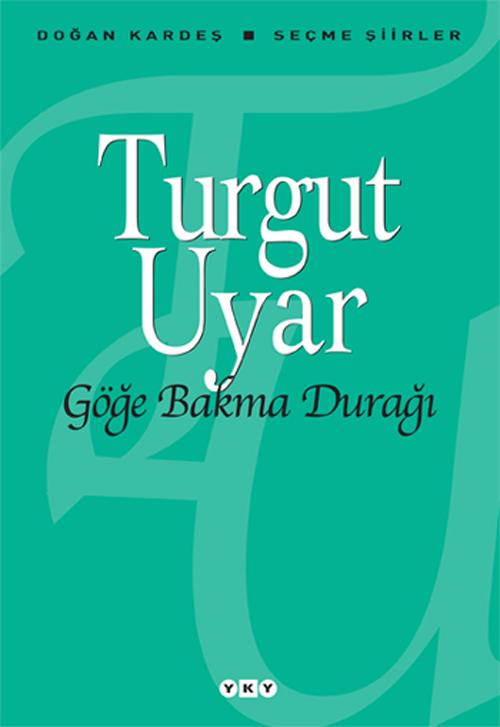

  
# Göğe Bakma Durağı - Turgut Uyar
## 112 Sayfa
### 04.09.2021
  
 

  

    
     

 
 

> ***(Tanıtım Bülteninden - Yapı Kredi Yayınları)***

***İkimiz birden sevinebiliriz göğe bakalım  
Şu kaçamak ışıklardan şu şeker kamışlarından   
Bebe dişlerinden güneşlerden yaban otlarından  
Durmadan harcadığım şu gözlerimi al kurtar  
Şu aranıp duran korkak ellerimi tut  
Bu evleri atla bu evleri de bunları da   
Göğe bakalım***  

_____

Bektaş mayıs böceği kadar yalnızdı,   
Esaretinde hürriyetinde sevdasında,   
Üç yaşında da yalnızdı, on beşte de, seksende de,   
Yağmurların altında, bulakların kenarında.   
Türküsünde, koşmasında, şarkısında,   
Tamamda da noksanda da,   
Papatya gibi yalnızdı, kuşyemi gibi yalnızdı. (s.13)

_____

Ne denmişse yalan hayat için,   
Işte o, yaşandığı gibi sokaklarda.   
Cümle geçmişimi aziz bileceğim   
Turnam bir gün bırakmıyacağım seni   
Yaşamak ve sevmek için ardarda,   
Ömrüm oldukça peşinden geleceğim... (s.15)
_____

**GÖĞE BAKMA DURAĞI** 

İkimiz birden sevinebiliriz göğe bakalım  
Şu kaçamak ışıklardan şu şeker kamışlarından  
Bebe dişlerinden güneşlerden yaban otlarından  
Durmadan harcadığım şu gözlerimi al kurtar  
Şu aranıp duran korkak ellerimi tut  
Bu evleri atla bu evleri de bunları da 
Göğe bakalım

Falanca durağa şimdi geliriz göğe bakalım  
İnecek var deriz otobüs durur ineriz  
Bu karanlık böyle iyi afferin Tanrıya  
Herkes uyusun iyi oluyor hoşlanıyorum  
Hırsızlar polisler açlar toklar uyusun  
Herkes uyusun bir seni uyutmam bir de ben uyumam  
Herkes yokken biz oluruz biz uyumayalım  
Nasıl olsa sarhoşuz nasıl olsa öpüşürüz sokaklarda  
Beni bırak göğe bakalım

Senin bu ellerinde ne var bilmiyorum göğe bakalım  
Tuttukça güçleniyorum kalabalık oluyorum  
Bu senin eski zaman gözlerin yalnız gibi ağaçlar gibi  
Suların ısınsın diye bakıyorum ısınıyor  
Seni aldım bu sunturlu yere getirdim  
Sayısız penceren vardı bir bir kapattım  
Bana dönesin diye bir bir kapattım  
Şimdi otobüs gelir biner gideriz  
Dönmeyeceğimiz bir yer beğen başka türlüsü güç  
Bir ellerin bir ellerim yeter belliyelim yetsin  
Seni aldım bana ayırdım durma kendini hatırlat  
Durma kendini hatırlat  
Durma göğe bakalım (s.27)

______

 

### Kitaptan Alıntılar ;
- ***"Sen nereye, ben oraya, adım adım  
İnsan sevdikçe iyileşiyor artık anladım..." (s.14)***
- ***Evet kimsesizdik ama umudumuz vardı." (s.20)***
- ***"Hiçbir şey umurumda değil diyorum   Aşktan ve umuttan başka (s.21)***
- ***"Aşkımda değişebilir gerçeklerim de" (s.24)***
- ***"Bir biz ikimiz varız güzel öbürleri hep çirkin" (s.25)***
- ***"İkimiz birden sevinebiliriz göğe bakalım" (s.27)***
- ***"Herkes uyusun bir seni uyutmam bir de ben uyumam  
Herkes yokken biz oluruz biz uyumayalım  
Nasıl olsa sarhoşuz nasıl olsa öpüşürüz sokaklarda  
Beni bırak göğe bakalım" (s.27)***
- ***"Senin bu ellerinde ne var bilmiyorum göğe bakalım  
Tuttukça güçleniyorum kalabalık oluyorum" (s.27)***
- ***"Seni aldım bana ayırdım durma kendini hatırlat  
Durma kendini hatırlat  
Durma göğe bakalım" (s.27)***
- ***"Başının o ağrısı beni görüncedir   Bana baktıkça yalnızlığın geliyor aklına" (s.29)***
- ***"Bu ellerimi nereye koysam yakışmıyor   Dedim ki en iyisi kucağında dursun" (s.30)***
- ***"Güzelim   Galiba sonundayız uykumuzun." (s.44)***
- ***"Bütün çalar saatlerin   Derin ve güzel bir su'yu vurduğu zamanda   Hızla gelişecek kalbimiz." (s.53)***
- ***"Seversin diye söylerim her şeyi, sana uygun olsun   çünkü her şeyin birbirine uygununu sen bulursun" (s.66)***
- ***"İlaç milaç bok püsür   şuramda bir şeyler var   sahiden bir şey var   haykırmadan anlatamam." (s.68)***
- ***"Ne kadar sürebilir ölümün en son düşünülmesi gereken bir kurtuluş olduğu." (s.69)***
- ***"Ne kadar yalnız olduğumuzu hep hatırla" (s.72)***
- ***"kanın ateşin ve seslerin böyle cömertçe kullanıldığı   böyle sorumsuzca kullanıldığı bir dönemde   herkesin şimdilik hakkı vardır hüzünlenmeye" (s.75)***
- ***"sevgim acıyor   Kimi sevsem   Kim beni sevse (s.87)***
- ***"Eylül toparlandı gitti işte   Ekim filan da gider bu gidişle" (s.87)***