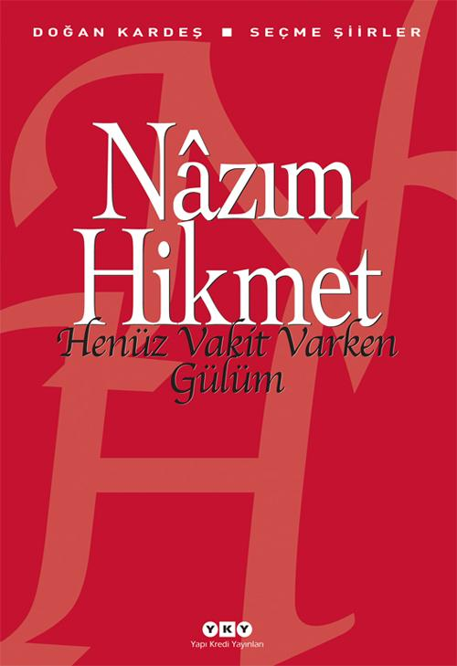

  
# Henüz Vakit Varken Gülüm - Nâzım Hikmet
##  112 Sayfa
### 24.09.2021
  
 

  

    
     

 
 

> ***(Tanıtım Bülteninden - Yapı Kredi Yayınları)***

***Henüz vakit varken, gülüm,  
Paris yanıp yıkılmadan,  
henüz vakit varken, gülüm,  
yüreğim dalındayken henüz,  
ben bir gece, şu Mayıs gecelerinden biri  
Volter Rıhtımında dayayıp seni duvara   
öpmeliyim ağzından   
sonra dönüp yüzümüzü Notrdama  
çiçeğini seyretmeliyiz onun,   
birden bana sarılmalısın, gülüm,  
korkudan, hayretten, sevinçten   
ve de sessiz sessiz ağlamalısın,   
yıldızlar da çiselemeli  
incecikten bir yağmurla karışarak.***  
***...***  
***Bu kitap, hem Türk şiirinde büyük bir çığır açmış, hem de modern dünya şiirinde Türkçeye yer açmış bu büyük şairle tanışmak için güzel bir buluşma yeri olması umuduyla hazırlandı.***
_____

***[Piraye için yazılmış şiirler: SAAT 21-22 ŞİİRLERİ'nden]***

Ne güzel şey hatırlamak seni:   
ölüm ve zafer haberleri içinden,   
hapiste ve yaşım kırkı geçmiş iken...  

Ne güzel şey hatırlamak seni:   
bir mavi kumaşın üstünde unutulmuş olan elin   
ve saçlarında   
vakur yumuşaklığı canımın içi İstanbul toprağının...   
İçimde ikinci bir insan gibidir  
seni sevmek saadeti....   
Parmakların ucunda kalan kokusu sardunya yaprağının,   
güneşli bir rahatlık ve etin daveti:   
kıpkızıl çizgilerle bölünmüş  
sıcak  
koyu bir karanlık...  

Ne güzel şey hatırlamak seni,   
yazmak sana dair,   
hapiste sırtüstü yatıp seni düşünmek:   
filânca gün, falanca yerde söylediğin söz,  
kendisi değil  
edasındaki dünya...  

Ne güzel şey hatırlamak seni.   
Sana tahtadan bir şeyler oymalıyım yine :  
bir çekmece  
bir yüzük, ve üç metre kadar ince ipekli dokumalıyım.   
Ve hemen  
fırlayarak yerimden   
penceremde demirlere yapışarak   
hürriyetin sütbeyaz maviliğine  
sana yazdıklarımı bağıra bağıra okumalıyım...  

Ne güzel şey hatırlamak seni:   
ölüm ve zafer haberleri içinden,   
hapiste   
ve yaşım kırkı geçmiş iken... (s.46-47)  

____

***24 EYLÜL 1945***

En güzel deniz:  
henüz gidilmemiş olanıdır.   
En güzel çocuk :  
henüz büyümedi.   
En güzel günlerimiz:  
henüz yaşamadıklarımız.   
Ve sana söylemek istediğim en güzel söz:  
henüz söylememiş olduğum sözdür.  

_____

***Bugün pazar.  Bugün beni ilk defa güneşe çıkardılar.   Ve ben ömrümde ilk defa gökyüzünün bu kadar benden uzak   bu kadar mavi   bu kadar geniş olduğuna şaşarak   kımıldamadan durdum. (s.56)***

____

***[RUBAİLER'den]***

Sarılıp yatmak mümkün değil bende senden kalan hayâle.   
Halbuki sen orda, şehrimde gerçekten varsın etinle kemiğinle   
ve balından mahrum edildiğim kırmızı ağzın, kocaman gözlerin  
gerçekten var   
ve âsi bir su gibi teslim oluşun ve beyazlığın ki dokunamıyorum bile.  

Öptü beni :"-- Bunlar, kâinat gibi gerçek dudaklardır," dedi.   
"Bu itir senin icâdın değil, saçlarımdan uçan bahardır," - dedi.  
"Ister gökyüzünde seyret, ister gözlerimde:   
"körler onları görmese de, yıldızlar vardır," - dedi... (s.57)

_____

***YAŞAMAYA DAİR***

Yaşamak şakaya gelmez,   
büyük bir ciddiyetle yaşayacaksın  
bir sincap gibi meselâ,   
yani, yaşamanın dışında ve ötesinde hiçbir şey beklemeden,  
yani, bütün işin gücün yaşamak olacak.  

Yaşamayı ciddiye alacaksın,   
yani, o derecede, öylesine ki,   
meselâ, kolların bağlı arkadan, sırtın duvarda,   
yahut, kocaman gözlüklerin,  
beyaz gömleğinle bir laboratuvarda  
insanlar için ölebileceksin,   
hem de yüzünü bile görmediğin insanlar için,   
hem de hiç kimse seni buna zorlamamışken,   
hem de en güzel, en gerçek şeyin  
yaşamak olduğunu bildiğin halde.  

Yani, öylesine ciddiye alacaksın ki yaşamayı,   
yetmişinde bile, meselâ, zeytin dikeceksin,  
hem de öyle çocuklara falan kalır diye değil,   
ölmekten korktuğun halde ölüme inanmadığın için,  
yaşamak, yani ağır bastığından. (s.62)  
1947

____

Diyelim ki, hapisteyiz,   yaşımız da elliye yakın,   daha da on sekiz sene olsun açılmasına demir kapının.   Yine de dışarıyla beraber yaşayacağız,   insanları, hayvanları, kavgası ve rüzgarıyla   yani, duvarın arkasındaki dışarıyla. 

Yani, nasıl ve nerde olursak olalım   hiç ölünmeyecekmiş gib yaşanacak... (s.63)
____

***YİNE SANA DAİR*** 

Sende, ben, kutba giden bir geminin sergüzeştini,   
sende, ben, kumarbaz macerasını keşiflerin,   
sende uzaklığı, sende, ben, imkânsızlığı seviyorum.  

Güneşli bir ormana dalar gibi dalmak gözlerine   
ve kan ter içinde, aç ve öfkeli,   
ve bir avcı iştihasıyla etini dişlemek senin.  

Sende, ben, imkânsızlığı seviyorum,   
fakat aslâ ümitsizliği değil... (s.66)  
[1948]

____

***"Hiroşima'da öleli   oluyor bir on yıl kadar.   Yedi yaşında bir kızım,   büyümez ölü çocuklar. (s.79)***
____

***MAVİ LİMAN***

Çok yorgunum, beni bekleme kaptan.  
Seyir defterini başkası yazsın.  
Kubbeli, çınarlı mavi bir liman.  
Beni o limana çıkaramazsın...(s.86)  

Balçik, 1 Temmuz 1957

_____

Çocuklar koşuyor avluda,  
avluda koşuyor çocuklar.  
İhtiyar bir kadın geçiyor sokaktan,  
sokaktan ihtiyar bir kadın geçiyor,  
geçiyor sokaktan ihtiyar bir kadın. (s.90)

_____

***HENÜZ VAKİT VARKEN GÜLÜM***

Henüz vakit varken, gülüm,   
Paris yanıp yıkılmadan,   
henüz vakit varken, gülüm,   
yüreğim dalındayken henüz,   
ben bir gece, şu Mayıs gecelerinden biri   
Volter Rıhtımı'nda dayayıp seni duvara  
öpmeliyim ağzından   
sonra dönüp yüzümüzü Notrdam'a  
çiçeğini seyretmeliyiz onun,   
birden bana sarılmalısın, gülüm,  
korkudan, hayretten, sevinçten   
ve de sessiz sessiz ağlamalısın,   
yıldızlar da çiselemeli  
incecikten bir yağmurla karışarak.  

Henüz vakit varken, gülüm,   
Paris yanıp yıkılmadan, henüz vakit varken, gülüm,   
yüreğim dalındayken henüz,   
şu Mayıs gecesi rıhtımdan geçmeliyiz  
söğütlerin altından, gülüm,  
islak salkımsöğütlerin.   
Paris'in en güzel bir çift sözünü söylemeliyim sana,  
en güzel, en yalansız,   
sonra da islıkla bir şeyler çalarak  
gebermeliyim bahtiyarlıktan  
ve insanlara inanmalıyız.  

Yukarda taştan evler,  
girintisiz, çıkıntısız,  
birbirine bitişik   
ve duvarları ayışığından   
ve dimdik pencereleri ayakta uyukluyor   
ve karşı yakada Luvr  
aydınlanmış ışıldaklarla   
aydınlanmış bizim için  
billûr sarayımız..  

Henüz vakit varken, gülüm,   
Paris yanıp yıkılmadan,   
henüz vakit varken, gülüm,   
yüreğim dalındayken henüz,   
şu Mayıs gecesi rıhtımda, depolarda  
kırmızı varillere oturmalıyız.   
Karşıda karanlığa giren kanal.   
Bir şat geçiyor,   
selâmlayalım, gülüm,   
geçen sarı kamaralı şat'ı selâmlayalım.   
Belçika'ya mı yolu, Hollanda'ya mı?   
Kamaranın kapısında ak önlüklü bir kadın  
tatlı tatlı gülümsüyor.  

Henüz vakit varken, gülüm,   
Paris yanıp yıkılmadan,   
henüz vakit varken, gülüm...   
Parisliler, Parisliler,   
Paris yanıp yıkılmasın... (s.95-96)  

13 Mayıs 1958, Paris

____

 

### Kitaptan Alıntılar ;
- ***"Sende çıkar göğsünün kafesinden yüreğini;   şu güneşten düşen  ateşe fırlat   yüreğini yüreklerimizin yanına at!" (s.12)***
- ***"Yüreklerin kulakları sağır...   Hava kurşun gibi ağır..." (s.22)***
- ***"Ben yanmasam sen yanmasan biz yanmasak, nasıl çıkar karanlıklar aydınlığa..." (s.23)***
- ***"Şimdi ne söylüyorsam   karanlıkta bir fısıltı gibi sen öğrettin bana.." (s.28)***
- ***"Kadın sustu.   SARILDILAR   Bir kitap düştü yere...   Kapandı bir pencere...   AYRILDILAR..." (s.29)*** 
- ***"Yalnız unutma bir şeyi:   yorulur da   ayağın kayarsa eğer   seni herkesten önce ben taşlarım!" (s.32)*** 
- ***`"En fazla bir yıl sürer`   `yirminci asırlılarda ölüm acısı." (s.33)`***
- ***"Ve unutma ki   daima iyi şeyler düşünmeli!" (s.34)***
- ***"O şimdi ne yapıyor   şu anda, şimdi, şimdi?" (s.48)***
- ***"Dışarda bahar geldi karıcığım, bahar.   Dışarda, bozkırın üstünde birdenbire   taze toprak kokusu, kuş sesleri ve saire..." (s.55)***
- ***"fakat yine de çıldırasıya merak edeceğiz   belki yıllarca sürecek olan savaşın sonunu." (s.63)***
- ***"bir de ekmeği   son lokmasına dek yemeyi   bir de ağız dolusu gülmeyi unutma hiçbir zaman." (s.68)***
- ***`"Bir de kim bilir`   `sevdiğin kadın seni sevmez olur." (s.68)`***
- ***"Ne ölümden korkmak ayıp,   ne de düşünmek ölümü." (s.77)***
- ***"En iyisi ağaçlar,   ağaçlar anılardan uzun yaşar...   Git orda en yaşlı kestanenin altına otur bir gün.   Her şeyi unut,   ayrılığımızı bile,   sede beni düşün..." (s.85)***
- ***"Bu sarı sıcaklarda seni düşünüyorum   bu sarı sıcaklarda bir otel odasında seni düşünüp   yalnızlığımı soyunuyorum   biraz da ölüme benzeyen yalnızlığımı." (s.100)***
- ***"...kimi insan otların kimi insan balıkların çeşidini bilir   ben ayrılıkların   kimi insan ezbere sayar yıldızların adını   ben hasretlerin." (s.103)***
