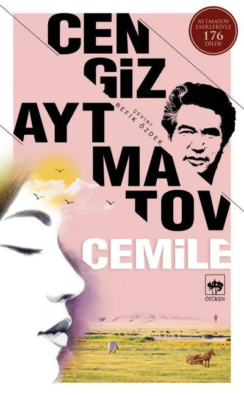

  
# Cemile - Cengiz Aytmatov
##  80 Sayfa
### 03.10.2021
  
 

  

    
     

 
 

***Karakterler;***
- ***Seyit:*** Kahramanımız, genç.
- ***Cemile:*** Seyit'in yengesi. Evli.
- ***Orozmat:*** Cemile ve Seyit'i cepheye çağıran komutan.
- ***Danyar:*** Seyit ve Cemile ile birlikte erzak taşıyan adam.

 

> ***(Tanıtım Bülteninden - Ötüken Yayınları)***

_____

Gözle görülmeyen, varlığı kimse için bir önem teşkil etmeyen, yokluğu kimseyi korkutmayan Danyar’ın türkü söyleyerek kendini, vatan aşkını, ruhunun derinliklerini açığa çıkarması ve sonrasında gelişen tüm olaylar…❝Bir insan kendini gösterecek bir şey yapmazsa, yavaş yavaş unutulur gider.❞ diyor ya zaten Cengiz Aytmatov da. Danyar kendini gösterdi ve çok şey kazandı.

_____

Hikayenin anlatıldığı zaman en yoğun savaş dönemleri.. Erkekler savaşlar için cephelere gitmişler, aynı zamanda çoğu dönememiş. Gençler okullarını bırakmak zorunda kalmış.. Böyle bir ortamda son çare Kahramanımız Seyit ve yengesi Cemile, cepheye erzak taşımak için görevlendirilir.. Aynı zamanda Seyit ve Cemile ile birlikte bu işi yapan Danyar ismindeki biraz yaşlı ve savaştan sakat, gazi olarak dönen bir adam vardır.. Danyar, sessiz sakin, konuşmayan ve aynı zamanda gariban bir adamdır. Danyar'ın bacağı sakattır ve aksamaktadır.

Uzun bir süre birlikte cepheye erzak taşırlar.. Seyit ve Cemile, Danyar ile alay eder ve onunla eğlenirler.. Danyar tüm bu olanlara hiçbir karşılık vermez..   Bir gün Seyit ve Cemile, şaka olsun diye Danyar'ın arabasına iki kişinin taşıması gereken çuvalı yüklerler. Danyar bunu fark etmez. Danyar tek başına o çuvalı sırtına alır ve sonrasında bunu fark eder.. Ama iş işten geçmiştir. Kendisine oynanan bu oyun karşısında gurur yapar ve Danyar o çuvalı tek başına taşımaya çalışır. Her ne kadar çok zorda olsa o çuvalı taşır ama, hiç hali kalmamıştır, bacağını çok fazla zorlamıştır.. Seyit, Cemile ve diğer insanların çuvalı sırtından bırak yere at uyarılarına rağmen onları dinlememiştir...  Danyar'ın bu halini gören Cemile ve Seyit çok pişman olmuşlardır ama iş işten geçmiştir.

Neyse ki devam eden günlerde. İlk önce Cemile türkü söylemeye başlar, sonrasında ise Danyar'ı söylemesi için teşvik eder.. Nitekim Danyar'da türkü söylemeye başlar. Danyar'ın o kadar güzel sesi vardır ki herkesi mest eder... Bu günlerce böyle sürer, her yolculuk esnasında Danyar türküler söyler...

Yine bir gün dönüş yolunda Danyar türkü söylerken, Cemile onun arabasına geçer ve Danyar'a sarılır.. Bir süre o şekilde kalırlar.. Bu ikisini bu şekilde gören Seyit, ilk başta anlam veremez ama sonrasında birbirlerine nasıl aşık olduklarını anlar.. Aradan biraz süre geçtikten sonra Seyit, onların o sarıldıkları anı gözünde canlandırarak çok güzel bir şekilde resim çizer.... 

En sonunda ise Cemile ve Danyar birbirlerine aşklarını itiraf ederler. Danyar ve Cemile, birlikte kaçarlar.. Bu ikisinin arkasından her ne kadar söylenmeyen kötü söz kalmasa da.. Seyit onların birbirlerini ne kadar sevdiklerini ve mutlu olabileceklerini bilen tek kişidir...

***- SON -***
___________

***Hâlâ unutamıyorum. Omuzlayıp taşıdığım çuvallar pek ağırdı. Aslında bu işler daha büyük ve güçlü erkeklerin harcıdır. Gıcırdayan tahta merdivenin basamaklarında sendeleyerek, çuval düşmesin diye bir kenarını dişlerimle de sımsıkı tutarak, titreye titreye yukarı çıkıyordum. Tozdan boğazım gıcıklanıyor, ağırlığın altında belim eziliyor, gözlerimin önünde kıvılcımlar oynaşıyordu. Kaç defa yarı yola geldiğim zaman kuvvetim iyice tükenmiş, çuvalın sırtımdan kaymasına engel olamayacağımı anlamış ve çuvalla beraber aşağıya yuvarlanmayı istemişimdir. Ama, arkamdan gelenler vardı ve onlar da çuval taşıyordu, onlar da benim yaşımda olan çocuklar ya da benim gibi çocukları olan asker karılarıydı. Eğer savaş olmasaydı, bunlara böyle ağır yükleri taşıtırlar mıydı? Kadınlar da bu ağır işleri yaptıklarına göre benim isyan etmeye hakkım yoktu. (s.37)***

____

***Birden her şey aydınlandı kafamda. Bazılarını kuşkulandıran, bazılarının alaya almalarına sebep olan o yabanîliğin, o tuhaflığın sebebini, onun bir hayal adamı, yalnızlığı, suskunluğu seven bir insan oluşunun sebebini, şimdi çok iyi anlıyordum. Akşam vakitlerini niçin Nöbet Tepesi'nde geçirdiğini, bütün gece çay kenarında niçin yapayalnız durduğunu, başkalarının işitemediği seslere niçin hep kulak kabarttığını, bazen birdenbire gözlerinin niçin parladığını, kaşlarını yukarı kaldırdığını anlıyordum şimdi: Danyar âşıktı. Denizler kadar derindi onun aşkı. Bunu iyice seziyordum, ama başkalarının aşkına hiç benzemiyordu. Çok büyük bir aşktı bu. Hayat âşığı, toprak âşığı, tabiat âşığı idi. Bu aşkını içinde saklıyor ve türkülerde duyup yaşıyordu. İlgisiz bir insan, âşık olmayan bir insan, sesi ne kadar güzel olursa olsun, böyle şarkı, böyle türkü söyleyemez. (s.49)***

_____

***Insanların savaşa gitmek için düştükleri yollarda acılar, acı yakarışlar kalıyordu...
Bütün bu yeryüzü güzelliklerini ve tasalarını gözlerimin önüne seren Danyar'ın türküleriydi. Bütün bunları nereden, kimden duyup öğrenmişti? Ancak vatanını çok seven ve uzun yıllar onun hasretini çeken bir insan söyleyebilirdi bu vatan türkülerini. Hasret çektiği için öğrenip söylediğini çok iyi anlıyordum şimdi. Türkü söylerken onu, bozkır yollarında koşup oynayan ya da bu yolları arşınlayan küçük bir çocuk olarak canlandırıyordum gözümde.   
Belki bu vatan türküleri o çocukluk günlerinde, savaşta, ateş altında, sonu gelmez yürüyüşler arasında doğmuştu ruhunda.   
Danyar'ı dinlerken, yere kapanarak toprağımızı, onu çok seven bir evlat gibi öpmek istiyordum. Çok seven insan böyle yapar. İşte o zamanlar ilk defa içimde bir şeyin, ad veremediğim ama zaptedilmez bir şeyin uyandığını hissettim. Bu, duyduklarımı, düşündüklerimi ve gördüklerimi yalnız kendime saklamamak, onu bir yolla ifade ederek başkalarıyla da paylaşmak arzusu idi. Düşünce ve duygularımı, topraklarımızın güzelliğini, Danyar'ın yaptığı gibi, ateşn bir ilhamla başkalarına anlatmak istiyordum. Buna zorunlu hissediyordum kendimi. Kalbim, bilemediğim bir şey karşısında, bilinçsiz bir sevinç, bilinçsiz bir korku ile durmuştu sanki. O zamanlar resim yapmak için fırçayı elime almam gerekiyormuş. Ama ben bunu anlamamıştım. (s.53)***

____

***Hıçkıra hıçkıra bağırıyordum: - Cemileee! Cemileee!...  
Bana en yakın ve en sevdiğim insanlardan ayrılmıştım. İşte o zaman, yerde uzanıp yattığım o anlarda, birden anladım Cemile'yi sevdiğimi. Evet, sevmiştim ve bu benim ilk çocukluk, ilk gençlik aşkımdı.  
Yüzüm, gözyaşlarımdan ıpıslak olan kolumun üzerinde, bir süre öylece kalakaldım. Ben yalnız Cemile'den ve Danyar'dan değil, çocukluğumdan da ayrılmıştım. (s.75)***

_____

***Tablomun kusursuz bir sanat eseri olmayışı umurumda değil. Insan bir çırpıda büyük usta olamaz. Ama o benim için eşsiz bir değer taşıyor, onu çok, çok severim. O benim ilk bilinçli yaratma heyecanımdır.  
Bugün de ara sıra başarısızlığa uğradığım, kendime olan güvenimi sarsacak kadar zorlu dakikalar yaşadığım olur. İşte böyle zamanlarda, çok sevdiğim bu tablonun, Danyar ve Cemile'nin karşısına geçerim. Uzun uzun bakar ve her bakışımda konuşurum onlarla.  
“Şimdi nerelerdesiniz, hangi yollarda yürüyorsunuz? Artık bizde, bozkırda, bütün Kazakistan'ı aşan, Altay'lara ve Sibirya'ya kadar ulaşan yollar var! Nice cesur insanlar oralarda çalışıyor. Siz de mi o ülkelere gittiniz! Cemile'm! O geniş bozkırda, hiç ardına bakmadan yürüyüp gittin! Yoruldun mu, kendine olan inancını yitirdin mi? Öyleyse Danyar'a yaslan. Sana, aşk üstüne, vatan sevgisi üstüne, hayat üstüne türkülerini söylesin! Bozkır canlansın ve bütün renkleriyle oynamaya başlasın! Git Cemile, git! Hiç pişman olma, sen mutluluğunu en sarp yollarda yürüyerek buldun!.."  
Onlara bakıyor ve Danyar'ın sesini işitiyorum. Beni de yola çağırıyor: Demek ki bavulumu alıp gitmemin zamanı geldi. Ben de bozkıra, kendi köyümüze döneceğim, orada yeni renkler bulacağım.
Fırçayı her vuruşumda Danyar'ın türküsü çınlasın! Fırçayı her vuruşumda Cemile'nin yüreği çarpsın! (s.80, son sayfa)***

____
 

### Kitaptan Alıntılar ;
- ***"Daha bu yaşta gece gündüz çalışmaktan canı çıkan bu çocuğa yiğit diyorsunuz ha! Bizim yiğitlerin, o sevgili evlâtlarımızın nerede olduğunu Allah bilir. Şimdi evlerimiz terkedilmiş bir oba gibi ıssız kaldı." (s.14)***
- ***"Evet, bizim gelin öyledir, derdi annem, doğruyu insanların yüzüne karşı söylemeyi sever. Böylesi dedikodu yapmaktan, dolaylı ve iğneli sözler söylemekten iyidir. Sizinkiler erdemli görünüp saman altından su yürütürler." (s.16)***
- ***"Ama kendi annemi anlamıyordum: O, hiç kimseyi lâf olsun diye sevecek bir kadın değildi. Annem sert tabiatlı, hükmeden, hükmetmesini bilen bir kadındı. O kendi kurallarına göre yaşardı ve bundan hiç şaşmazdı, hiç tâviz vermezdi." (s.16)***
- ***"Düşündüğünü dobra dobra söyler, fikirlerini açıklamaktan ve savunmaktan çekinmezdi." (s.16)***
- ***"Yalnız şunu bilmelisin ki, mutluluk ancak namus ve haysiyetini koruduğun sürece vardır. Bu sözümü sakın unutma!" (s.17)***
- ***"Osman gibileri kalbimden geçenleri ne bilsin? Kimse bilemez... Belki bunu anlayacak kimse yoktur dünyada..." (s.22)***
- ***"Öz vatanını, öz milletini kim sevmez!" (s.27)***
- ***"Ona, duygu ve düşüncelerini gizlemesini öğreten, pek zahmetli geçmiş öksüzlük yılları mıydı?" (s.29)***
- ***"İnsan kendini gösterecek bir şey yapmazsa, yavaş yavaş unutulur gider." (s.34)***
- ***"Serin havada yol almak, atların dalgalı bellerini seyretmek, Ağustos gecesini dinlemek ve kokularını içine çekmek, çok büyük bir zevk verir insana!" (s.46)***
- ***"Anladım ki sessizlik onu da duygulandırmış. Böyle bir gecede susup durmak imkânsızdır. Böyle bir gecede insan şarkı söylemek ister!" (s.46)***
- ***"İlgisiz bir insan, âşık olmayan bir insan, sesi ne kadar güzel olursa olsun, böyle şarkı, böyle türkü söyleyemez." (s.49)***
- ***"Hem konuşmaya ne gerek vardı? İnsan her şeyi anlatamaz, zaten kelimeler de her şeyi anlatmaya yetmez..." (s.51)***
- ***"Insanların savaşa gitmek için düştükleri yollarda acılar, acı yakarışlar kalıyordu..." (s.53)***
- ***"Belki bu duygu uzun zamandan beri ruhumuza saklanmıştı da şimdi gün ışığına çıkıyordu." (s.58)***
- ***"Ama bambaşka iki insan olmuşlardı. Harikulâde mutlu iki insan. Mutluluk denen şey bu değil midir?" (s.60)***
- ***"Hayat niçin bu kadar karmaşık, bu kadar anlaşılmaz?" (s.69)***
- ***"Kabahat benim mi? Sende kabahatli değil misin?.." (s.70)***
- ***"Uzun zamandan beri seviyorum seni... Bilmediğim zamanlardan beri seni  sevmiş, seni beklemişim ben. Ve işte geldin, seni beklediğimi biliyormuş gibi geldin!" (s.71)*** 
- ***"Mutluydum. Bİr hastalıktan sonra ilk defa güneşe çıkmış gibi bir duygu vardı içimde." (s.72)***
- ***"Varsın Danyar'ın kaputu eski, pabuçları delik olsun! Ondaki ruh zenginliğinin bizim hiçbirimizde bulunmadığını çok iyi biliyorum ben." (s.76)***
