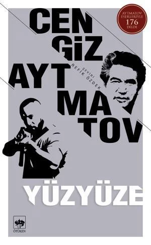

  
# Yüzyüze - Cengiz Aytmatov
##  63 Sayfa
### 07.10.2021
  
 

  

    
     

 
 

***Karakterler;***
- ***Seyde:*** Kahramanımız, kadın.
- ***İsmail:*** Seyde'nin kocası.
- ***Totoy:*** Seyde'nin komşusu, 3 çocuk sahibi.

 

> ***(Tanıtım Bülteninden)***

***Cengiz Aytmatov'un Yüzyüze isimli hikâyesi, bir Kırgız köyündeki erkeklerin askere alınması neticesinde hayatlarını tek başlarına idame etme mecburiyetinde olan kadınları, onların çektiği çileleri anlatır. Bu kadınlardan hele bir tanesi vardır ki o, cesaret ve fedakarlık timsali olarak karşımıza çıkar: Topladığı buğday tanelerinden ekmek yapmaya çalışan, her türlü meşakkate rağmen yılmayan Seyde… Ve buna karşılık savaştan kaçıp mağaraya saklanan, cephede savaşan erkeklerin cesaretinden nasiplenmemiş İsmail… Seyde'nin aşkı İsmail… Aytmatov'un, yayımlandığı zaman hayli ses getiren hikayesi Yüzyüze okuyucuya birçok duyguyu tattırırken, aynı zamanda devlet ve fert çatışmasından da bahseder. Yazar bu hikaye için şöyle der: “Yüzyüze'de anlatmaya çalışılan ana konu devlet otoritesi ve bireyin karşı karşıya gelmesi olgusudur. Bu sadece Sovyetler Birliği'nde olan bir olgu değildir; bütün savaşlarda devlet ve birey çatışması vardır.”***
_____

Seyde ve İsmail yeni evli bir çifttir. Evliliklerinin başında daha yeni bir ev inşa etmektedirler ve çok güzel hayalleri vardır. Fakat hiçbir şey beklendiği gibi gitmez. Bir anda savaş çıkar ve İsmail askere çağırılır.. Henüz evliliklerinin başında, birlikte zaman geçiremeden birbirlerinden ayrılırlar. Aynı zamanda bu sıralarda Seyde ise hamiledir.. Seyde kocasından koparıldığı sırada kocasının bile karısının hamile olduğundan haberi yoktur.

Aradan biraz zaman geçtikten sonra ise bir gece İsmail çıkıp gelmiştir. Fakat bu çıkıp geliş hiçte masum değildir, yani askerden kaçmıştır.. Onca zamanın ayrı kalmasının ardından hasret giderirler.. Sonrasında ise Seyde, kocasını köyden biraz uzak bir mağaraya saklamıştır.. İlerleyen zamanlarda Seyde, kocası için yiyecek ve içecek götürüp getirmektedir.

Aynı zamanda Seyde'nin komşusu Totoy isminde bir kadın daha vardır. O kadının da kocası askere gitmiştir ve haber alamamaktadır.. Aynı zamanda kadının üç tane çocuğu vardır ve çok zorluk çekmektedirler..

Artık kış vakti gelmiştir. Hem Seyde ve çocuğu hemde komşusu Totoy ve çocukları sefalet içerisinde yaşamakta ve yiyecek bir şey bulmakta zorlanmaktadırlar.. Aynı şekilde Seyde, her gün o soğukta, yağan kara rağmen mağarada yaşayan kocasına yemek götürmektedir.. Seyde en sonunda ise tarlalardan tek tek buğday tanesi toplayacak duruma gelmiştir.. Fakat bunun zıttı bir şekilde kocası günden güne iyice hırçınlaşmış ve Seyde'den daha fazla yiyecek bir şeyler istemektedir..

Aynı zamanlarda Seyde, komşusunun çocukları ile karşılaştıklarında çocukların haline gerçekten acımaktadır ve üzülmektedir.. Komşusu Totoy'un ineği vardır ve doğurmak üzeredir.. Bu kış gününde yiyeceklerinin de kalmadığı zamanda Totoy, bir an önce ineğinin doğurmasını ve yavrularına süt verebilmesini dört gözle beklemektedir... Fakat bir sabah uyandıklarında Totoy'un ineği çalınmıştır.. Köy halkı ve Seyde gün boyu nereye arasalarda ineği bulamazlar..
Seyde bitkin bir şekilde akşam eve döndükten bir süre sonra İsmail eve gelir.. Fakat Seyde'nin dünyası başına yıkılır.. Kocası elinde bir miktar et ile içeriye girmiştir...

Bunun ardından ertesi gün Seyde, görevlileri de alarak kocasının saklandığı yere götürmüştür ve kocasını ele vermiştir.

***- SON -***

__________

***"KÜÇÜK İSTASYANONUN peronunda, ıslak yapraklar çevrintisi, buradaki tek lambanın huzmeleri arasından savrulup geçiyor. Kavaklar yaprak döküyor bu gece. Tüfek harbisi gibi ince ve dik gövdeleri rüzgârda yavaş yavaş sallanıyor. Yüksek uçların uğultusu uzak bir denizi düşündürüyor insana." (s.8)***

_________

***Hiç unutamayacağı bir gündü o. Ayrılık acısı hâlâ dinmemişti: Bütün avıl (köy) askere çağırılanlarla birlikte köyün çıkışına kadar yürüdüler. Seyde, utandığı için, kocasını istediği gibi uğurlayamadı. Gencecik bir gelindi henüz. Utana sıkıla elini eline vermiş ve gözyaşlarını göstermemek için başını öne eğmişti. Ayrılıkları böyle oldu. Ama yiğitler bozkırda görünmez olunca, Seyde, yaşlıların bakışlarından çekindiği için, sevgiyle kocasını kucaklamamış, kalbinin sesine uyamamış olmasına pek üzüldü. Belki onu son defa böyle kucaklamış olacaktı. Onu kucaklamayışına pişman oluyor, yüreği bu acıyla yanıyordu. Hatta eğilip kulağına hamile olduğunu fısıldayacak zaman bile bulamamıştı. O günlerde hamile olduğunu henüz ve belli belirsiz hissetmeye başlamıştı. Ama artık vakit geçmişti ve geçen zaman geri gelmezdi. Ötede, tâ bozkırın oradaki yolda, gidenlerin kaldırdığı toz inip yok olmuştu. (s.12)***

_____

***"Zamanın bu kadar çabuk geçmesi korkunç bir şey, daha düne kadar sümüğü akarak yalınayak dolaşan çocuklar, askerlik çağına gelmişler bile!  Hayatın zevkini tadamadan savaşa gidecekler! Ey kahrolası Cermen, ne zaman bırakacaksın yakamızı?" (s.18)***

____

***Aralarındaki mesafe gittikçe kısalıyordu ve birden yüzyüze geldiler! O zaman Seyde'sini tanıyamadı. Bu kadın o değildi. Başı açık, saçları ağarmış, kucağında yavrusuyla korkusuzca kendisine bakan bu kadın o değildi. Birden onu kendisinden fersah fersah uzaktaymış gibi gördü. Kederinin heybetiyle, erişilmez, ulaşılmaz bir yüceliğe kavuşmuştu. Onun karşısında kendisi ne kadar güçsüz, ne kadar acınacak bir haldeydi!  
Ve İsmail, olduğu yerde sendeledi. Tüfeğini, onlara yaklaşan askerlere doğru fırlatarak ellerini havaya kaldırdı. (s.63, son sayfa)***

____

 

### Kitaptan Alıntılar ;
- ***"Ey ulu yaradan, sana sığındım, kaderimizi senin merhametine bırakıyorum..." (s.9)***
- ***"Böylesine kötü günlerin geleceğini kim düşünür, kim tahmin edebilirdi?" (s.9)***
- ***"Ama o anlarda zaman büyük bir hızla akıp geçiyor, gecelerin ardından gündüzlerin, gündüzlerin ardından gecelerin gelip geçtiğini anlamıyorlardı bile." (s.11)***
- ***"Ama artık vakit geçmişti ve geçen zaman geri gelmezdi. (s.12)***
- ***"Dilediği halde yapamadığı her arzusu, yüreğine bir yara gibi oturdu." (s.12)***
- ***"Orada bir süre her şeyi unutup gökyüzüne bakmak ne iyiydi!" (s.14)***
- ***"Gerekirse daha uzaklara da gideriz. Nereye olursa giderim onunla.. tek yanımda olsun!.. (s.17)***
- ***"Zamanın bu kadar çabuk geçmesi ne korkunç bir şey..." (s.18)***
- ***"İnsan birini seviyorsa, bu sevginin gerçek boyutu ancak ayrılır sırasında anlaşılır." (s.19)***
- ***"Bir erkek ağladığını belli etmemeli, gözyaşlarını göstermemeliydi." (s.22)***
- ***"Ne yapalım?" diye düşündü, herkes kaderini yaşar. İnsanın kaderi daha doğarken yazılmıştır alnına. (s.28)***
- ***"Seyde, kimseye güvenilecek zaman değil, hiç kimseye tek kelime söyleme, babam mezarından kalkıp gelecek olsa, ona bile söyleme, anladın mı?" (s.29)***
- ***"Fırtınadan dalları kopmuş, gövdesi kırılmış bir ağaca benziyordu." (s.30)***
- ***"Rus kadınları cephelere, siperlere gidiyor ve erkek gibi silah kullanıyorlar. Gözlerimle gördüm bunu. Siz ise evde oturuyor, mektup gelmedi diye ağlıyorsunuz!" (s.32)***
- ***"Hayat her gün biraz daha güçleşiyordu." (s.34)***
- ***"Gözünün bütün yaşlarını dökerek ağlamak istiyordu, ağlayamıyordu." (s.46)***
- ***"Bazen böyle hayaller kurmak da iyiydi. İnsan, içini kemiren kaygılardan sıyrılıyordu biraz." (s.50)***
- ***"Kim yapabilir bunu? Kim bu kadar kötü, bu kadar vicdansız olabilir!" (s.53)***
- ***"Şimdi bir tek arzu vardı içinde: Evden kaçmak, böyle bir insanı görmemek, böyle bir insanın bulunabileceğini düşünmemek için, hıçkıra hıçkıra, rastgele koşmak!" (s.58)***
