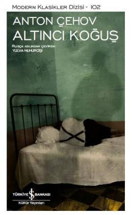

  
# Altıncı Koğuş - Anton Çehov
##  68 Sayfa
### 12.10.2021
  
 

  

    
     

 
 

***Karakterler;***
- ***Moyseyka:*** Yaklaşık yirmi yıl önce şapka atölyesi yandığında aklını yitirmiş. Yalnızca onun hastane avlusundan dışarı çıkma izni vardır.
- ***İvan Dmitriç:*** Bir süre sonra aklını yitiren adam.
- ***Doktor Andrey Yefimıç Ragin:*** Oradaki hastalarla ve altıncı koğuş ile ilgilenen doktor.
- ***Mihail Averyanıç:*** Doktor'un sıkılmadığı tek arkadaşı olan postane müdürü.

 

> ***(Tanıtım Bülteninden - Türkiye İş Bankası Kültür Yayınları)***

**Çehov bir taşra kasabasındaki akıl hastanesinde geçen bu novellasında, eğitimli bir hasta olan İvan Dmitriç ile Doktor Andrey Yefimıç arasındaki felsefi çatışmaya odaklanır. İvan Dmitriç maruz kaldıkları adaletsizliğe, içinde yaşamaya zorlandıkları berbat koşullara karşı çıkarken, Andrey Yefimıç bunları görmezden gelmekte ısrar eder ve durumu değiştirmek için kılını bile kıpırdatmaz. Doktor sonunda içine düştüğü “felsefi” yanılgının farkına vardığında ise artık iş işten geçmiştir. Altıncı Koğuş, Rusya’nın ve ülkenin sorunlarıyla ilgilenmek yerine onları uzaktan izlemeyi tercih eden elit Rus aydınının “deliliği”nin simgesidir adeta.**

**Altıncı Koğuş, Russkaya Mısl dergisinin 1892 kasım sayısında yayımlandığında büyük ilgi görmüştü. Hatta Lenin’in de yapıtı okuduktan sonra dehşete kapıldığı, “Kendimi Alıncı Koğuş’a kapatılmış gibi hissettim” dediği rivayet edilir.**

***`ANTON PAVLOVİÇ ÇEHOV (1860-1904):`*** **Büyük Rus tiyatro yazarı ve modern öykünün en önemli ustalarından olan Çehov, Rus Gerçekçilik okulunun önde gelen temsilcisidir. Taganrog’da dünyaya geldi. Lisede Yunan ve Latin klasiklerini temel alan bir eğitim gördü. 1879’da Moskova’ya giderek tıp fakültesine yazıldı ve 1884’te doktor oldu.** 

**Alacakaranlıkta adlı öykü kitabıyla 1887’de Rus Akademisi tarafından verilen Puşkin Ödülü’nü kazandı. Yaklaşık bin sözcükten oluşan komik kısa öykü türünü başlı başına bir sanat haline getirdi. Ancak 1888’de yayımlanan Bozkır adlı yapıtıyla komik öykülere sırt çevirmiş oldu. Önemli oyunları arasında Ayı (1888), Evlenme Teklifi (1889), Martı (1896), Vanya Dayı (1899), Üç Kız Kardeş (1900) ve Vişne Bahçesi (1903) sayılabilir.**

_____

Altıncı koğuşta başta Moyseyka olmak üzere birden fazla kişi yaşamaktadır. Altıncı koğuş ise akıl sağlığını yitirmiş, deli gözüyle baktıkları insanları kapattıkları bir yerdir.

İvan Dmitriç,  normal bir şekilde hayatını sürdüren sıradan bir memurdur. Ama bir gün İvan Dmitriç, dışarıdayken polislerin suçluları kelepçeleyerek götürmesine şahit olur. Bunun üzerine İvan Dmitriç'in içerisini büyük bir korku kaplar ve her ne kadar hiçbir suç işlememiş olsa dahi polislerin kendisini aynı şekilde alıp götüreceğini düşünür... Bir süre sonra İvan Dmitriç, iyice psikolojisini bozmuştur ve en ufak şeyde korkmaya başlar. En sonunda ise kendisini bodruma kapatmaya ve ardından insanlardan kaçarak uzaklaşmaya başlar... Tüm bunların üzerine İvan Dmitriç'i getirip, altıncı koğuşa kapatırlar.

Bir süre sonra Andrey Yefimıç Ragin ismindeki doktor burada görev yapmaya başlar.. Aradan uzun bir zaman geçmesine rağmen altıncı koğuştaki hastalar bu doktoru hiç sevmez ve aynı zamanda kimse bu doktor ile konuşmaz...   Bir gün Andrey Yefimıç hastanedeyken, İvan Dmitriç doktorun sesini duyar ve bağırmaya başlar. İvan, doktordan ne kadar nefret ettiğinden bahseder ve bunun üzerine Andrey Yefimıç bunun sebebini merak eder... Bunun üzerine bir süre bu ikili sohbet ederler.. Aynı gün Andrey Yefimıç şunları düşünür:   ***Andrey Yefimıç lojmanına doğru yolda yürürken "Ne hoş bir delikanlı!" diye geçirdi içinden. "Burada yaşadığım süre boyunca konuşabildiğim ilk insan herhalde. Hem tartışma becerisine sahip hem de gerekli olan neyse onunla ilgileniyor."   Kitap okurken, yatmaya giderken sürekli İvan Dmitriç'i düşündü. Ertesi sabah uyandığında dün tanıştığı zeki ve ilginç adamı anımsadı. İlk fırsatta tekrar yanına giderek onunla yakınlık kurmaya karar verdi. (s.34-35)***

Ertesi gün doktor yine İvan ile konuşmak için ziyarete gelir..   ***Sohbetleri yaklaşık bir saat kadar devam etti ve görünüşe göre, Andrey Yefimıç'ın üzerinde derin bir etki bıraktı. Her gün hastane binasına gelmeye başladı. Sabahları ve öğleden sonraları geliyor, sık sık  akşamın karanlığına kadar İvan Dmitriç ile sohbet ediyordu. İvan Dmitriç doktordan uzak duruyor, kötü niyetli olmasından şüpheleniyor ve ondan hoşlanmadığını  açıkça dışa vuruyordu. Ama daha sonra alış ve ters tavırları yerini küçümseyen bir ironiye bıraktı. (s.42)***

Aradan uzun bir süre geçti. Andrey Yefimıç, her gün İvan'ı ziyaret edip onunla sohbet ediyordu.. Andrey Yefimıç, İvan ile hiç konuşmuyorken herkes tarafından çok seviliyordu. Fakat bu olanlardan sonra çeşitli dedikodular yayılmaya başladı ve herkes Andrey Yefimıç'den uzaklaşmaya başladı.. Artık Andrey Yefimıç'in akıl sağlığını yitirdiğini düşündüler ve Andrey Yefimıç'in emekli olmasını ve mesleği bırakmasını istediler. Nitekim de böyle oldu.. 

En sonunda Andrey Yefimıç'a sana  yardım edeceğiz diyerek Altıncı Koğuşa getirdiler ve onu oraya kapattılar.. Andrey Yefimıç, her ne kadar kısa bir süreliğine dışarıya çıkmak istesede izin verilmedi. Bunun üzerine Andrey Yefimıç, kendilerini ne hakla burada tuttuklarına isyan etti ve bunun üzerine dayak yedi.. Andrey Yefimıç, artık bu insanların çektiği acıyı görebilmiş ve hissedebilmişti.. Ne yazık ki ertesi gün Andrey Yefimıç öldü.

***Akşama doğru Andrey Yefimiç felç geçirerek başta bütün vücudunu saran bir titremeyle mide bulantısı duydu. Sanki iğrenç bir şey, parmakları dahil bütün vücuduna nüfuz etmiş, midesinden başına kadar yayılmış, gözlerinin ve kulaklarının içine akmıştı. Gözlerinin önündeki her şey yemyeşildi. Andrey Yefimiç sonunun geldiğini anladı. Ivan Dmitriç'in, Mihail Averyanıç'ın ve milyonlarca insanın ölümsüzlüğe inandığını anımsadı. Peki, ölümsüzlük gerçekten var mıydı? Ama o ölümsüzlüğü istemiyordu, sadece bir anlığına aklına gelmişti bu düşünce. Önceki gece hakkında bir şeyler okuduğu güzel ve zarif geyik sürüsü önünden geçip gitti. Daha sonra kadının biri kendisine taahhütlü bir mektup uzattı. Mihail Averyanıç bir şeyler söyledi. Sonra her şey kayboldu ve Andrey Yefimiç sonsuza kadar maziye gömüldü.  
Köylüler gelip doktoru ellerinden ve ayaklarından tutarak şapele götürdüler. Ay işığının aydınlattığı gece boyunca masanın üzerinde gözleri açık yattı. Sabah olunca Sergey Sergeiç geldi. İsa'nın çarmıha gerilmiş tasviri önünde yürekten dua ettikten sonra eski şefinin gözlerini kapadı.  
Ertesi gün Andrey Yefimiç'i defnettiler. Cenazeye sadece Mihail Averyaniç ile Daryuşka gelmişlerdi. (s.68)***

***- SON -***
_________

***Eğer ölüm herkes için olağan ve meşru bir sondan ibaretse insanların ölmelerine engel olmak niye? Bir tüccarın ya da memurun fazladan beş, on yıl yaşamasının kime ne faydası var? Tıbbin gayesini, ilaçların acıları hafifletmesi olarak görürseniz kaçınılmaz olarak ortaya şu soru çıkar: Acıları hafifletmenin amacı nedir? İlk olarak, acıların insanı kusursuzluğa götürdüğü söylenir. İkinci olarak ise, eğer insanoğlu acılarını haplarla ve damlalarla hafifletebileceğini öğrenirse, bugüne kadar onları hem her türlü kötülükten koruyan hem de onlara mutluluk bahşeden dini ve felsefeyi tümüyle terk edebilir. Ölüm döşeğindeki Puşkin korkunç acılara maruz kalmış, zavallı Heine birkaç yıl felçli yaşamıştı. Peki acı çekmedikleri takdirde bir amip gibi bomboş ve anlamsız bir yaşam sürdürecek olan falanca Andrey Yefimiç ya da filanca Matryona Savişna'nın hasta olmasına engel olmak niye? (s.17)***

__________

***Kasabamızda şöyle akıllıca, ilgi çekici şeylerden söz etmeyi bilen ve seven hiç kimsenin olmaması ne kadar da kötü, Saygıdeğer Mihail Averyanıç. Bu bizim için çok büyük bir kayıp. Aydın kesim bile bayağılıktan öteye geçemiyor; gelişme seviyeleri, sizi temin ederim ki, aşağı tabakadan üstün değil.  
  -Tamamen doğru. Size katılıyorum.  
Doktor sakince ve ara vere vere konuşmasına devam ederdi:  
-Siz de çok iyi bilirsiniz ki, bu dünyada insan aklının yüksek manevi dışavurumu dışındaki her şey önemsiz ve sıkıcıdır. Akıl, hayvanlar ve insanlar arasında keskin bir sınır çizer, insandaki ilahi yöne ışık tutar, hatta bir dereceye kadar gerçekte var olmayan ölümsüzlüğün yerini tutar. Buradan yola çıkarak şunu söyleyebilirim ki akıl, elimizde olan yegâne zevk kaynağıdır. Etrafımızda akla dair hiçbir şey görmüyor, duymuyoruz, bu da zevkten mahrum olduğumuz anlamına geliyor. Gerçi elimizin altında kitaplar var, ama bu canlı bir sohbetin, karşılıklı ilişkinin yerini tutmuyor. Çok da doğru olmayan bir kıyaslama yapmama müsaade edecek olursanız, bence kitaplar notaya, sohbet ise şarkı söylemeye benziyor. (s.21-22)***

____

***Düşlerimde sık sık zeki insanlarla sohbet ederken görüyorum kendimi. Babamdan muazzam bir eğitim aldım, ama altmışlı yılların düşüncelerinin etkisi altında olduğundan beni doktor olmam için zorladı. Bana öyle geliyor ki, eğer o zamanlar sözünü dinlememiş olsaydım şu an düşünsel hareketin tam ortasında olurdum. Belki de herhangi bir fakültenin üyesi olurdum. Elbet akıl da sonsuz değil, gelip geçicidir; ancak akla beslediğim bu düşkünlüğümün nedenini siz de bilirsiniz. Hayat can sıkıcı bir tuzaktır. Düşünen bir insan olgunluğa eriştiğinde ve tam bir bilinç kazandığında kendini istençsiz olarak sanki çıkışı olmayan bir tuzağın içindeymiş gibi hisseder. Aslında insan, iradesi dışında birtakım tesadüfler tarafından yokluktan var olmuştur. Peki neden? Varlığının anlamını ve amacını öğrenmek ister, sorularına cevap alamaz ya da saçma sapan cevaplar alır. Kapıyı çalar, ama açan kimse olmaz. Olüm de aynı şekilde iradesi dışında karşılar insanı. İşte tıpkı bir hapishanede ortak bir felaketle birbirine bağlı olan insanlar bir arada olduklarında kendilerini nasıl daha rahat hissederlerse, hayatta da analiz etmeye ve sentezlemeye yatkın olan insanlar bir araya geldiklerinde, onurlu ve özgür düşüncelerini birbirlerine aktararak vakit geçirdiklerinde bu tuzağın farkına varmazlar. Bu bakımdan akıl yeri doldurulamaz bir zevk kaynağıdır. (s.23)***

____

***-Beni neden burada tutuyorsunuz?   
-Hasta olduğunuz için.  
-Evet, hastayım. Ancak siz de biliyorsunuz ki onlarca, hatta yüzlerce deli özgürce dışarıda dolaşıyor, çünkü cehaletiniz yüzünden onları sağlıklı olanlardan ayırt edemiyorsunuz. Neden ben ve bu zavallı insanlar, dışarıda dolaşanların yerine burada günah keçisi gibi oturmak zorunda? Siz, sağlık memuru, idare amiri ve bütün hastane güruhunuz; ahlaki bakımdan hepimizden ölçülemeyecek derecede aşağı konumdasınız. Neden burada oturan siz değilsiniz de biziz? Mantık bunun neresinde?  
-Konunun ahlaki yönle ya da mantıkla alakası yok. Her şey tesadüften ibaret. İçeri kapatılanlar oturuyor, kapatılmayanlar ise dışarıda dolaşıyor. Hepsi bu kadar. Benim doktor olmamda, sizin akıl hastası olmanızda ne ahlak ne de mantık arayabilirsiniz. Bu sadece boş bir tesadüften ibaret. (s.30)***

_____

***`-Biz hiçbir zaman anlaşamayacağız, bana inancınızı aşılayamayacaksınız, -diyordu.`  
`-Gerçeklikle hiçbir bağınız yok. Hiçbir zaman acı çekmemişsiniz, yalnızca bir ayyaş gibi, başkalarının acılarıyla beslenmişsiniz. Ben ise doğduğum günden bugüne kadar hep acı çektim. Bu yüzden açıkça şunu söyleyebilirim ki, kendimi sizden üstün ve bütün ilişkilerde daha yetkin görüyorum. Siz bana akıl veremezsiniz. (s.42-43)`***

***`Asla size kendi inancımı aşılamak gibi bir iddiam yok. Dostum, mesele bu değil. Mesele sizin acı çekmiş olmanız ve benim çekmemiş olmam değil. Acılar ve sevinçler gelip geçicidir. Bunları bir kenara bırakalım, boş verin gitsin. Mesele bizim düşünebiliyor olmamız, birbirimizi düşünmeye ve tartışmaya yetkin insanlar olarak görmemiz. Görüşlerimiz her ne kadar farklı olsa da bu durum bizi hemfikir kılıyor. Ah dostum, bu evrensel delilikten, yeteneksizlikten, ahmaklıktan nasıl bıktığımı, sizinle her seferinde ne büyük bir keyifle sohbet ettiğimi bir bilseniz! Zeki bir insansınız ve ben bunun tadını çıkarıyorum.(s.43)`***

____

***-Dostum, iyileşeceksiniz.   Andrey Yefimiç sinirlenmişti.  
-Neden böyle söylüyorsunuz? Hayatının sonuna gelmiş çok az insan benim şu an yaşadığım şeyleri yaşamıştır. Size böbrekleriniz iyi çalışmıyor, kalbinizde büyüme var gibi şeyler söylediklerinde doğal olarak tedaviye başlarsınız. Deli ya da bir suçlu olduğunuzu söylediklerinde ya da kısacası etrafınızdaki insanların ilgisi bir anda üzerinizde yoğunlaşmaya başladığında, bilin ki artık çıkışı olmayan bir kısırdöngünün içine düşmüşsünüz demektir. İçinden çıkmaya çalışsanız da daha fazla kaybolacaksınız. Bu durumda pes edin, zira hiçbir insani çaba sizi bu durumdan kurtaramayacaktır. En azından ben böyle düşünüyorum.(s.60)***

____

***-Umurumda değil...-diye düşündü.- Ne fark eder ki?.. İster frak olsun, ister asker üniforması, ister sabahlık...  
Peki ya saati ne olacaktı? Ya yan cebindeki not defteri, sigaraları? Nikita kıyafetlerini nereye götürmüştü? Bir daha belki de ölene kadar pantolonunu, yeleğini, çizmelerini giymek zorunda kalmayacaktı. Bütün bunlar ilk defa ona garip, hatta anlaşılmaz gelmişti. Andrey Yefimiç artık ev sahibesi Belova'nın evi ile Altıncı Koğuş arasında hiçbir farkın olmadığına, bu dünyadaki her şeyin saçma ve boş olduğuna emindi. Bu arada elleri titremeye, ayakları buz kesmeye başlamıştı. İvan Dmitriç'in birazdan uyanıp onu sabahlığının içinde göreceği fikri ürkütücüydü. Ayağa kalktı, biraz dolaştı, sonra tekrar yerine oturdu. (s.62)***

____

 

### Kitaptan Alıntılar ;
- ***"İnsanlar onu sokaklarda etrafı çocuklar ve köpeklerle çevrilmiş halde görmeye çoktan alışmış." (s.3)***
- ***"İnsanların alçaklıklarından, hakikate kafa tutan zorbalıktan, zamanla yeryüzüne inecek olan güzel hayattan, zorbaların aptallığını ve acımasızlığını her dakika anımsatan pencelerin parmaklıklarından bahseder." (s.5)***
- ***"Namuslular kıt kanaat geçinirken, namussuzların karnı yok sırtı pektir." (s.6)***
- ***"Ona göre insanlık namuslular ve namussuzlar olmak üzere ikiye ayrılıyordu; ikisinin arası yoktu." (s.6)***
- ***"Kadınlardan ve aşktan daima tutkuyla, heyecanla bahsederdi; ancak bir kez bile âşık olmamıştı." (s.6)***
- ***`"Okumak onun hastalıklı alışkanlıklarından biri kabul edilmelidir; zira geçmiş yılların gazete ve takvimleri bile olsa eline geçen her şeye aynı açgözlülükle saldırırdı." (s.7)`***
- ***"Her türlü zorbalığın toplum tarafından  makul ve yerinde bir gereklilik olarak karşılandığı, beraat kararı gibi her türlü merhamet göstergesinin toplumda tatminsizlik ve intikam duyguları uyandırdığı bir dünyada adaleti düşünmek gülünç değil midir? (s.8)***
- ***"Eğer ölüm herkes için olağan ve meşru bir sondan ibaretse insanların ölmelerine engel olmak niye?" (s.17)***
- ***"Acıları hafifletmenin amacı nedir?" (s.17)***
- ***"Hastalığımız da sefaletimiz de hep merhametli Tanrı'ya dua etmediğimiz için." (s.19)***
- ***`"Oldukça fazla okur ve okuduğundan büyük keyif alırdı. Maaşının  yarısını kitaba harcardı." (s.19)`***
- ***"Gerçi elimizin altında kitaplar var, ama bu canlı bir sohbetin, karşılıklı ilişkinin yerini tutmuyor. Çok da doğru olmayan bir kıyaslama yapmama müsaade edecek olursanız, bence kitaplar notaya, sohbet ise şarkı söylemeye benziyor." (s.22)***
- ***"Hayat can sıkıcı bir tuzaktır." (s.23)***
- ***"Kader de bizi ne yaban yere atmış! En sıkıcı yanı da burada ölecek olmamız. Çok yazık!" (s.24)*** 
- ***"Andrey Yefimıç masasına oturur, yeniden okumaya başlardı. Akşamın ve sonrasında gecenin sessizliğinde tek bir ses işitilmezdi. Sanki zaman da kitabına gömülmüş ve doktorla beraber dururdu." (s.24)***
- ***"Geçmişinden nefret ediyordu, en iyisi geçmişi hatırlamamaktı, ancak şimdiki halinin geçmişinden farkı yoktu." (s.25)***
- ***"Demek ki namuslu olmamamın suçlusu ben değilim, zaman. İki yüzyıl sonra doğsaydım bambaşka biri olabilirdim." (s.27)***
- ***"Hapishaneler ve tımarhaneler var olduğu sürece içinde birilerinin oturması gerekir. Siz değilse ben, ben değilse  başka üçüncü biri elbet girecektir buralara. Hapishanelerin ve tımarhanelerin, pencerelerindeki parmaklıkların ve bu sabahlıkların uzak bir gelecekte yok olacağı zamanı bekleyin." (s.31)***
- ***"Hayatınız muazzam bir şafak tarafından aydınlatılacak olsa da eninde sonunda sizi de bir tabutun içine çivileyip çukurun içine atacaklar." (s.32)***
- ***"Siz inanmıyor olabilirsiniz, ama ben inanıyorum. Dostoyevski ya da Voltaire'in eserlerinin birinde, birisi `'Eğer Tanrı olmasaydı bile insanoğlu onu icat ederdi,'` demiş. Şuna derinden inanıyorum ki, ölümsüzlük olmasa bile yüksek insan aklı ölümsüzlüğü er ya da geç icat edecektir." (s.32)***
- ***-"Sıcak, rahat bir oda ve bu koğuş arasında hiçbir fark yok," dedi.   -"İnsanın huzuru ve memnuniyeti dışarıda değil, içindedir." (s.37)*** 
- ***"Sıradan bir insan iyiyi ya da kötüyü dışarıdan, yani bir atlı arabadan ya da bir çalışma odasından bekler. Düşünen bir insan ise kendinde bulur." (s.37)***
- ***Marcus Aurelius, "Acı, acı hakkındaki canlı düşüncedir. Bu düşünceyi değiştirmek için irade gücü göster, onu silkip at, şikâyet etmeyi bırak; acı kaybolup gidecektir." (s.37)***
- ***"Bütün bir hayat bu duygulardadır. Hayatın yükü altında ezilebilir, ondan nefret edebilirsiniz, ama onu küçümseyemezsiniz." (s.39)***
- ***"Acıyı küçümsersiniz, ama parmağınızı kapıya sıkıştırdığınız vakit en yüksek perdeden inlersiniz!" (s.41)***
- ***`"Doktora göre yalnızca akıl ilgi çekici ve dikkate değerdi; geri kalan her şey küçük ve aşağıydı." (s.46)`***
- ***"Bu melun ve alçak insanlardan çektiği bütün acılara karşılık ödül olarak istediği tek bir şey vardı: Tek başına bir hücreye kapatılmak." (s.55)*** 
- ***"İnanmayın onlara sayın dostum! İnanmayın! Yalan hepsi! Benim hastalığım, yirmi yıl içinde bütün kasabada tek bir akıllı adam bulabilmemdir." (s.60)***
- ***"Moralim çok bozuk, dostum. Ümitsizliğe düştüm." (s.64)***
- ***"Güçsüzüz biz, zavallı yaratıklarız." (s.65)***
- ***"Bizi buradan hiç salmayacaklar! Çürütecekler bizi burada! Tanrım, öbür dünyada cehennem gerçekten yok mu? Bu alçaklar yaptıklarından ötürü bağışlanacak mı? Nerede adalet?" (s.66)***
