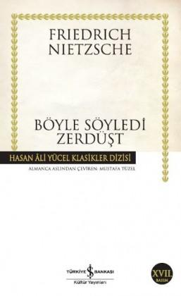

  
# Böyle Söyledi Zerdüşt - Friedrich Nietzsche
##  335 Sayfa
### 28.10.2021
  
 

  

    
     

 
 

> ***(Tanıtım Bülteninden - Türkiye İş Bankası Kültür Yayınları)***

***Otuz yaşındayken yurdunu ve yurdunun gölünü ardına bırakarak dağa çekildi Zerdüşt. Dağda on yıl zaman zarfında, bıkmadan, usanmadan hep ruhunu dinledi... Ve sonunda içinde, gönlünün derinliklerinde bir değişiklik duyumsadı. Günlerden birgün yıldız, aydınlatacak bir şeyin kalmasyadı yazgın ne olurdu? On yıl varki buruya mağarama çıkıyorsun. Eğer, ben, kartalım ve yılanım olmasaydık, ışığından ve yolundan bezerdin. Fakat her sabah seni bekledik. Işığının fazlasını aldık ve bunun için seni kutsadık.  
Bak! Ben, fazla bal toplamış arı gibi uzanacak ellere muhtacım. İnsanlar arasında, akıllılar deliliklerine; fakirlerde zenginliklerine kavuştuğu o derin sevinci tekrar yaşatmak için armağanlarımı paylaştırmak istiyorum. Bunun için aşağılara inmeliyim. Nasıl ki sen, cömert yıldız, akşamları denizin arkasına iniyor ve arkadaki dünyaya ışık götürüyorsan, ben de senin gibi, inmek istediğim insanların arasına girmek istiyorum.***

***Ey, en büyük mutluluğu bile kıskanmadan görebilen tek göz, beni kutsa!... Taşmak isteyen kadehi kutsa ki içinden su, altın gibi aksın ve mutluluğun parıltılarını her tarafa saçsın.***

***"Bak, bu kadeh yine boşalmak, Zerdüşt yine insan olmak istiyor." Zerdüşt'ün on yıl sonra insanların arasına karışma isteği ve dağdan inişi böyle başladı.***
_____

36+

____

42+43+44+45

____

135-kurtuluş üzerine

____

182+183

________

***Bir defasında şöyle demişti şeytan bana: "Tanrının da var kendi cehennemi: insanlara duyduğu sevgi."   Ve geçenlerde şöyle dediğini işittim şeytanın: "Tanrı öldü; insanlara duyduğu merhamet yüzünden öldü tanrı." (s.237)***

__________

 

### Kitaptan Alıntılar ;
- ***"Ey sen büyük yıldız! Aydınlattıkların olmasaydı, ne olurdu mutluluğun?" (s.3)***
- ***"Şimdi tanrıyı seviyorum: sevmiyorum insanları. Tamamlanmamış bir şeydin insan benim gözümde. İnsanları sevmek mahveder beni." (s.5)***
- ***"Sahiden, kirli bir ırmaktır insan." (s.7)***
- ***"Başını yere koyar koymaz uyuyakaldı, bedeni yorgundu, ama ruhu dingindi." (s.16)***
- ***"İnsanların arasında daha tehlikede olduğumu gördüm hayvanların arasında olduğundan..." (s.18)***
- ***"O zaman dünya acı çeken ve işkence gören bir tanrının eseriymiş gibi görünüyordu bana." (s.24)***
- ***"Ben sizin yolunuzdan yürümüyorum, ey bedeni aşağılayanlar! Siz benim için Üstinsana giden köprü değilsiniz!" (s.29)***
- ***`"Kıskançlık ateşinin ortasına kalan, sonunda kendine yöneltir zehirli iğnesini, tıpkı bir akrep gibi." (s.31)`***
- ***"Ölmeyi çok istiyorlar ve biz de arzularına saygı duyalım! Bu ölüleri uyandırmaktan ve bu canlı tabutlara zarar vermekten kendimizi alıkoyalım!" (s.39)***
- ***"Yaşam acı çekmektir." (s.39)***
- ***"Kendi düşmanınızı aramalısınız ve kendi düşünceleriniz uğruna kendi savaşınızı vermelisiniz! Kendi düşünceniz yenilse bile, dürüstlüğünüz zafer çığlıkları atmalı!" (s.41)***
- ***"Başkalarına duyduğumuz inanç kendimizde neye inanmak istediğimizi ele verir." (s.50)***
- ***"İnsan bir dostu olsun istiyorsa, onun için savaşmak da istemelidir: ve savaşmak için düşman da olabilmelidir." (s.50)*** 
- ***"Dostu en yakın düşmanı olmalı insanın. Ona karşı çıktığında onun yüreğine en yakın sen olmalısın." (s.51)***
- ***"Her zaman ilk olmak, diğerlerinin önüne geçmek istiyorsun: kimse sevmeyecek senin kıskanç ruhunu dostundan başka." (s.53)***
- ***"Uzaktakine ve gelecektekine duyulan sevgi daha yücedir yakındakine duyulan sevgiden; davalara ve hayaletlere duyulan sevgi daha yücedir insanlara duyulan sevgiden." (s.55)***
- ***"Oysa günün birinde yalnızlık yoracak seni, günün birinde gururun iki büklüm olacak ve cesaretin kırılacak. "Yalnızım!" diye haykıracaksın günün birinde." (s.57)***
- ***`"Özgür mü diyorsun kendine? Sana hükmeden düşünceni duymak isterim.." (s.57)`***
- ***"Ama önce sen kendini inşa etmelisin, dimdik bir beden ve dimdik bir ruhla." (s.64)***
- ***"Binlerce yol var henüz gidilmedik; binlerce çeşit sağlık var ve binlerce gizli adacığı var yaşamın. Tüketilmemiş ve keşfedilmemiştir henüz insan ve insanın dünyası." (s.72)***
- ***"Zordur insanlarla yaşamak, çünkü öyle zordur ki susmasını bilmek." (s.84)***
- ***"İnsan sıkı tutmalı yüreğini; çünkü gitmesine izin verirse, çok geçmeden aklı da gider başından!" (s.85)***
- ***"İntikam almak istiyoruz vebizimle aynı olmayan herkese küfretmek." (s.96)***
- ***Kendine inanmayan yalan söyler her zaman." (s.121)***
- ***"Her şey boş, her şey aynı, her şey geçti bitti!" (s.131)***
- ***"Sahiden, ölmek için bile çok yorgunduk." (s.132)***
- ***"Gözlerim için en korkunç şeydir bu, insanları paramparça olmuş ve mezbahaya dönmüş bir savaş alanında dağılmış gibi görmek." (s.136)***
- ***"Her şey geçip gider, bu yüzden layıktır her şey geçip gitmeye!" (s.138)*** 
- ***"Zordur insanlarla yaşamak, çünkü çok zordur susmak. Özellikle de çenesi düşük biri için." (s.139)***
- ***`"Yükseklik değil: uçurumdur korkunç olan!" (s.140)`***
- ***"En sessiz sözcüklerdir fırtınayı getiren. Güvercin adımlarıyla gelen düşünceler yönlendirir dünyayı." (s.145)***
- ***"Böyle söyledi Zerdüşt, yukarıya çıkarken, sert sözlerle yüreğini teselli ederken: çünkü hiç olmadığı kadar yaralıydı yüreğinden." (s.150)***
- ***"Anlıyorum kaderimi dedi sonunda hüzünle, Pekâlâ! Ben hazırım. Şimdi başladı son yalnızlığım." (s.150)***
- ***"Her zaman komşunuzu kendiniz gibi sevin- ama önce, kendini seven birileri olun." (s.170)***
- ***"Artık sevemediğin yerin önünden geçip gitmeli!" (s.177)***
- ***`"Terk edilmişlik başkadır, yalnızlık başka." (s.183)`***
- ***"İnsanı keşfetmek zordur, insanın kendini keşfetmesi ise en zorudur." (s.194)***
- ***`"Senin yaptığını kimse yapamaz sana." (s.200)`***
- ***"Nereden geldiğiniz değil, nereye gittiğiniz belirlesin bundan sonra şerefinizi!" (s.204)***
- ***"Mağarandan dışarı çık: dünya bir bahçe gibi bekliyor seni." (s.220)***
- ***"Ve birbirimizi yürekten sevmesek bile, öfkelenmek mi gerekir, yürekten sevmeyince?" (s.230)***
- ***"Uzun zamandır, söylediğin kadar sevmiyorsun beni; biliyorum, çok geçmeden terk etmeyi düşünüyorsun beni." (s.231)***
- ***"Birçok şeyi yarım yamalak bilmektense, hiçbir şeyi bilmemek daha iyi! Başkalarının insafına kalmış bir bilge olmaktansa, kendi başına bir deli olmak daha iyi!" (s.252)***
- ***"...durmadan acınacak bir halde çevresine bakınıyordu, tüm dünyanın terk ettiği, yapayalnız kalmış birisi gibi." (s.254)***
- ***"İnsan insandır, tanrının önünde - hepimiz eşitiz." (s.290)***
- ***"Kendinize gülmeyi öğrenin, gerektiği gibi gülmeyi!" (s.297)***
- ***"İyi şarkılar iyi yankılanmak ister; iyi şarkılardan sonra uzun süre susmalı." (s.307)***
