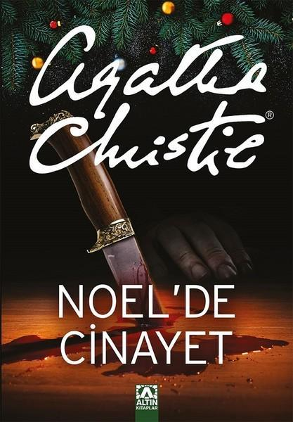

  
# Noel'de Cinayet - Agatha Christie
##  176 Sayfa
### 05.11.2021
  
 

  

    
     

 
 

***Karakterler;***
- ***Simeon:*** Çocukların yaşlı babası.
- ***Eb Farr:*** Simeon'un, Güney Afrika'da, Kimberley'de ortağı.
- ***Stephen Farr:*** Eb Farr'ın oğlu.
- ***Pilar Estaravados:*** Genç kız | Adresi:  | Jennifer'ın kızı.
- ***Alfred  ve Lydia:*** Alfred, Simeon'un oğlu. | Lydia onun karısı.
- ***David ve Hilda:*** David, Simeon'un oğlu | Hilda onun karısı.
- ***George Lee | Magdalena Lee:*** George, Westeringham milletvekili
- ***Harry:*** Simeon'un oğlu.
- ***Başkomiser Sugden:*** Soruşturmayı yürüten komiser.
- ***Hercule Poirot:*** Dedektifimiz.
- ***Tressilian:*** 40 yılı aşkın süredir bu evde çalışan yardımcı.

***Yer:*** Gorston Hall, Longdale, Addesfield

 

> ***(Tanıtım Bülteninden - Altın Kitaplar)***

***Kulakları sağır eden bir gürültü ve canhıraş bir çığlık, Lee Ailesi’nin Noel yemeğini berbat eder. Üst katta zalim Simeon Lee boğazı kesilerek öldürülmüştür. Köyde bir arkadaşının evinde Noel tatilini geçirmekte olan Hercule Poirot olaya el koyunca evde yas havası yerine kuşku rüzgarlarının estiğini fark eder. Herkesin yaşlı adamdan nefret etmesi için kendine göre bir nedeni vardır.***
_____

> ***Benim Yorumum:***

***Yine bir Agatha Christie ve yine muhteşem bir eser.
O kadar sade ve akıcı bir dili var ki, ne ara kitabın sonuna geldiğimi anlayamadım..
Agatha'nın okuduğum 6. kitabı, ama sanırım hiçbir zaman katili doğru bir şekilde tahmin edemeyeceğim.  
Aslında ipuçlarını kitabın içerisine öyle bir yerleştirmiş ki, en sonunda katili açıklarken ben bunları nasıl fark edemedim diye hayıflanmıyor değilim..  
Nitekim katilin bu olmasını hiç beklemiyordum. Hercule Poirot her şeyi, bir bir açıklarken heyecanımı ve kalbimin hızla çarpmasına engel olamadım..  
Şimdiye kadar okuduğum Agatha eserlerinin en güzel sonlarından biri olabilir... Bir sonraki eserini okumak için büyük bir heyecanla bekliyor olacağım sevgili Agatha Christie...***
____

Simeon ismindeki yaşlı adam. Noel için tüm ailesini bir araya toplama kararı aldı. Dört bir yana dağılan çocuklarına tek tek mektup gönderen Simeon, çocuklarını yeniden göreceği için heyecanlıydı.. Yıllar önce Simeon, ailesine hiç sadık değilmiş ve üstelik karısını bir çok defa aldatmış ve bunu karısının gözüne sokmaktan hiç çekinmiyor, adeta zevk alıyormuş.. Hatta Simeon, karısının ölmesine neden olduğu için oğlu David tarafından sevilmiyor..

Noel'den iki gün önce tüm çocukları gelmişti. Bunların dışında iki yeni misafirleri de vardı. Bu kişiler yolda gelirken zaten tesadüfen trende karşılaşmışlardı. Bunlardan biri Stephen Farr, Simeon'un ortağının oğlu. Diğeri ise Pilar ismindeki genç kız. Pilar, Simeon'un öz kızı olan Jennifer'in kızıydı. Yani Pilar, Simeon'un torunuydu. 

Bir süre Simeon çocuklarıyla, yani evdeki herkes ile sohbet etmişti ama en sonunda hepsini odasına çağırdı. Herkes, keyifli bir aile toplantısı bekliyordu fakat bunun aksine Simeon, oradaki herkes ile alay etti ve aşağıladı.. Zaten bunların üzerine bir süre sonra Simeon, odasında ölü bir şekilde bulundu.

____

Kitabın devamında ise soruşturmayı Başkomiser Sugden yönetti ve ona destek veren ise dedektifimiz olan Hercule Poirot oldu.. Kitabın büyük bir bölümü Hercule Poirot için insanları sorgulamak ve ipuçları bulmakla geçti.

Sonundan bahsedecek olursak; Stephen Farr ve Pilar Estaravados, gerçek kişiler olmadıkları ortaya çıktı ve asıl bu isimlerin yerlerine geçtikleri anlaşıldı. Ama bu iki isminde cinayetle herhangi bir ilgisi yoktu. Fakat yine de Stephen Farr, öldürülen yaşlı adamın yıllar öncesinden gayrimeşru olan bir çocuğundan bir tanesiydi... 

 Kitabın sonunda Hercule Poirot, cinayeti kimin işlediğini o kadar güzel açıkladı ki, muhteşemdi. Cinayeti Başkomiser Sugden işlemişti. Sugden, yine öldürülen adamın gayri meşru çocuklarından biriydi ve babasından intikam almak için böyle bir şey yaptı...

 ____

 

### Kitaptan Alıntılar ;
- ***"Neden? Değer mi? Geçmişin üzerinde durmak neden? Niçin her şeyi unutmuyorsun?" (s.7)***
- ***"İnsanlar... Karınca sürüsünden farksız insanlar... Üstelik o kadar o kadar... renksizler ki. Korkunç bir şekilde birbirlerine benziyorlar." (s.8)***
- ***"Ama nasıl olsa hepimiz er ya da geç öleceğiz. Öyle değil mi?" (s.11)***
- ***"Hayır! Kötülük sadece insanın kafasında değil! Dünyada yaşayan, var olan bir şey! Sen dünyadaki kötülüklerin farkında değilsin. Ama ben bunu hissediyorum!" (s.16)***
- ***"Sen geçmişin küllenmesine izin vermiyorsun, onu canlı tutmak için elinden geleni yapıyorsun." (s.24)***
- ***"Konuşma sırasında bazı şeyler ortaya çıkar. İnsan fazla konuşursa, gerçeği de saklayamaz." (s.95)***
- ***"Mon cher, herkes yalan söyler. Yalnız zararsız yalanları önemlilerden ayırmak gerekir." (s.95)***
- ***"Bazen geçmiş insana geride kalmış gibi gelmiyor efendim." (s.96)***
- ***"İnsanın içinde, kendisinin bile bilmediği birtakım istekler, arzular vardır." (s.113)***
- ***"İnsanlar ne de ikiyüzlü oluyor." (s.118)***
- ***"Dünya kadınlara karşı çok zalim." (s.148)***
- ***"Beni korkutan delilik değil. Akıllılık!" (s.152)***
- ***"Fakat biliyor musun? Bu evden hatıra almayı pek istemiyorum. Bence insanın geçmişle bütün ilgisini kesmesi daha iyi olur." (s.173)***
- ***"Mendel kanunlarını inceleseydiniz, mavi gözlü bir anneyle mavi gözlü bir babanın çocuklarının kahverengi gözlü olamayacaklarını anlardınız."*** 
