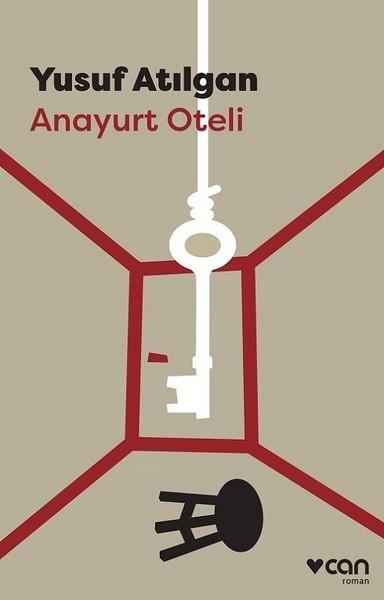

  
# Anayurt Oteli - Yusuf Atılgan
##  128 Sayfa
### 13.11.2021
  
 

  

    
     

 
 

***Karakterler;***
- ***Zebercet:*** Kahramanımız
- ***Ortalıkçı Kadın:***
- ***Emekli Subay:***
- ***Gecikmeli Ankara Treniyle Gelen Kadın:***

_____

- ***Kedi:***
- ***Odadaki İki Havlu:***

____

> ***Her ne kadar bu kitap olay örgüsü olarak bu şekilde olsa da kitabı okuduktan sonra yaptığım araştırmalar sonucunda çok daha derin anlamların ve altmetinlerin olduğunu keşfettim... Aynı zamanda bu kitapla ilgili olarak tüm bu anlamları açıklayan bir eser olduğunu keşfettim. Bu eser: `"Zebercet'ten Cumhuriyete Anayurt Oteli"`... Bu eseri ve ardından Anayurt Oteli'ni tekrardan okumak istiyorum... Şu an çoğu şeyin havada kaldığını hissediyorum.***

 

> ***(Tanıtım Bülteninden - Can Yayınları)***

Bir oteli yönetmekle bir kurumu, geniş bir işletmeyi, bir ülkeyi yönetmek aynı şeydi aslında. İnsan kendini, olanaklarını tanımaya, gerçek sorumluluğun ne olduğunu anlamaya başlayınca bocalıyordu, dayanamıyordu. Ülkeleri yönetenler iyi ki bilmiyorlardı bunu; yoksa bir otel yöneticisinin yapabileceğinden çok daha büyük hasarlar yaparlardı yeryüzünde. Defteri kapadı. Ne gereği vardı artık bunları yazmanın ya da birkaç satır yazıp bırakmanın?

Çağdaş edebiyatımızın en ünlü kişilerinden Zebercet, yaşamını günlük yaşamın gerektirdiği en basit işlevlere odaklamış biri. Görünüşüyle son derece gerçek, basit ve sıradan. Ama içimizde bıraktığı etki öyle mi? Yusuf Atılgan’ın unutulmaz romanı Anayurt Oteli, bir memleket portresi, bir mizaç izahı. Yayımlandığı ilk günden bu yana başucumuzda. Okura düşen de onu daha yakından tanımak.
_____

Kahramanımız Zebercet, annesi henüz yedi aylıkken dünyaya gelen bir çocuktu. Bunun akabinde zaten çocukluğunda da çok sabırsız biriydi.. Zebercet, henüz küçükken annesi ölmüştü. Böyle olunca babası onu okula göndermekten vazgeçmişti...

***Kitabın içerisinde yer yer Zebercet'in askerlik anılarından ve aynı zamanda geneleve gittiğinden bahsediyor. Kitabın içerisinde anlatım olarak, hoş olmayan şeylerden bahsetmekte. Bu noktada kitap, biraz edepsiz bir anlatıma sahip.***

Dedelerinden, babasına kalan oteli baba oğul birlikte işletmeye başlamışlardı.. Zebercet, zamanla büyüdü ve askere gitti. Askerden döndükten çok kısa bir süre sonra babası da ölmüştü.. Haliyle otel kendisine kaldı.. Uzun bir süre oteli işletti. Aynı zamanda yanına kendisine yardım edecek bir tane kadın da almıştı.. Bu oteli birlikte işletiyorlardı.. 

Bir gün Ankara'ya gidecek olan bir kadın otelinde sadece bir gün konaklamıştı. Ama ne olduysa, Zebercet ona aşık olmuştu. Kadın bir süre sonra geri döneceğini söylemişti. Kadın otelden ayrılırken, aynı anda başka bir adam içeri girmişti. Bu adam emekli subaydı, bu kadının ayrıldığı odayı almak istemişti ama Zebercet buna izin vermedi.. Aradan bir hafta geçmişti, Zebercet bu kadının hasretiyle yanıp tutuşuyordu, kadının kaldığı odada hiçbir şeye dokunmamıştı ve bir süre sonra o odada kalmaya başlamıştı.. 

Bir haftanın ardından emekli subay oradan ayrılmıştı.. Ama Zebercet, kadını beklemekten vazgeçmek istemiyordu.. Kısa bir süre sonra ise oteli kapattı ve gelenleri gidenleri geri çevirdi..  

Bir süre sonra, Emekli Subay'ın da odasında Gecikmiş Ankara Treniyle Gelen kadının bıraktığı havluyu bulmuştu.. Bu ilginç bir tesadüftü. Aynı zamanda polislerin o adamı araması üzerine, aslında adamın emekli subay olmadığı ortaya çıkmıştı. O kaçak olan adam kendi kızını boğarak öldürmüştü...

   En sonunda ise kendi yanında çalıştığı kadını öldürmüştü ve bunun ardından kendisini asarak hayatına son verdi.. Fakat son saniyede yaşama isteği ağır basmıştı fakat artık çok geçti. Ne yaptıysa kendisini ipten kurtaramadı...

   ***- SON -***

 

### Kitaptan Alıntılar ;
- ***"Elinde olmadan kirleniyordu insan." (s.41)***
- ***"Gelmez artık; ama benim beklemem gerek." (s.46)***
- ***"...ama kimi ayrıntılar önemliydi." (s.46)***
- ***"Belki sonuna dek gitmekten korkuyorlardır; sonunu görmekten." (s.59)***
- ***`"Ne çok yalan söyleniyordu yeryüzünde; sözle, yazıyla, resimle ya da susarak."` (s.63)***
- ***"Günlerdir kafasında, yüreğinde gittikçe artan ağırlığı biraz olsun azaltır mıydı bu?" (s.103)***
- ***"Bir eylemin ertesini, sonuçlarını göze alabilirse ya da bunlara kayıtsız kalabilirse, insanın yapamayacağı şey yoktu." (s.106)***
- ***"Değişmez tek bir kesinlik vardı insan için: Ölüm." (s.124)***
____
- ***"Bedenin dayanma gücünü zorlamak da bir çeşit kendini öldürmek değil miydi?"***
- ***"Tatlı bir kazaydı bu; ama insanın ölmesi nasıl da kolaydı" (s.27)***
- ***"Yeryüzünde her şey olağandı." (s.81)*** 
- ***"Çay ister misin? Çay yapayım mı? Çay içelim mi? Çay..." (s.98)***
- ***"Söylenecek, yapılacak ne çok şey vardı." (s.63)***
