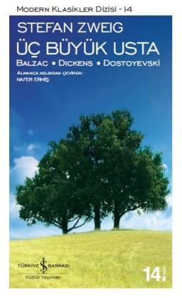

# Üç Büyük Usta - Stefan Zweig
##  228 Sayfa
### 27.11.2021
  
 

  

    
     

 
 

> ***(Tanıtım Bülteninden - Türkiye İş Bankası Kültür Yayınları)***

***Roman yazarı aslında kimdir? Stefan Zweig, Üç Usta'da bu soruya cevap arıyor ve yarattıkları unutulmaz figürler evreniyle epik dünyalar kuran üç edebiyat dehasının eserlerinde dolaştırıyor bizi. Zweig'ın "Dünyanın Mimarları" adını verdiği dizinin ilk kitabı olan Üç Usta, bireyin hayata tutunma çabası ve direnç sınırları üzerinden Balzac, Dickens ve Dostoyevski'nin eserlerindeki evren modellerini serimliyor. Üç Usta sadece bu üç büyük yazarın evreninde dolaşmak için değil, modern zamanlarımızın modern insanını anlamak için de gözden kaçırılmaması gereken bir kitap. Dünya edebiyatının bir başka usta kaleminden, Stefan ZweIg'ın gözünden Balzac, Dickens ve Dostoyevski'ye yakından bakmak için eşsiz BİR dilsel lezzet, benzersiz bir edebî deneme.***
_____

***BALZAC (s.13)***

***Ama dünyayı fethetmek Balzac'ın gençlik rüyasıydı ve hiçbir şey gerçekleşen çocukluk hayallerinden daha müthiş değildir. Napolyon'un bir resminin altına şunu yazması boşuna değildir: "Ce qu'il n'a pu achever par l'êpêe je l'accomplirai par la plume." (Onun kılıçla sona erdiremediğini ben kalemle tamamlayacağım.) (s.22)***

____

***DICKENS (s.51)***

***Ve Dickens hakkında, yüzyılımızda başka hiç kimse hakkında bu kadar kesin söyleyemeyeceğimiz şeyi söyleyebiliriz: O bu dünyadaki mutluluğu çoğaltmıştır. Milyonlarca göz onun kitaplarını okurken gözyaşı dökmüştür; gülme nedir bilmeyen ya da unutan binlerce insanın göğsüne gülüşü yeniden yerleştirmiştir: Onun etkisi edebi olanın çok üstündedir. Chereby Kardeşler'in hikâyesini okuduklarında zengin insanlar düşüncelere dalmışlar, vakıflar kurmuşlardır; taş kalpliler yumuşamıştır; Oliver Twist yayımlandığında sokak çocukları -ki bu kesindir-, daha fazla sadaka almıştır; hükümet düşkünler evlerini iyileştirmiş ve özel okulları denetim altına almıştır. İngiltere'deki merhamet ve iyilik Dickens sayesinde güçlenmiş, sayısız yoksul ve mutsuzun kaderi değişmiştir. Biliyorum: Bu tür etkilerin bir sanat eserinin estetik değeriyle hiçbir alakası yoktur. Ama bunlar önemlidir, çünkü bunlar, gerçekten büyük her eserin, yaratıcı iradenin özgürce süzüldüğü hayal dünyasının sınırlarını aşıp gerçek dünyada da değişimlere neden olabildiğini gösteriyorlar. Önemli şeylerde, gözle görülür şeylerde ve ardından duygu dünyasının sıcaklığında meydana gelen değişimlerdir bunlar. Dickens, bizzat kendileri için merhamet ve teselli isteyen yazarların tersine, kendi dönemindeki neşeyi ve sevinci çoğaltmış, onun kan dolaşımını hızlandırmıştır. Parlamentodaki stenograf, insanları ve onların kaderlerini yazmak için eline kalemi aldığından beri dünya daha aydınlık hale gelmiştir. Kendi döneminde sevinci ve sonraki kuşakların, Napolyon savaşlarıyla emperyalizm arasındaki o "mutlu yaşlı İngiltere”sinin mutluluk anlayışını kurtarmıştır. Yıllar sonra insanlar, çoktan endüstrileşmenin havanında un ufak edilmiş olacak olan o tuhaf ve yitik meslekleriyle, ilerde sonra modası geçecek olan dünyaya bakacaklardır; belki de bu basit, sessiz neşelerle dolu saf yaşama bakacaklardır. Dickens edebi olarak İngiltere'nin idilini yaratmıştır - onun eseri budur. Bu sessizliği, bu hoşnutluğu şiddetli olandan daha az önemsemezsek: İdil de ebedidir ve ilk zamanlardan beri tekrar tekrar geri gelir. Çiftçinin ve çobanın şiiri, arzunun ürpertilerinden kaçıp dinlenmek isteyen insanların şiiri burada yeniden karşımızdadır, tıpkı kuşakların devir daiminin sürekli yenileneceği gibi. O tekrar geçip gitmek için gelir, heyecanlara bir mola vermek için; gayretlerden önce ya da sonra güç kazanmak için aralıksız atıp duran yüreklerdeki huzur anıdır bu. Kimileri şiddeti yaratır, kimileri huzuru. Charles Dickens dünyadaki bir huzur anını şiire yerleştirmiştir. Bugün hayat yine gürültülü, makineler harıl harıl çalışıyor, zaman hızlı periyotlarla yanımızdan vınlayarak geçiyor. Ama idil ölümsüzdür, çünkü yaşam sevincidir; fırtınadan sonra ortaya çıkan mavi gökyüzü gibi tekrar gelir, bütün krizlerden ve ruhsal sarsıntılardan sonra geri gelen neşesidir hayatın. Aynı şekilde Dickens'ta tekrar tekrar unutuluşundan geri gelecektir; insanların sevince ihtiyaçları olduğunda ve tutkunun trajik gerilimlerinden bitkin düştüklerinde, en ufak şeylerde bile şairane olanın hayaletimsi müziğini tekrar dinlemek istediklerinde de. (s.84-85)***

____

***DOSTOYEVSKİ (s.87)***

***Hayat onu üç kez havaya fırlatır, üç kez yere serer. Erken bir zamanda ünün tatlı besiniyle yemler: İlk kitabı ona bir isim bahşeder; ama hemen ardından güçlü pençeler onu tekrar yakalar ve isimsizler diyarına firlatır: Hapishaneye, Katorga’ya, Sibirya’ya. Sonra daha güçlü ve daha cesur olarak yeniden ortaya çıkar: Ölüler Evinden Anılar Rusya'yı serseme çevirir. Çar bile kitabı gözyaşları içinde okur, Rus gençliği onun için yanar tutuşur. Bir dergi çıkarır, sesini bütün halka yöneltir, ilk romanlar vücuda gelir. Sonra aniden maddi durumu çöküntüye uğrar, borçlar ve kaygılar onu ülkesinden atar, hastalık bedenini kemirir, bir göçebe gibi bütün Avrupa'yı dolaşır, ulusu tarafından unutulur. Ama çalışma ve mahrumiyet yıllarından sonra üçüncü kez, isimsiz sefaletinin korkunç sularında yeniden belirir: Puşkin'i anma konuşması onu ülkesinin en büyük yazarı, peygamberi haline getirir. Artık ününün önü alınamaz. Ama tam da o sırada demir pençe onu yeniden yere serer ve ulusunun coşkulu heyecanı kendini kaybederek hiddetle bir tabutun etrafını sarar. Artık kaderin ona ihtiyacı kalmamıştır, o korkunç ve ne yaptığını bilen irade istediğini elde etmiş, onun hayatından en yüksek zihinsel verimi almıştır: Şimdi ise bedeninin boş kabuğunu öylece bir kenara ativerir. (s.98)***

 ***Fyodor Mikhailoviç Dostoyevski bir yoksullar evinde doğar. Daha ilk anda ona hayatının yeri gösterilmiştir; toplumun dışında, hor görülen, hayatın dibine yakın bir yer, ama insani kaderin tam ortasında, acıya, ıstıraba ve ölüme komşu bir yer. Son günlerine kadar (işçi mahallesinde bir binanın dördüncü katında ölmüştür) asla, kendisini saran bu çemberin dışına çıkamamıştır, hayatının ağır koşullarda geçen elli altı yılı boyunca sefaletten, yoksulluktan, hastalıktan ve hayatın yoksullar evindeki mahrumiyetinden kurtulamamıştır. (s.99)***

 
***Günün birinde bu karanlık dünyadan bir delikanlı olarak çıktığında çocukluğu çoktan sönüp gitmişti. Bütün doyumsuzların ebedi özgürlük ülkesine, ihmal edilmişlerin sığınağına, kitapların renkli ve tehlikeli dünyasına kaçmıştı. O zamanlar erkek kardeşiyle birlikte inanılmaz derecede çok okuyordu, geceler ve gündüzler boyu-daha o zamanlar bu doyumsuz genç okuma eğilimini müptelalık derecesine kadar vardırdı, ve bu fantastik dünya onu gerçek dünyadan giderek daha fazla kopardı. İnsanlığa karşı duyduğu güçlü tutkuyla dopdoluydu, ama insanlar karşısında da hastalık derecesinde çekingen ve kapalı, aynı anda kor ve buz, en tehlikeli yalnızlıklarınsa müptelasıydı. Tutkusu dağınık bir şekilde çevrede dolanıyor, bu “bodrum yılları”ında sefahatin bütün karanlık yollarından geçiyordu; ama bütün hazlardan duyduğu tiksinti, her mutlulukta suçluluk duyguları ve hiddetten sürekli sıktığı dudakları ile her zaman tek basına. Para sıkıntısı yüzünden, sadece birkaç ruble icin askere gider: Orada da hiç arkadaş bulamaz. Bütün kitaplarındaki kahramanlar gibi bir köşede bir çeşit inziva hayatı yaşar; hayal kurarak, düşünerek, düsüncelerinin ve duyularının bütün gizli yükleriyle birlikte. İhtirası henüz yolunu bulamaz, kendini dinler ve gücünü kuluçkaya yatırır. Onun şehvet ve dehşetle derinlerde mayalandığını hisseder, onu sever ve ondan korkar. bu belli belirsiz oluşumu mahvetmemek için ona dokun maya bile cesaret edemez. Birkaç yıl bu karanlıkta bi cimsiz bir kukla halinde, yalnız ve suskun bir şekilde kalır; hastalık hastalığına tutulur, içini mistik bir ölüm korkusu sarar; zaman zaman dünyadan, zaman zaman kendinden dehşet duymaya, kalbindeki kaostan dolayı son derece ürkmeye başlar. Geceleri, karmaşık mali sorunlarını çözmek için (parası, yeterince ona özgü bir şekilde, karşıt eğilimlere, sadakalara ve sefahata akıyordu) Balzac'ın Eugenie Grandet’sini ve Schiller'in Don Carlos’unu tercüme eder. Bugünlerin yoğun sisinden yavaş yavaş bir şeyler şekillenmeye başlar ve nihayet korku ve esrime karışımı bu sisli, düşsel durumdan ilk sanatsal eseri olgunlaşır: Insancıklar adlı küçük romanı. (s.100-101)***

Beyaz Geceler'i yazarken, bir yanlış anlaşılma sonucu hapishaneye atılır. En sonunda idam edilmesine karar verilir ve idam sehpasında ölmek üzereyken, saniyeler kala af çıkar ve bunun sonucunda sürgüne gönderilir. 4 yılın sonunda bambaşka biri olarak geri döner.. Evlenir, dergi çıkarmaya başlar.. Ama bunun devamında felaketler yine peşini bırakmaz...

____

***Yine bir yanlış anlama ve birincisi kadar öldürücü. Ve artık darbe üstüne darbe gelir ve hayatının tam ortasına dehşet çöker. Karısı ölür, onun hemen ardından kardeşi ve aynı zamanda en iyi arkadaşı da olan yardımcısı ölür. İki ailenin borçları kurşun gibi omuzlarına yüklenmiştir ve bel kemiği bu taşınmaz yükün altında bükülmektedir. Hâlâ umutsuzca direnmekte, gece gündüz hummalı bir şekilde çalışmakta, yazmakta, yazdıkları üzerinde çalışmakta, sırf paradan tasarruf etmek için, şerefini ve hayatını kurtarmak için yazdıklarını kendisi basmaktadır, ama kaderi ondan daha güçlüdür. Bir gece bir suçlu gibi kendine inananlardan kaçar ve dış dünyaya çıkar.
Artık sürgün yeri Avrupa'da yaptığı, yıllarca süren o başıboş dolaşma, Rusya'dan, kanının geldiği kaynaktan o korkunç kopuş başlamıştır, kırgınlık ruhunu Katorga’nın (hapishanenin) kazıklarından daha fazla sıkmaktadır. Rusya'nın en büyük yazarının, kendi kuşağının dâhisinin, bir sonsuzluğun habercisi olan bir adamın böyle parasız pulsuz, yersiz yurtsuz, amaçsızca ülke ülke dolaştığını düşünmek ne korkunç! Sefalet kokusunun doldurduğu basık tavanlı küçük odalarda güçbela sığınacak yer bulur; sara illeti sinirlerini rahat bırakmaz; borçlar,   senetler, taahhütler onu bir işten ötekine kırbaçlamakta şaşkınlık ve utanç bir şehirden diğerine sürüklemektedir. Hayatında bir parça mutluluk parlayacak olsa kader hemen karanlık bulutlarını gönderir. Genç bir kız, bir stenograf onun ikinci karısı olmuştu, fakat karısının
ona bahşettiği ilk çocuk, güçsüzlük ve sürgün hayatının zor koşulları tarafından birkaç gün sonra alınıp götürülür. Sibirya arafsa, hayatının ön avlusuysa, Fransa, Almanya, İtalya kesinlikle cehennemiydi. Bu trajik hayatı tekrar canlandırmaya insan neredeyse cesaret edemiyor. Ama ne zaman Dresden'de sokaklarda dolaşsam, herhangi bir alçak tavanlı, pis bir evin yanından geçsem, onun orada, Saksonya'lı küçük esnaf ve işçilerin arasında, dördüncü katta, tek başına, kendisine yabancı bu keşmekeş arasında, sonsuz bir yalnızlık içinde oturup oturmadığı düşüncesinden kurtulamam. Bütün bu yıllar içinde kimse onu tanımadı. Bir saatlik mesafede, Naumburg' da, onu anlayabilecek tek kişi olan Nietzsche yaşıyordu, Richard Wagner, Hebbel, Flaubert, Gottfried Keller, yani bütün çağdaşları oradaydı, ama onlardan hiç haberi yoktu, onların da ondan. Büyük ve tehlikeli bir hayvan gibi, yırtık pırtık elbiseler içinde, çalıştığı mağaradan ürkek ürkek sokaklara süzülür, her zaman aynı yolu kullanır, Dresden'de, Genf'de, Paris'te: Sadece Rusça gazeteleri okuyabilmek için bir kafeye, bir kulübe gider. Rusya'yı, vatanını, Kiril alfabesinin çıplak harflerini, anadilinin kısa süreli soluğunu hissetmek ister. Bazen galerilere gider, sanat aşkından değildir bu (hayatı boyunca, resimlere saldıran Bizanslı barbar olarak kalmıştır), sadece ısınmak içindir. Çevresindeki insanlar hakkında hiçbir şey bilmez, sadece onlardan nefret eder; Rus olmadıkları için Almanya'daki Almanlardan, Fransa'daki Fransızlardan nefret eder. Kalbi Rusya'yı dinlemek   tedir, sadece bedeni bu yabancı dünyada bir yabancı  olarak, adeta bitkisel bir hayat sürmektedir. Hiçbir Alman, Fransız ya da Italyan yazarı onunla konuştuğunu, ona rastladığını hatırlamaz. Sadece bankadan tanıyorlardır onu; beti benzi atmış bir halde gişeye gelip, heyecandan titreyen sesiyle, Rusya'dan beklediği çekin, yabancı ve bayağı insanlara binlerce mektup yazıp ayaklarına kapanarak istediği yüz rublenin nihayet gelip gelmediğini sorduğu bankadan. Bu zavallı deliye ve onun beklentisine, daha kapıdan girer girmez gülmeye başlıyordu memurlar. Ayrıca rehincinin de sürekli ziyaretçilerinden biriydi: Her şeyi oraya rehin bırakmıştı, hatta son pantolonunu bile, sırf Petersburg'a bir telgraf daha çekebilmek, mektuplarında mütemadiyen karşılaşılan o korkunç, umutsuz çığlıklarından birini daha atabilmek için. On ruble dilenmek için beş kere İsa'yı anan, bu dalkavukça, yaltaklanan mektupları, zavallı bir avuç para için yalvaran, ağlayan, inleyen bu korkunç mektupları okurken insanın kalbi daralır. Geceler boyu çalışır ve yazar, karısının yanı başında acılar içinde inlemektedir, sara illeti hayatı onun gırtlağından söküp almak için tırnaklarını çıkarmıştır; ev sahibesi polisle birlikte gelip kirayı istemekte, ebe ücreti için dırdır edip durmaktadır - bütün bunlar olurken o Suç ve Ceza'yı, Budala'yı, Ecinniler'i, Kumarbaz'ı, on dokuzuncu yüzyılın bütün bu büyük eserlerini, ruhsal dünyamızın bu evrensel kişiliklerini yazmaktadır. Çalışmak onun kurtuluşu ve istirabıdır. Yazarken bir anlamda Rusya'da, vatanında yaşar. Dinlenme zamanlarında Avrupa'da, Katorga'da sararıp solmaktadır. Bu yüzden eserlerine giderek daha fazla gömülür. Bunlar onu sarhoş eden iksirdir, bunlar onun zavallı sinirlerini en yüksek hazza ulaştıran oyunlardır. Ve ara sira, tıpkı hapishanenin kazıklarına çentik atarak yap   tığı gibi günleri sayar: Bir dilenci olarak da olsa vatanına dönmek, ne olursa olsun dönmek! Rusya, Rusya, Rusya... onun umutsuzluğunun bitmek bilmeyen feryadıdır. Ama henüz geri dönemez, eserlerinin ortaya çıkabilmesi için henüz isimsiz biri olarak kalmalı, bu yabancı sokaklarda bir kurban olarak, tek başına, feryat figan etmeden, yakınmadan dolaşmalıdır. Ebedi şöhretin büyük ihtişamına doğru yükselmeden önce hayatın bu haşarat mekânlarında yaşamak zorundadır. Vücudu yoksunluklar yüzünden şimdiden çökmüştür. Hastalığının topuzu sürekli beynine inip durmaktadır, öyle ki günlerce baygın halde, duyu organları körelmiş bir halde yatmaktadır, gücünü toplar toplamaz yine yazı masasına doğru sürünmek için. O sırada Dostoyevski elli yaşındaydı: Ama binlerce yıllık acı çekmişti.
O anda, nihayet, en sıkışık anında kaderi ona seslendi: Yeter. Tanrı Eyüp'e yüzünü tekrar döndü: Dostoyevski elli iki yaşında tekrar Rusya'ya dönebildi. Kitapları onun için çalışmıştır. Turgenyev, Tolstoy gölgede kalmıştır. Rusya artık sadece ona bakmaktadır. Bir Yazarın Günlüğü onu ulusunun mesihi haline getirir, son gücünü de toplayarak, sanatının doruğuna çıkarak ulusunun geleceğine olan vasiyetini bitirir: Karamazov Kardeşler'i. Artık kaderi yavaş yavaş ona anlamını açmaktadır; sınavları başarıyla veren adama, hayatının tohumundan sonsuz bir hasat elde edildiğini gösterecek en yüce mutluluk anını bahşedecektir. Dostoyevski zaferini nihayet tek bir ana sıkıştırabilecektir, tıpkı bir zamanlar acılarını sıkıştırdığı gibi, Tanrısı ona bir şimşek gönderir, ama bu sefer onu yere sermek için değil, alev alev yanan bir arabayla, bir peygamber gibi sonsuzluğa uğurlamak için. Puşkin'in yüzüncü doğum günü vesilesiyle Rusya'nın en büyük yazarları bir konuşma yapmak için çağrılır. Batılı Turgenyev'in,   hayatı boyunca Dostoyevski'nin hakkı olan ünü gasp etmiş olan bu yazarın önceliği vardı ve konuşmasını yumuşak, dostane bir havada yaptı. Ertesi gün Dostoyevski söz aldı ve şeytani bir sarhoşluk içinde, taşlaşmıs bir fosil gibi konuştu. Kısık ve alçak sesinden aniden bir gök gürültüsü gibi kopan esrikliğin alevleriyle Rus halkının birleşmesinin kutsal bir misyon olduğuna ilan etti, dinleyenler heyecan içinde onun dizlerine kapandı. Salon sevinç çığlıklarından sarsılıyor, kadınlar onun ellerini öpüyor, bir öğrenci önünde baygınlık geçiriyor ve diğer bütün konuşmacılar konuşmalarını iptal ediyordu. Heyecan ve coşkunun önü alınamıyordu ve başındaki dikenli tacın üzerindeki zafer halesi alev alev yanıyordu.
Kaderi bunu da istiyordu: Kor gibi yanan bir dakika içinde misyonun yerine getirildiğini, eserinin zaferini ona göstermek istiyordu. Ardından -saf meyve kurtarılmıştı– bedeninin kurumuş kabuğunu bir kenara attı.     `Dostoyevski 10 Şubat 1881'de öldü.` Rusya boydan boya ürperdi. Sessiz bir acı anı yaşandı. Ama sonra, en uzak şehirlerden aynı anda, üstelik aralarında anlaşmaksızın, son görevlerini yerine getirmek üzere akın akın temsilci heyetleri gelmeye başladı. Bu binlerce hanelik şehrin her köşesinden çok geç! çok geç!- bir sevgi dalgası yükseliyordu, herkes hayat boyu unuttuğu ölüyü görmek istiyordu. Tabutun bulunduğu Demirciler Sokağı simsiyah insan kaynıyordu; karanlık kalabalık ürkütücü bir suskunluk içinde o işçi evinin merdivenlerinden çıkıyor ve dar odaları tabutu sıkıştıracak derecede dolduruyordu. Birkaç saat içinde, altına gömüldüğü çiçeklerin hepsi ortadan kayboldu, çünkü yüzlerce el bu değerli hatıraları tek tek alıp götürmüştü. Küçük oda o kadar havasız kalmıştı ki, mumlar oksijen yokluğundan sönüp gitti.   - Kalabalık giderek daha fazla akın edip dalga dala tabutu sıkıştırıyordu. Onların bu akınından tabut sallanıyor, nerdeyse devrilecek gibi oluyordu: Dul karısı ve korku icindeki çocukları elleriyle onu tutmak zorunda kaldı. Polis şefi, öğrencilerin mahkûmun zincirlerini tabutun arkasından taşımayı planladıkları bir cenaze törenini yasaklamak istedi, ama aksi halde silah kullanarak törene katılmak isteyecek bir coşkuya karşı koymava cesaret edemedi. Ve cenaze taşınırken Dostoyevski'nin kutsal rüyası bir saatliğine gerçek oldu: Birleşmiş Rusya! Eserindeki gibi kardeşçe duygularla Rusya'nın bütün sınıfları ve zümreleri, binlerce insan tabutunun arkasında, acılarından dolayı tek vücut halinde yürüdü; genç prensler, ihtişamlı papazlar, işçiler, öğrenciler, subaylar, hizmetçiler ve dilenciler, bütün hepsi dalgalanan bir bayrak ve flama ormanının altında tek bir sesle değerli ölünün ardından yas tutuyordu. Törenin yapıldığı kilise baştan başa çiçek yığını haline gelmişti. Açık mezarının etrafında toplanan her kesimden insan bir sevgi ve hayranlık andı içmişti. Böylece Dostoyevski son anında ulusuna bir barış anı bahşetti ve şeytani bir kuvvetle zamanının taşkınlıklara varacak gerginliğini bir kez daha frenledi. Ve ölüye muazzam bir selam vermek ister gibi onun son yolculuğunun ardından o korkunç mayın patladı: İhtilal. Üç hafta sonra Çar öldürüldü, ayaklanmanın fırtınası gümbür gümbür geliyordu, her tarafta intikam şimşekleri çakmaya başladı: Beethoven gibi Dostoyevski de temel güçlerin kutsal galeyanında öldü: Fırtına da dindi. (s.106-107-108-109-110-111)***

_____

***Dostoyevski'nin durumu neredeyse budala bir karanlıktır, bunun bütün dehşetini Prens Mişkin'de kendine acı verecek bir açıklıkla anlatır. Yatakta yorgun argın, genellikle örselenmiş bir halde yatar; dil sesin, el kalemin emirlerini dinlemez, homurdanarak yıkılmış bir şekilde herkese karşı kendini savunur. Binlerce ayrıntıyı uyumlu bir özet halinde kavrayan beynin o berraklığı dağılıp gitmiştir, en yakın şeyleri bile hatırlayamaz olur; onu çevresine, eserine bağlayan hayat ipi kopmuştur. Bir keresinde, Ecinniler'i yazarken geçirdiği bir kriz sırasında, kendi yazdığı şeyde olan biten hiçbir şeyi hatırlamadığını dehşetle fark eder, kahramanların isimlerini bile unutmuştur. Güç bela o kişiliklerin içine yeniden girer, uyuşmuş hayalleri, zorlayıcı bir iradeyle yeniden kor haline getirir, ta ki yeni bir kriz onu yere serene kadar. Böylece, sırtında sara dehşeti, dudaklarında ölümün arta kalan tadı, sefaletin ve yoklukların kırbacıyla ortaya çıkmıştır o son, o en büyük romanları. Ölüm ve delilik arasında gidip gelerek, uyurgezer gibi güvenle, yaratısı daha büyük bir güçle yükseliyor ve sürekli ölümden, ebediyen yeniden dirilen bu insanın içinde o şeytani güç büyüyor, yaşamı hırsla kavramak ve onun en yüksek gücünü ve tutkusunu sıkıp çıkarmak için. (s.118)***

***Dostoyevski para hırsı yüzünden kumarcı değildir, tersine benzersiz, “uygunsuz”, Karamazov Kardeşler'de de bulunan, her şeyi en güçlü özüyle isteyen yaşama susuzluğundan, baş dönmesine duyduğu hastalıklı özlemden, şu “kule duygusu"undan, uçuruma eğilme arzusundan dolayıdır bu. Çünkü o uçurumu sever; yaşamın derinliklerini, rastlantının şeytaniliğini, fanatik bir alçakgönüllülükle, kendininkinden daha güçlü olan kuvvetleri sever ve ebedi bir tahrikle sürekli onların öldürücü şimşeklerini üzerine çeker. Dostoyevski şans oyunlarında kaderi provoke eder: Onun masaya sürdüğü şey sadece para değildir -ve her zaman son parasıdır-, tersine onunla birlikte bütün varlığını sürer masaya; bundan kazandığı şey son raddeye varmış bir sinir sarhoşluğu, ölümcül ürperme, temel korku, şeytani yaşam duygusudur. Altın bardakta sunulan zehri içerken bile Dostoyevski sadece, tanrısal olana duyduğu yeni susuzluğu içmektedir.(s.122)***

***Bu yüzden Dostoyevski'nin romanlarında asla dinlenemeyiz, asla yumuşak ve ritmik bir okumaya kendimizi bırakamayız, asla huzur içinde nefes almamıza izin vermez, sürekli elektriğe tutulmuş gibi sarsılırız, her sayfada daha sıcak, daha yakıcı, daha tedirgin, daha merak uyandırıcıdır onun romanları. Edebi şiddet altında olduğumuz sürece biz de ona benzeriz. O ebedi ikili kişilik, karşıtlığın tahta çarmıhına gerili o insan, tıpkı kendisi ve yarattığı kişiliklerde olduğu gibi Dostoyevski okuyucuda da duygu bütünlüğünü parçalar. (s.160)***

 

### Kitaptan Alıntılar ;

- ***"Her duygunun ancak gücünden hiçbir şey  kaybetmediği zaman anlamlı olacağını, her insanın ancak bir hedefe konsantre olduğu,  yolundan sapmadığı, ufak hırslar içinde dağılıp gitmediği, tutkusu bütün diğer duygular için düşünülmüş suyu tek başına içtiği, haydutlukla ve doğal olmayan yollardan güçlendiği zaman büyüyeceğini bilir..." (s.29)***
- ***"Düşünsene, o mutsuz kadın kendini öldürdü!" (s.33)***
- ***"Bu şekilde insan kalbinin en gizli kıvrımlarına girmenin, bu kadar derine inip onu bütün çıplaklığıyla görmenin bir anlamı yok mu sanıyorsunuz?" (s.35)***
- ***"Sevgi yalnızca konuşulan sözlerde soluk alır." (S.53)***
- ***"Ama küçük şeyler," demişti bir keresinde, "hayatın anlamını oluşturan şeylerdir." (s.71)***
- ***"Eğer içerden  yaşanmazsa Dostoyevski bir hiçtir." (s.89)***
- ***"Evdeki sefalet yakınmalarından ve mahrumiyet nidalarından son derece utanan, ama yine de yakınlarını dünyaya karşı savunma ya her zaman hazır olan, ayyaş yüzbaşının oğlu Ilyuska gibiydi." (s.100)***
- ***"Geceleri tek başına evde oturup düşünüyor, lambanın gazı bitinceye kadar çalışıyordu." (s.101)***
- ***"Ayrıca rehinecinin de sürekli ziyaretçilerinden biriydi:  Her şeyi oraya rehin bırakmıştı, hatta son pantalonunu bile, sırf Petersburg'a bir telgraf daha çekebilmek, mektuplarında mütemadiyen karşılaşılan o korkunç, umutsuz çığlıklarından birini daha atabilmek için." (s.108)***
- ***"O sırada Dostoyevski elli yaşındaydı: Ama binlerce yıllık acı çekmişti." (s.109)***
- ***"İnsanlar  için sonsuzluğun önünde eğilebilmekten daha gerekli bir duygu yoktur." (s.112)***
- ***"Beni buna sen soktun, yine sen çıkaraksın." (s.127)***
- ***"Ah, inanmayın insanın birliğine." (s.129)***
- ***"İnsan bu dünyada sadece acı sayesinde gerçekten sever." (s.140)***
- ***"Benim için gerçeklikten daha fantastik ne olabilir ki?" (s.149)***
- ***"Lorsqu'il n'avait pas d'êmotion, il êtait sans esprit. (Duyguları uyarıldığı zaman zihni çalışmıyordu.)" (s.169)***
- ***"Ne şartlar altında çalıştığımı bir görseler. Benden kusursuz şaheserler bekliyorlar, oysa ben en acı, en sefil sıkıntılar yüzünden alelacele yazmak zorundayım." (s.180)***
- ***`"Dostoyevski psikologların psikoloğudur."` (s.185)***
- ***"Artık geçmişe götüren bir yol yoktur." (s.194)***
- ***"Tanrı bana bütün hayatım boyunca eziyet etti." (s.196)***
- ***"Hayatı, hayatın anlamından daha çok sevin." (s.211)***
- ***"Sadece acı sayesinde hayatı sevmeyi öğrenebiliriz." (s.213)***
- ***"Sanırım, hepimiz önce hayatı sevmeyi öğrenmek zorundayız." (s.213)***
- ***"Ölümden daha geri döndürülemez mutsuzluk yoktur." (s.214)***
- ***"Ah, yeniden yaşamayı ne kadar isterdim. Her dakika, her an bir mutluluk olmalı insan için." (s.214)***

