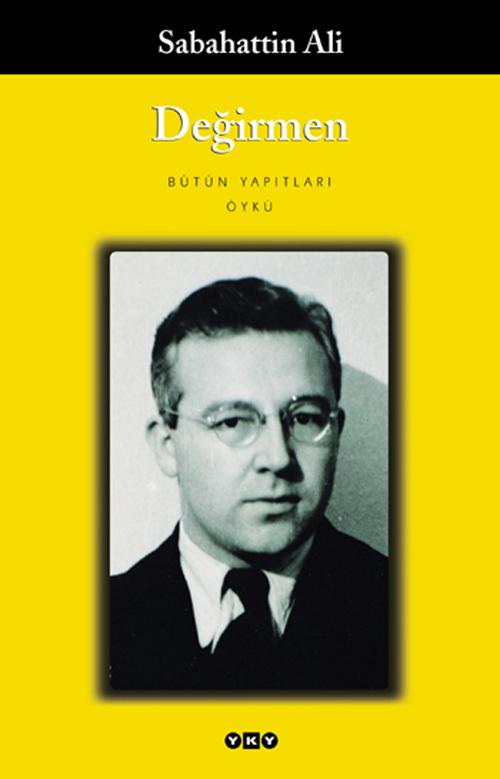

# Değirmen - Sabahattin Ali
##  140 Sayfa
### .2021

 

  

    
     

 
 

> ***(Tanıtım Bülteninden - Yapı Kredi Yayınları)***

Değirmen Sabahattin Ali’nin ilk hikâye kitabıdır. Bu ilk denemeler arasında aşk tema olarak baskındır. Duygulu ve hayalci anlatımına temiz bir dil eşlik eder. Aynı zamanda gerçekçi, toplumcu bir tavır da sezilir. İnsanı ve doğayı içi içe belirleyen o güçlü anlatımın ilk örnekleri Değirmen’de belirmeye başlar.

"İşte adaşım, sana seven bir Çingenenin hikayesi. Çiçeklerin açtığı bir mevsimde, senin kollarına yaslanan ve çiçekler kadar güzel kokan bir vücutla uzak su kenarlarında oturtmak ve öpüşmek, yoruluncaya kadar öpüşmek hoş şeydir... (...) Fakat sevgili bir vücutta bulunmayan bir şeyi kendisinde taşımaya tahammül etmeyerek onu koparıp atabilmek, işte adaşım, yalnız bu sevmektir."
_____

***DEĞİRMEN (s.13)***

Atmaca olarak adlandırdığımız bir delikanlı, bir gün değirmencinin kızına aşık olur. Fakat değirmencinin kızının kolu yoktur. Kız, çocukken kolunu değirmendeki makinaya kaptırmıştır.. Bu sebeple çocukluğundan bu yana, istediği gibi yaşayamamış ve insanlardan uzak bir şekilde büyümüştür. Hiçbir bir zaman insanlarla bir araya gelip, onlarla zaman geçirememiş, onların yaptığını yapamamıştır...

Bir süre sonra, bu iki genç birbirlerine aşık olurlar. Fakat kız, bir türlü Atmaca'yla birlikte olmak onunla evlenmek istemez. Kız, Atmaca'yı ömrü boyunca unutamayacağını, onu çok sevdiğini söyler. Fakat bunun aksine Atmaca'nın buradan gitmesini ve bir daha geri dönmemesini ister.. Çünkü eğer birlikte olurlarsa, hiçbir zaman mutlu olamayacaklarını, onun kendisini acıdığını düşünecektir...

Tüm bunların sonunda en sonunda ise bir gün Atmaca, kolunun birini kesmiştir. Ve kanlar içerisinde yerde kalmıştır... İşte bunlardaki aşk böyle bir şeydir...

 

### Kitaptan Alıntılar ;
- ***"Sen aşkın ne olduğunu bilir misin adaşım, sen hiç sevdin mi?.." (s.13)***
- ***`"Sen sevgiline ne verebilirsin sanki? Kalbini mi? Pekâlâ, ikincisine? Gene mi o? Üçüncü ve dördüncüye de mi o?.. Atma be adaşım, kaç tane kalbin var senin?.." (s.14)`***
- ***`"Peki ama, bu sevmek midir be adaşım, bir kadını öpmek, onu istemek sevmek midir?" (s.14)`***
- ***"Çok konuşmaz, konuştuğu zamanda içindekilerden bize bir şey sezdirmezdi. Neler hisseder, neler düşünürdü? Onu bu dünyaya bağlayan şey neydi?" (s.16)***
- ***"Bana sakatlığımı unutturarak deli deli rüyalar gördürdün, seni ömrümün sonuna kadar unutamam, ama olmayacak şeylere beni inandırmaya kalkma, eğer sahiden beni seviyorsan hemen buralardan git!.." (s.19)***
- ***"Yarın öldüğümüz zaman birisi bize sorsa: 'Dünyada neler gördünüz?' dese herhalde verecek cevap bulamayız. Koşmaktan görmeye vaktimiz olmuyor ki.." (s.39)***
- ***"Ne yapayım, burada oturup etrafa bakıyorum. Siz de, şey, sen de gelmesen böyle yapayalnız bu yazı geçirecektim." (s.40)***
- ***"Hiç ayrılmayalım, olmaz mı?" (s.40)***
- ***`"Odamda beni kitaplarım bekler. Bu yegâne tesellidir." (s.65)`***
- ***"Halbuki en çok okuduğum bir kitabın en çok okuduğum bir satırı bile bana bazan başka şeyler söyleyebilir." (s.65)***
- ***"Bu oda karanlık" diyordum, "bu oda yalnız bugün değil, her zaman böyle karanlık... Burada kitaplarımla ben yaşarız ve bize aydınlık getirecek kimsemiz yok... Ben burada yalnızlığı bardak bardak içiyorum." (s.72)***
- ***"Delikanlı, bizim elimizden ormanımızı aldılar, bizi ormansız bıraktılar... Bizi bir tek ağaçsız bıraktılar!.." diye bağırdı. (s.81)***
- ***"Artık çocukluğumuzun, delikanlılığımızın geçtiği yerlerde yüreğimiz sızlanmadan dolaşamıyorduk. Gençliğimde kız kaçırdığım zaman arkasına sığınıp dört kişiyle dövüştüğüm bir ağaç vardı. Gövdesinde o zamandan kalma kurşun  yaraları dururdu. Onu devirirlerken uzakta durup baktım. Bir bacağımı, bir kolumu kesiyorlarmış gibi oluyordum. Ne gelir elden delikanlı? Gözümün yaşını silip ayaklarımı kuru otlarda sürüyerek uzaklaştım." (s.83)***
- ***`"Ah, reis bey, sevmek, hele benim gibi sevmek berbat bir şeydir. Hayatımda yalnız o vardı. Gözümü kapadığım zaman onu, açtığım zaman onu, uyuduğum zaman onu, uyandığım zaman onu görüyordum." (s.112)`***
- ***"Ah!.. Bilhassa bu kadar kalabalığın içinde yalnızlık ne acı oluyor yarabbi!.." (s.119)***
- ***"Gidersem istikbalimi kaybedecektim, fakat durursam aklımı... Yalnız kaldığım günlerde benim yegâne dostum olan aklımı..." (s.119)***
- ***"Öyle adamlar vardır ki, haysiyet, şeref gibi kayıtlara aşina olmadıkları halde, gurur ve nahvetlerine dokunulur, acizleri yüzlerine çarpılırsa kendilerini kaybedecek kadar hiddetlenirler." (s.134)***
